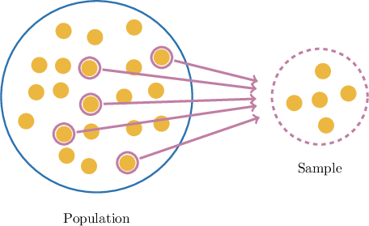
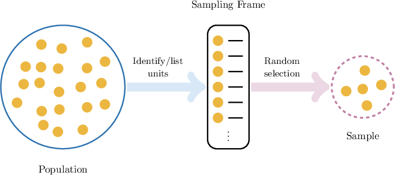

# Sampling

Source: https://www.mathacademy.com/topics/6216?courseId=37
Topic ID: 6216

## Prerequisites

- [Introduction to Statistics](../prealgebra/2478-introduction-to-statistics.md)

## Lesson

### Introduction

In statistics, a **population** is the complete set of individuals or objects about which information is sought.

For example:

- If we want to determine the voting intentions in an upcoming U.S. presidential election, the population would consist of *all eligible voters* in the United States.

- If a scientist wants to study the average sugar content in oranges grown in Spain during a particular growing season, the population would be *every orange produced* in Spain during that season.

These examples show that studying every element of a population is often impractical — it may be too costly, too time-consuming, or simply impossible. Instead, we typically gather information from a *smaller* group that's representative of the whole population. This smaller subset is called a **sample**.

When conducting a sample, the **sampling units** are the individual elements of a population from which observations are taken and could be selected in a sample.

For example:

- If we want to determine the voting intentions of the population in an upcoming U.S. presidential election, the *sampling units* are the individual eligible voters.

- If we want to determine the average sugar content in oranges grown in Spain during a particular growing season, the *sampling units* are the individual oranges.

An investigation that's carried out using a sample is called a **survey.**

### Example: Identifying Sampling Units

#### Question

A transportation agency is studying car ownership in a suburban neighborhood. The neighborhood has $1{,}500$ households. Surveyors randomly select $75$ households and record the number of cars owned by each household.

What are the ** in this study?

#### Explanation

The ** are the ** of a population from which observations are taken and could be selected in a sample.

In this case, the sampling units are the ** in the suburban neighborhood. Each household is the basic unit selected for the sample, and the number of cars is recorded for each one. Although the data involve the people in the households, the selection is at the household level.

### Sampling Frames

A **sampling frame** is the *list* or set of sampling units from which a sample is drawn.

For example:

- If we want to determine the voting intentions of the population in an upcoming U.S. presidential election, the *sampling frame* is a list containing all eligible voters.

- If a scientist wants to estimate the average sugar content in oranges grown in Spain during a particular season, the sampling frame might be a catalog or registry of all orchards in Spain along with their harvest inventories.

Typically, the sample is chosen from the sampling frame *at random* to fairly represent the population. We'll discuss this in more detail shortly.

### Example: Identifying Sampling Frames

#### Question

A university IT department wants to estimate the proportion of computers on campus running the latest operating system. They obtain a complete list of the $3{,}200$ device inventory numbers from the campus asset database and randomly select $150$ computers to check.

What is the ** in this study?

#### Explanation

A ** is the list or set of ** from which a sample is drawn.

In this case, the sampling frame is the ** obtained from the campus asset database. This is the set of all possible computers (the sampling units) that could be selected for the check.

### Advantages of Sampling

Contrary to sampling, a **census** is a study in which data is collected from *every* member of the population. For example, if a school lunch survey included *every student in the school*, it would be a census.

Sampling has several advantages over a census:

- **Sampling is cheaper and faster** Conducting a census can be prohibitively expensive and time-consuming, especially for large populations. A sample provides useful information much more quickly and at a lower cost.

- **Sample data is more readily available** When a population is very large or widely dispersed, gathering information from every unit is impractical. For example, to study the average age of deer in a certain county, it would be nearly impossible to locate every deer. By sampling a smaller group, we can still make reliable estimates.

- **Sampling is necessary when testing causes destruction** Some studies require destroying the sampling units being tested. For example, to determine the average lifetime of a battery, testing every battery in a population would render them all useless. By sampling, we can estimate the average lifetime while preserving most of the population.

- **Sampling allows for more intensive study of each unit** Because fewer units are studied, researchers can afford to collect more detailed or higher-quality measurements than would be feasible in a census.

### Disadvantages of Sampling

Because a sample represents only part of the population, the way it is chosen matters. If the selection process is flawed, the sample may be **biased**.

For example, if a survey about school lunches only included girls, the results may not represent the opinions of the entire student body.

Sampling, therefore, has several *disadvantages* over a census.

- **Samples can be biased** If the sampling method is poorly designed or executed, the results *may not accurately represent the population.*

- **Samples show natural variation** There will always be some variation between any two samples due to differences among the sampling units that make them up.

- **Sampling error is unavoidable** Because a sample is only a subset of the population, estimates from a sample may differ from the true population values.

- **Rare characteristics may be missed** Certain uncommon features may not appear in a sample if the sample size is too small or if the selection method is inadequate.

To reduce these problems, we often conduct a **random sample**, where each element of the population has an equal chance of being chosen. We will explore the details of bias and random sampling in future lessons.

### Example: Identifying Advantages of Samples

#### Question

A meteorological research institute wants to estimate the average annual rainfall in remote villages across a large desert region. Why might the institute choose to use a sample instead of conducting a census?

#### Explanation

Advantages of sampling:

- Sampling is generally cheaper and faster than taking a census.

- Sample data is more readily available, especially when the population is large or widely dispersed.

- Sampling is useful when testing items leads to their destruction (e.g., testing for the average lifetime of a battery).

- Sampling can allow more intensive study of each unit (e.g., collecting more detailed measurements than would be feasible in a census).

In this case, traveling to every remote village in the desert to record rainfall data would be extremely time-consuming, costly, and logistically challenging. By selecting a representative sample of villages from different parts of the region, the institute can still estimate the average rainfall without needing to visit every single village.

Sampling is more practical for gathering data when the population is widely dispersed.

### Advantages of Censuses

Recall that a **census** is a study in which data is collected from *every* member of the population.

A census has several *advantages* over sampling:

- **A census includes every unit in the population** Because data is collected from all members, the results reflect the entire population rather than a subset.

- **A census eliminates sampling error** Since there is no need to estimate from a sample, sampling error is avoided. Bias from sample selection is also removed.

- **A census allows detailed analysis of subgroups** Because all members are included, we can study small subgroups within the population that might be missed or underrepresented in a sample. For example, a school lunch census would allow researchers to compare the opinions of different grade levels, even if some grades have very few students.

### Disadvantages of Censuses

There are also several *disadvantages* of conducting a census:

- **A census is more expensive and time-consuming** Collecting information from every unit requires far more resources than working with a sample.

- **A census can be logistically difficult** For very large or widely dispersed populations, studying every unit may be impractical or even impossible.

- **Data collection errors can be harder to detect** Mistakes such as measurement errors or nonresponse can occur in a census, and these issues may be more difficult to identify at a large scale.

- **A census may be impossible if testing causes destruction** In cases where testing damages or destroys the item, a census cannot be conducted.

- **Census results may be outdated by the time they are completed** Because data collection takes so long, the information gathered may no longer accurately reflect the current population.

### Example: Identifying Advantages and Disadvantages of Censuses

#### Question

A large university wants to record the total number of publications authored by each faculty member in the current academic year.

Why might the university decide to conduct a census instead of using a sample to gather this information?

#### Explanation

Advantages of a census:

- Provides data for every unit in the population.

- Eliminates sampling error and bias, since all units are measured.

- Allows detailed analysis of small subgroups within the population.

In this case, a census will gather information from every faculty member in the university. This approach eliminates sampling error and bias, because all units in the population are measured rather than a subset.

Conducting a census ensures data is collected from every faculty member, eliminating sampling error and bias.
