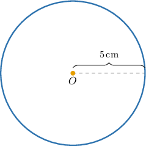
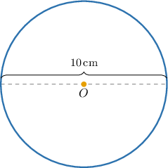
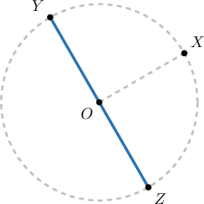
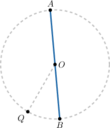
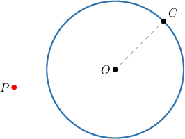

# Introduction to Circles

Source: https://www.mathacademy.com/topics/7211?courseId=37
Topic ID: 7211

## Prerequisites

- [Inequalities](./178-inequalities.md)
- [The Segment Addition Postulate](./2278-the-segment-addition-postulate.md)

## Lesson

### Introduction

Let $O$ be a point on the plane. Let's consider all the points on the plane whose distance to $O$ is equal to $5\,\textrm{cm}.$

The collection of all such points defines a geometrical shape which is called a **circle**.

- The point $O$ is called the **center** of the circle.

- The distance from $O$ to any point on the circle is called the **radius**.

In our diagram above, the radius is $r=5\,\textrm{cm}.$

### Diameter of a Circle

The distance between two points on a circle, measured along a straight line passing through the center, is called the **diameter** of the circle.

Notice that the diameter is twice the radius:

$$

\text{Diameter} = 2 \cdot \text{Radius}

$$

For the circle above, the diameter is $10\text{cm}$, which means its radius is $5\text{cm}$.

### Relationship Between Radius and Diameter

Recall that in circles, the diameter is always twice the radius:

$$

\text{Diameter} = 2 \cdot \text{Radius}

$$

Now, to solve the above equation for $\text{Radius},$ we divide both sides by $2{:}$

$$

\begin{aligned}\frac{Diameter}{2} & =\frac{2⋅Radius}{2} \\ \frac{Diameter}{2} & =\frac{2⋅Radius}{2} \\ \frac{Diameter}{2} & =Radius\end{aligned}

$$

Therefore, we get

$$

\text{Radius} = \dfrac{\text{Diameter}}{2}.

$$

### Example: Finding the Diameter and Radius

#### Question

The diameter of a circle is $18\:\text{cm}.$ What is its radius?

#### Explanation

In any circle, the diameter is twice the radius:

$$

\text{Diameter} = 2 \cdot \text{Radius}

$$

Thus,

$$

\text{Radius} = \dfrac{\text{Diameter}}{2}.

$$

In our case,

$$

\text{Diameter} = 18 \: \text{cm}.

$$

Therefore, we have

$$

\begin{aligned}Radius & =\frac{Diameter}{2} \\ & =\frac{18}{2} \\ & =9\,cm.\end{aligned}

$$

### Circles in Word Problems

Circles naturally arise in real-world situations. For example, a circular fountain is planned for a town plaza. The distance from the center of the fountain to its edge is $12 \: \text{ft}.$ What is the fountain's diameter?

The distance from the center of a circle to its edge is its radius. In our case,

$$

\text{Radius} = 12 \: \text{ft}.

$$

In any circle, the diameter is twice the radius:

$$

\text{Diameter} = 2 \cdot \text{Radius}.

$$

Therefore, we have

$$

\begin{aligned}Diameter & =2⋅Radius \\ & =2⋅12 \\ & =24\,ft.\end{aligned}

$$

### Example: Finding the Diameter and Radius in Context

#### Question

A circular trampoline is installed in a backyard playground. The circle that forms the trampoline has a diameter of $36 \: \text{in}.$ What is the trampoline's radius?

#### Explanation

In any circle, the diameter is twice the radius:

$$

\text{Diameter} = 2 \cdot \text{Radius}

$$

Thus,

$$

\text{Radius} = \dfrac{\text{Diameter}}{2}.

$$

In our case,

$$

\text{Diameter} = 36 \: \text{in}.

$$

Therefore, we have

$$

\begin{aligned}Radius & =\frac{Diameter}{2} \\ & =\frac{36}{2} \\ & =18\,in.\end{aligned}

$$

### Interpreting Components of a Circle

Consider the figure below. How can we determine the measure of $\overline{OX}$ if $YZ = 10?$

Notice that the points $X,$ $Y,$ and $Z$ lie on the circle, with $O$ at the center. From the diagram, the radius of the circle is

$$

r =OX.

$$

We can also see from the diagram that the straight line segment $\overline{YZ}$ passes directly through the center $O.$ Because $O$ lies exactly between $Y$ and $Z,$ we can write the total length of the segment as the sum of its two parts:

$$

YZ = OY + OZ.

$$

Now, $\overline{OY}$ and $\overline{OZ}$ are both segments between the center of the circle and the circle itself.

So, they are both radii of the circle, and because $YZ = 10,$ we have

$$

\begin{aligned}𝑌𝑍 & =10 \\ 𝑂𝑌+𝑂𝑍 & =10 \\ 𝑟+𝑟 & =10 \\ 2𝑟 & =10 \\ 𝑟 & =5.\end{aligned}

$$

Finally, we obtain

$$

OX = r = 5.

$$

### Example: Determining the Radius and Diameter From a Diagram

#### Question

Consider the diagram below. What is the measure of $\overline{AB}$ if $OQ=3?$

#### Explanation

Notice that the points $A,$ $B,$ and $Q$ lie on the circle. From the diagram, the radius of the circle is

$$

r =OQ=3.

$$

To find $AB,$ we first notice that

$$

AB = AO + OB.

$$

Now, $\overline{AO}$ and $\overline{OB}$ are both segments between the center of the circle and the circle itself. So, they are both radii of the circle, and because the radius is $3,$ we have

$$

AO=3, \qquad OB=3.

$$

Finally, we obtain

$$

\begin{aligned}𝐴𝐵 & =𝐴𝑂+𝑂𝐵 \\ & =3+3 \\ & =6.\end{aligned}

$$

### Regions Defined by a Circle

Any circle splits the plane into two regions: inside and outside the circle.

So, let $O$ be the center of a circle with radius $r,$ and let $P$ be any point in the plane. Then:

- If $OP = r,$ the point $P$ lies *on* the circle:

- If $OP < r,$ the point $P$ lies *inside* the circle:

- If $OP > r,$ the point $P$ lies *outside* the circle:

### Example: Identifying True Statements About the Distance to a Circle's Center

#### Question

The diagram below shows a circle of radius $4,$ a point $C$ that lies on the circle, and a third point $P$ on the plane.

Which of the following statements are true about the diagram above?

1. $OP \leq 4$

2. $OC = 4$

3. $OP > 4$

#### Explanation

The point $C$ lies on the circle itself. So, the distance from $O$ to $C$ is equal to the radius of the circle:

$$

OC = 4.

$$

On the other hand, the point $P$ lies strictly outside the circle. So, the distance between $P$ and the center $O$ of the circle must be greater than the radius:

$$

OP > OC = 4.

$$

Therefore, statements II and III are true, while statement I is false.
