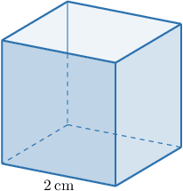

# Volumes of Cubes

Source: https://www.mathacademy.com/topics/7213?courseId=37
Topic ID: 7213

## Prerequisites

- [Volumes of Right Rectangular Prisms: Word Problems](../grade-5/2411-volumes-of-right-rectangular-prisms-word-problems.md)
- [Faces, Vertices, and Edges of Polyhedrons](../grade-6/2484-faces-vertices-and-edges-of-polyhedrons.md)
- [Working With Unit Prices](./6818-working-with-unit-prices.md)

## Lesson

### Introduction

In this lesson, we'll learn how to find the *volume* of a cube.

For example, suppose that we have a cube whose edges are $2\,\textrm{cm}$ in length, like the one shown below.

The *formula for the volume* $V$ of a cube with sides of length $s$ is given by

$$

V = s^3.

$$

To find the volume of this cube, we substitute $s=2 \: \textrm{cm}$ into the formula. This gives

$$

V = (2\, \textrm{cm})^3 = 8 \text{ cm}^3 .

$$

So the volume of the cube is $8\,\textrm{cm}^3.$

### Example: Calculating the Volume of a Cube

#### Question

Find the volume of the cube whose sides each have length $\dfrac{1}{4} \: \textrm{m}.$

#### Explanation

The volume $V$ of a cube can be found using the formula

$$

V = s^3,

$$

where $s$ is the side length of the cube.

Substituting $s = \dfrac{1}{4}\,\textrm{m}$ into the formula, we get

$$

V = \left(\dfrac{1}{4}\, \textrm{m}\right)^3 = \dfrac{1}{64}\, \textrm{ m}^3 .

$$

### Volumes of Cubes in Context

Volumes of cubes naturally arise in real-world contexts.

For example, suppose a large storage box is shaped like a cube and is used to hold equipment. Each side of the box has length $6 \: \textrm{ft}.$ What is the volume of the box?

We need to find the volume of a cube.

The volume $V$ of a cube can be found using the formula

$$

V = s^3,

$$

where $s$ is the side length of the cube.

Substituting $s = 6\,\textrm{ft}$ into the formula, we get

$$

V = \left(6\, \textrm{ft}\right)^3 = 216 \: \textrm{ft}^3 .

$$

Therefore, the volume of the box is $216 \: \textrm{ft}^3.$

### Example: Calculating the Volume of a Cube in Word Problems

#### Question

Each side of a sugar cube has length $\dfrac{3}{5} \: \textrm{cm}.$ What is the volume of the sugar cube?

#### Explanation

We need to find the volume of a cube.

The volume $V$ of a cube can be found using the formula

$$

V = s^3,

$$

where $s$ is the side length of the cube.

Substituting $s = \dfrac{3}{5}\,\textrm{cm}$ into the formula, we get

$$

V = \left(\dfrac{3}{5}\, \textrm{cm}\right)^3 = \dfrac{27}{125} \: \textrm{cm}^3 .

$$

Therefore, the volume of the sugar cube is $\dfrac{27}{125} \: \textrm{cm}^3.$

### Problems Involving Volumes of Cubes

Other real-world scenarios with volumes of cubes may involve rates and prices.

For example, suppose a company charges $0.08$ per $\textrm{cm}^3$ to produce a solid cube-shaped block of wax. Each side of the cube has a length of $5\: \textrm{cm}.$ What is the total cost to produce the block?

We first find the volume of the cube. The volume $V$ of a cube is given by

$$

V = s^3.

$$

Substituting $s = 5\,\textrm{cm},$ we get

$$

V = (5\,\textrm{cm})^3 = 125 \: \textrm{cm}^3.

$$

Now, we compute the total cost. The company charges $0.08$ per $\textrm{cm}^3,$ so we get

$$

125 \cdot 0.08 = 10.

$$

Therefore, the total cost is $10.$

Let's see another example with rates.

### Example: Solving Problems Involving Volumes of Cubes

#### Question

A cube-shaped container with side length $6\:\text{m}$ is being filled with sand at a constant rate of $3$ cubic meters per hour. How many hours will it take to completely fill the container?

#### Explanation

We first find the volume of the cube. The volume $V$ of a cube is given by

$$

V = s^3.

$$

Substituting $s = 6\,\textrm{m},$ we get

$$

V = (6\,\textrm{m})^3 = 216 \: \textrm{m}^3.

$$

Now, we compute the total time needed to fill the container. The filling rate is $3$ cubic meters per hour, so we get

$$

216 \div 3 = 72.

$$

Let's check the units:

$$

 \text{m}^3 \div \dfrac{\text{m}^3}{\text{h}} = \text{m}^3 \cdot \dfrac{\text{h}}{\text{m}^3} = \text{h} \:\: {\color{darkgreen}\checkmark}

$$

Therefore, it takes $72$ hours to fill the container.
