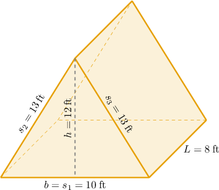
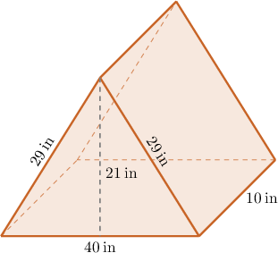
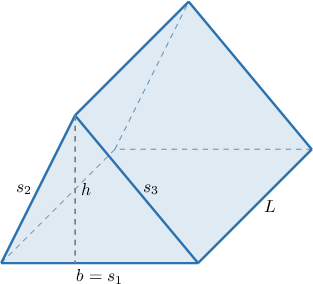

# Surface Areas of Triangular Prisms

Source: https://www.mathacademy.com/topics/7218?courseId=37
Topic ID: 7218

## Prerequisites

- [Areas of Triangles](./1397-areas-of-triangles.md)
- [Working With Unit Prices](./6818-working-with-unit-prices.md)
- [Finding Surface Areas Using Nets](../grade-6/7208-finding-surface-areas-using-nets.md)

## Lesson

### Introduction

The surface area of a triangular prism is given by

$$

S = bh+(s_1+s_2+s_3)L,

$$

where

- $b$ and $h$ are the base and the height of a triangular face of the prism,

- $s_1,$ $s_2,$ and $s_3$ are the sides of the triangular face, and

- $L$ is the length of the prism.

For example, let's determine the surface area of the triangular prism shown below (not drawn to scale).

In our case,

$$

h=12 \:\text{ft}, \qquad b=s_1=10 \:\text{ft}, \qquad s_2=s_3=13 \:\text{ft}, \qquad L=8 \:\text{ft}.

$$

Therefore, substituting these into the formula, we obtain

$$

\begin{aligned}𝑆 & =10⋅12+(10+13+13)⋅8 \\ & =120+36⋅8 \\ & =120+288 \\ & =408\,ft^{2}.\end{aligned}

$$

### Example: Finding the Surface Area of a Triangular Prism

#### Question

A triangular face of the triangular prism is an isosceles triangle with a base of $14\:\text{cm}$ and a height of $24\:\text{cm}.$ The legs of this triangle are $25\:\text{cm}$ each. What is the surface area $S$ of the prism, if the length of the prism is $8\:\text{cm}?$

#### Explanation

The surface area of a triangular prism is given by

$$

S = bh+(s_1+s_2+s_3)L,

$$

where

- $b$ and $h$ are the base and the height of a triangular face of the prism,

- $s_1,$ $s_2,$ and $s_3$ are the sides of the triangular face, and

- $L$ is the length of the prism.

In our case,

$$

h=24 \:\text{cm}, \qquad b=s_1=14 \:\text{cm}, \qquad s_2=s_3=25 \:\text{cm}, \qquad L=8 \:\text{cm}.

$$

Therefore, substituting these into the formula, we obtain

$$

\begin{aligned}𝑆 & =14⋅24+(14+25+25)⋅8 \\ & =336+64⋅8 \\ & =336+512 \\ & =848\,cm^{2}.\end{aligned}

$$

### Surface Areas of Triangular Prisms in Context

We can use the formula for the area of a triangular prism to solve word problems.

For example, consider the package below (not drawn to scale). An artist can paint $4$ square inches of its surface each second. How long will it take the artist to paint the entire surface area of the package?

First, we find the surface area. The surface area of a triangular prism is given by

$$

S = bh+(s_1+s_2+s_3)L,

$$

where

- $b$ and $h$ are the base and the height of a triangular face of the prism,

- $s_1,$ $s_2,$ and $s_3$ are the sides of the triangular face, and

- $L$ is the length of the prism.

In our case,

$$

h=21 \:\text{in}, \qquad b=s_1=40 \:\text{in}, \qquad s_2=s_3=29 \:\text{in}, \qquad L=10 \:\text{in}.

$$

Therefore, substituting these into the formula, we obtain

$$

\begin{aligned}𝑆 & =40⋅21+(40+29+29)⋅10 \\ & =840+98⋅10 \\ & =840+980 \\ & =1,820\,in^{2}.\end{aligned}

$$

Now, we compute the total time. The artist covers $4$ square inches each second, so the total time needed is

$$

1{,}820 \div 4 = 455.

$$

Let's check the units:

$$

 \text{in}^2 \div \dfrac{\text{in}^2}{\text{s}} = \text{in}^2 \cdot \dfrac{\text{s}}{\text{in}^2} = \text{s} \:\: {\color{darkgreen}\checkmark}

$$

Therefore, it takes the artist $455$ seconds to paint the package.

Let's see another example.

### Example: Solving Problems Involving Surface Areas of Triangular Prisms

#### Question

A storage container is shaped like a triangular prism. The prism has a length of $10\:\text{m}.$ A triangular face of the prism is an isosceles triangle with a base of $10\:\text{m}$ and a height of $12\:\text{m}.$ The legs of the triangle are $13\:\text{m}$ each. It costs $0.25$ per square meter to paint the container. What is the total cost to paint the entire container?

#### Explanation

We first find the surface area. The surface area of a triangular prism is given by

$$

S = bh+(s_1+s_2+s_3)L,

$$

where

- $b$ and $h$ are the base and the height of a triangular face of the prism,

- $s_1,$ $s_2,$ and $s_3$ are the sides of the triangular face, and

- $L$ is the length of the prism.

In our case,

$$

h=12 \:\text{m}, \qquad b=s_1=10 \:\text{m}, \qquad s_2=s_3=13 \:\text{m}, \qquad L=10 \:\text{m}.

$$

Therefore, substituting these into the formula, we obtain

$$

\begin{aligned}𝑆 & =10⋅12+(10+13+13)⋅10 \\ & =120+36⋅10 \\ & =120+360 \\ & =480\,m^{2}.\end{aligned}

$$

Now, we compute the total cost. It costs $0.25$ per $\text{m}^2,$ so we get

$$

480 \cdot 0.25 = 120.

$$

Therefore, the total cost is $120.$
