# Cross-Sections of Three-Dimensional Shapes

Source: https://www.mathacademy.com/topics/801?courseId=37
Topic ID: 801

## Prerequisites

- [Faces, Vertices, and Edges of Polyhedrons](../grade-6/2484-faces-vertices-and-edges-of-polyhedrons.md)
- [Introduction to Circles](./7211-introduction-to-circles.md)

## Lesson

### Introduction

A **cross-section** is the shape formed when a plane cuts through a three-dimensional solid.

Cross-sections appear in many real-world situations. For example, engineers may analyze cross-sections of objects to understand their internal structure.

In this lesson, we will learn how to identify the shape of a cross-section formed when a plane cuts through different three-dimensional solids.

First, we consider prisms. For example, let's determine the cross-section of the rectangular prism by a vertical plane shown below.

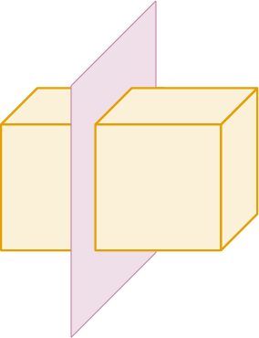

In our case, the vertical plane intersects the top and bottom faces in line segments and also intersects two vertical faces of the prism.

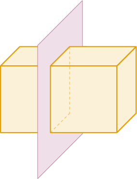

These four intersection segments meet at right angles to form a four-sided figure.

Therefore, the cross-section is a rectangle.

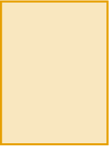

Let's see more examples.

### Example: Identifying the Cross Section of a Right Prism

#### Question

Determine the cross-section of the triangular prism by a vertical plane shown below.

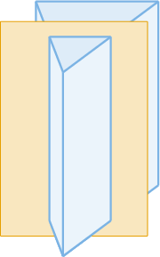

#### Explanation

A ** is the shape formed when a plane cuts through a three-dimensional solid.

In our case, the vertical plane intersects the top and bottom faces in line segments and also intersects two vertical faces of the prism.

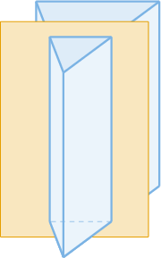

These four intersection segments meet at right angles to form a four-sided figure.

Therefore, the cross-section is a rectangle.

### Cross Sections of Pyramids

Now, consider pyramids. Let's determine the cross-section of the *rectangular* pyramid by a vertical plane shown below.

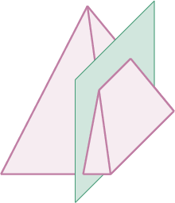

Recall that a *cross-section* is the shape formed when a plane cuts through a three-dimensional solid.

In our case, the vertical plane doesn't pass through the vertex and intersects four faces of the pyramid in segments.

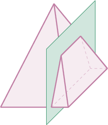

Only one pair of opposite segments is parallel, and these four intersection segments connect to form a four-sided figure.

Therefore, the cross-section is a trapezoid.

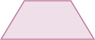

Let's see more examples.

### Example: Identifying the Cross Sections of a Pyramid

#### Question

Determine the cross-section of the ** pyramid by a horizontal plane shown below.

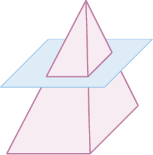

#### Explanation

A ** is the shape formed when a plane cuts through a three-dimensional solid.

In our case, the horizontal plane intersects the four slant faces of the pyramid in segments.

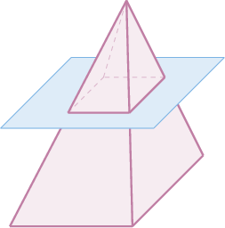

These four intersection segments meet at right angles to form a four-sided figure.

Therefore, the cross-section is a rectangle.

### Cross Sections of Spheres

Next, consider solids with non-flat surfaces, like spheres, cylinders, and cones.

For example, let's determine the cross-section of the sphere by a horizontal plane shown below.

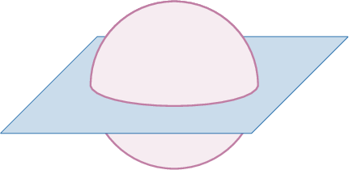

Recall that a *cross-section* is the shape formed when a plane cuts through a three-dimensional solid.

In our case, the horizontal plane intersects the sphere in a circle.

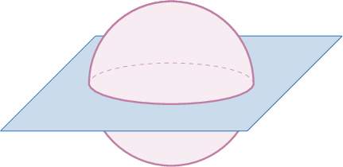

Therefore, the cross-section is a circle.

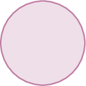

### Cross Sections of Cylinders

Finally, consider a vertical slice of a cylinder. Let's determine the cross-section of the cylinder by a vertical plane shown below.

Here, we assume the plane passes exactly through the central line of the cylinder.

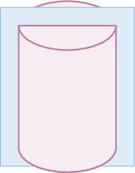

Recall that a *cross-section* is the shape formed when a plane cuts through a three-dimensional solid.

In our case, the vertical plane intersects the top and bottom faces in line segments and also intersects the lateral surface of the cylinder in two more segments.

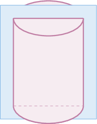

These four intersection segments meet at right angles to form a four-sided figure.

Therefore, the cross-section is a rectangle.

Let's see more examples.

### Example: Identifying Cross Sections of Spheres, Cylinders, and Cones

#### Question

Determine the cross-section of the cone by a horizontal plane shown below.

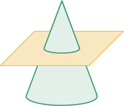

#### Explanation

A ** is the shape formed when a plane cuts through a three-dimensional solid.

In our case, the horizontal plane intersects the cone in a circle.

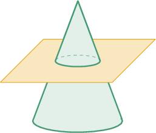

Therefore, the cross-section is a circle.
