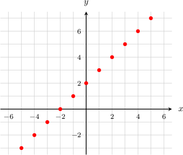
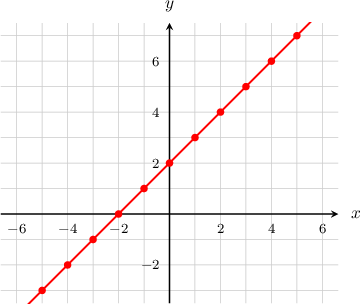
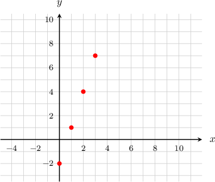
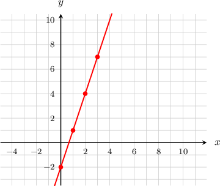
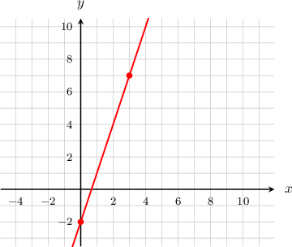
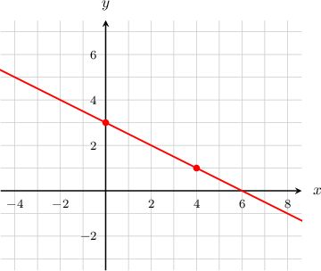
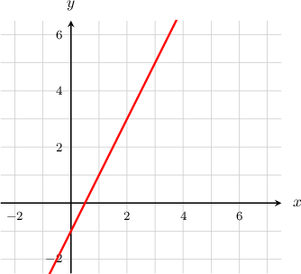
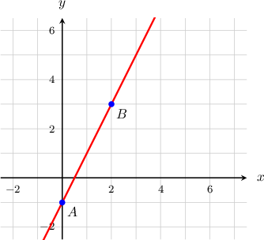
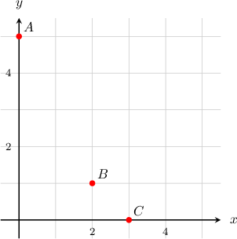

# Graphing Linear Equations

Source: https://www.mathacademy.com/topics/95?courseId=37
Topic ID: 95

## Prerequisites

- [Two-Variable Linear Equations and Their Solutions](./94-two-variable-linear-equations-and-their-solutions.md)

## Lesson

### Introduction

Suppose we want to **plot** the graph of $y = x + 2.$ We can do this by substituting some $x$-values into the equation, calculating the corresponding $y$-values, and plotting the $xy$-pairs.

We'll start by creating a table of values for $x$ and $y$, including a few values of $x$ to begin with.

Using our equation $y=x+2,$ we can calculate the corresponding values for $y.$ So for $x=-5,$ we have

$$

y = -5+2 = {\color{blue}{-3}},

$$

and we add this to our table:

We repeat this process to fill in the rest of the table:

Then, we plot these $(x,y)$ pairs on the $xy$-plane:

Finally, connecting the points gives us a **straight line**.

This is the graph of $y = x + 2.$

### Example: Plotting a Line Using a Table

#### Question

Use the table below to plot the graph of $y=3x-2.$

.equal-width td {width: 10px; text-align: center;}

#### Explanation

First, we fill the table. Given a value of $x,$ we can find the corresponding $y$ by substituting $x$ into the formula $y=3x-2.$ Therefore,

- if $x=0$ then $y=3(0)-2=-2,$

- if $x=1$ then $y=3(1)-2=1,$

- if $x=2$ then $y=3(2)-2=4,$ and

- if $x=3$ then $y=3(3)-2=7.$

.equal-width td {width: 10px; text-align: center;}

We plot these $(x,y)$ pairs on the $xy$-plane:

Finally, connecting the points gives us a straight line. This is the graph of $y=3x-2.$

### A Line Passing Through Two Points

The graph of a linear equation will *always* be a straight line! As we know, any straight line is defined by two points. Therefore, instead of plotting lots of points, we only need to plot two of them, and then we can draw a straight line through them.

For example, we previously encountered a line that passed through the points $(0,-2),$ $(1,1),$ $(2,4),$ and $(3,7).$ Its graph is shown below:

However, given only two points $(0, -2)$ and $(3, 7)$, we can still draw the same line through them:

### Example: Sketching a Line Using Two Points

#### Question

Sketch the graph of $y=-\dfrac{1}{2}x+3.$

#### Explanation

We need to find two distinct points that lie on our line. Any two points will do!

It is often easiest to pick one of the points to have an $x$-coordinate of $x=0.$ So, for the first point, we will let the $x$-coordinate be $x=0.$ Then the $y$-coordinate is

$$

\begin{aligned}𝑦 & =−\frac{1}{2}𝑥+3 \\ & =−\frac{1}{2}(0)+3 \\ & =0+3 \\ & =3.\end{aligned}

$$

So, the first point is $(0,3).$

For the second point, let's choose $x=4.$ Then the $y$-coordinate is

$$

\begin{aligned}𝑦 & =−\frac{1}{2}𝑥+3 \\ & =−\frac{1}{2}(4)+3 \\ & =−2+3 \\ & =1.\end{aligned}

$$

So, the second point is $(4,1).$

Finally, we plot those two points on the $xy$-plane and draw a line through them. This is the graph of $y=-\dfrac{1}{2}x+3.$

### Example: Identifying a Line Given a Graph

#### Question

Which of the following gives the graph of the straight line below?

1. $y=2x-1$

2. $y=\dfrac{1}{2}x-1$

3. $2x-y=1$

#### Explanation

Let's pick two distinct points on the line. For example, we can choose $A$ and $B$ with coordinates $(0,-1)$ and $(2,3)$, respectively.

Now, we substitute the coordinates of both points in our equations. If both points satisfy an equation, then we can conclude that the equation represents the line in the graph. Otherwise, if any point does ** satisfy the equation, then we can conclude that the equation does ** represent the line in the graph.

- Equation I: $y=2x-1.$ Substituting the coordinates of $A(0,-1)$ and $B(2,3),$ we obtain Therefore, $y=2x-1$ is an equation of the line in the graph.

- Equation II: $y=\dfrac{1}{2}x-1.$ Substituting the coordinates of $A(0,-1)$ and $B(2,3),$ we obtain Therefore, $y=\dfrac{1}{2}x-1$ is ** an equation of the line in the graph.

- Equation III: $2x-y=1.$ Substituting the coordinates of $A(0,-1)$ and $B(2,3),$ we obtain Therefore, $2x-y=1$ is an equation of the line in the graph.

Of the given equations, the only equations that represented the line in the graph were $y=2x-1$ and $2x-y=1,$ corresponding to answer choices I and III. Therefore, the correct answer is "I and III only."

### Example: Identifying Points That Lie on a Line

#### Question

Identify the points that lie on the line $y=5-2x.$

#### Explanation

The plotted points correspond to the $xy$-pairs $A(0,5), B(2,1)$ and $C(3,0).$

To check whether a point lies on the line, we substitute the coordinates of the point into the equation and determine whether the resulting statement is true.

- Substituting the point $A(0,5)$ results in a true statement: Therefore, the point $A$ does lie on the line:

- Substituting the point $B(2,1)$ results in a true statement: Therefore, the point $B$ does lie on the line:

- Substituting the point $C(3,0)$ results in a false statement: Therefore, only points $A$ and $B$ lie on the line.
