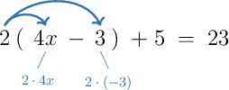

# Solving Linear Equations Using the Distributive Property

Source: https://www.mathacademy.com/topics/13763?courseId=39
Topic ID: 13763

## Prerequisites

- [Simplifying Linear Expressions Using the Distributive Law](../prealgebra/138-simplifying-linear-expressions-using-the-distributive-law.md)
- [Solving Multi-Step Linear Equations](./13762-solving-multi-step-linear-equations.md)

## Lesson

### Introduction

Parentheses can hide like terms that we need before we can solve an equation. The distributive property lets us rewrite a product outside parentheses by multiplying it by each term inside.

One way to picture the distributing step is to draw an arrow from the outside factor to each term inside the parentheses.

The arrows remind us that the outside factor multiplies *both* terms. For example, we can start solving by expanding first.

Now, the equation is a familiar multi-step equation.

**Watch out!** When a term inside the parentheses is negative, the sign stays with that term during distribution. That is why becomes not

### Example: Solving Linear Equations With Parentheses on One Side

#### Question

Find the value of that satisfies

#### Explanation

First, we expand the parentheses on the left-hand side of the equation using the distributive property:

Next, we collect like terms on the left-hand side:

Now, we isolate the variable term by adding to both sides:

Finally, we divide both sides of the equation by

### Solving Equations With Parentheses on Both Sides

When an equation has parentheses on both sides, we distribute on both sides before moving variable terms. After that, the equation becomes a variables-on-both-sides equation.

A useful plan is:

- Expand each set of parentheses.

- Combine like terms on each side if needed.

- Move all variable terms to one side and all constant terms to the other side.

- Divide by the coefficient of the variable.

Let's solve First, we expand both sides.

Since is larger than we can bring the variable terms to the right by subtracting from both sides.

Now, we isolate the variable.

Choosing the side with the larger variable coefficient is not required, but it often keeps the variable coefficient positive.

### Example: Solving Linear Equations With Parentheses on Both Sides

#### Question

Find the value of that satisfies

#### Explanation

First, we expand the parentheses on both sides:

Now, we must bring all variables to one side of the equation and all constants to the other side.

Notice that we have on the left-hand side and on the right-hand side. Since the variable on the left-hand side has a larger coefficient, let's bring all the variables to this side.

The first step is to remove the from the right-hand side of the equation. We do this by subtracting from both sides:

Next, we remove the from the left-hand side. We do this by adding to both sides:

Finally, we divide both sides of the equation by

### Clearing Fractions Before Distributing

Sometimes, an equation has fractional coefficients outside parentheses. **Clearing fractions** means multiplying both sides of an equation by a common multiple of the denominators so the next equation has no fractional coefficients.

For example, in the denominators are and A common multiple is so we multiply both sides by

Now, the equation is ready for distribution.

Then, we solve the variables-on-both-sides equation.

**Watch out!** When we clear fractions, we multiply the *entire* left side and the *entire* right side by the same number. That keeps the equation balanced.

### Example: Solving Linear Equations With Fractions Using the Distributive Property

#### Question

Find the value of that satisfies

#### Explanation

First, we clear the fractions by multiplying both sides of the equation by which is the least common multiple of the denominators and

Next, we expand the parentheses on both sides using the distributive property:

Now, we must bring all variable terms to one side of the equation and all constant terms to the other side.

Notice that we have on the left-hand side and on the right-hand side. Since the variable on the left-hand side has a larger coefficient, let's bring all the variables to this side.

The first step is to remove the from the right-hand side of the equation. We do this by subtracting from both sides:

Next, we remove the from the left-hand side. We do this by subtracting from both sides:

Therefore, the solution is
