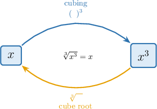
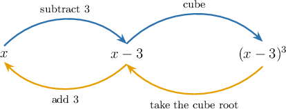

# Solving Equations Using Cube Roots

Source: https://www.mathacademy.com/topics/13765?courseId=39
Topic ID: 13765

## Prerequisites

- [Solving Two-Step Equations](../prealgebra/66-solving-two-step-equations.md)
- [Evaluating Expressions With Positive Integer Exponents](../prealgebra/121-evaluating-expressions-with-positive-integer-exponents.md)
- [The Cube Root of a Perfect Cube](./1819-the-cube-root-of-a-perfect-cube.md)

## Lesson

### Introduction

An equation like asks, "What number can be cubed to get " Since the solution is

A **cubed expression** is a quantity raised to the power such as or To solve equations with cubed expressions, we work backward from the cube.

For example, if we know that then we take the cube root of both sides:

Cube roots are especially helpful because positive and negative perfect cubes both have real cube roots. Since the exponent is odd, equations like and each have exactly one real solution.

Next, we will use this idea after first isolating the cubed expression.

### Cube Roots as Inverse Operations

**Inverse operations** undo each other. Cubing and taking the cube root are inverse operations because

So, once a cubed expression is isolated, taking the cube root of both sides lets us solve for the variable.

Let's solve First, we isolate the term by subtracting from both sides:

Now, we take the cube root of both sides:

Therefore, the solution is

### Example: Solving an Equation Using the Addition Principle and Cube Roots

#### Question

Solve

#### Explanation

First, we apply the addition principle, adding to both sides:

Second, we take the cube root of both sides to isolate

Therefore, the solution is

### Example: Solving an Equation Using the Multiplication Principle and Cube Roots

#### Question

Find the value of that satisfies

#### Explanation

First, we apply the multiplication principle, multiplying both sides by

Second, we take the cube root of both sides to isolate

### Using Two Inverse Operations

Sometimes the cubed term has both a constant added or subtracted and a number multiplying it. We still work backward, one operation at a time.

For an equation like we first undo the addition, then undo the multiplication, and then take a cube root:

Now, the cubed expression is isolated, so we take the cube root of both sides:

We can check quickly by substituting Since the solution is correct.

### Example: Solving an Equation Using the Addition and Multiplication Principles and Cube Roots

#### Question

Find the value of that satisfies

#### Explanation

To isolate, we first apply the addition principle, adding to both sides of the equation:

Next, we apply the multiplication principle, dividing both sides by

Finally, we take the cube root of both sides and solve for Since the exponent is odd, there is only one real solution to this equation:

Let's check the result by substituting it back into the original equation:

Since satisfies the original equation, we can be confident in our solution.

### Solving Equations With Shifted Cubes

A **shifted cube** has a whole expression inside the cube, such as The cube is applied after the shift, so we undo the cube first.

Let's solve First, we take the cube root of both sides:

Now, we solve the remaining one-step equation by adding to both sides:

Finally, we check in the original equation: So, the solution is

### Example: Solving an Equation Using Cube Roots

#### Question

Find the value of that satisfies

#### Explanation

We can solve this equation by taking the cube root of each side to undo the cube, and then isolating

First, we take the cube root of each side. Since we are taking a cube root, there is only one real solution to this equation:

Next, we isolate by subtracting from both sides:

Finally, we can check our solution by substituting back into the original equation:
