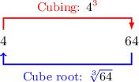
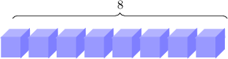
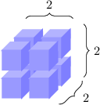

# The Cube Root of a Perfect Cube

Source: https://www.mathacademy.com/topics/1819?courseId=39
Topic ID: 1819

## Prerequisites

- [Cubing Rational Numbers](../prealgebra/2195-cubing-rational-numbers.md)
- [Squaring a Square Root](./3552-squaring-a-square-root.md)

## Lesson

### Introduction

Finding the **cube root** of a number is the reverse of cubing a number. We express the cube root using the **radical symbol** $\sqrt[3]{\phantom{x}}.$

For example, the "cube root of $8$" equals $\color{blue}2$ since

$$

{\color{blue}2}^3 = {\color{blue}2}\cdot {\color{blue}2}\cdot {\color{blue}2} = 8.

$$

So, we write $\sqrt[3]{8}={\color{blue}2}.$

Some basic cube roots are as follows:

$$

\begin{aligned}\sqrt[√0]{3} & = & \sqrt[√0^{3}]{3} & = & 0 \\ \sqrt[√1]{3} & = & \sqrt[√1^{3}]{3} & = & 1 \\ \sqrt[√8]{3} & = & \sqrt[√2^{3}]{3} & = & 2 \\ \sqrt[√27]{3} & = & \sqrt[√3^{3}]{3} & = & 3 \\ \sqrt[√64]{3} & = & \sqrt[√4^{3}]{3} & = & 4 \\ \sqrt[√125]{3} & = & \sqrt[√5^{3}]{3} & = & 5 \\ \sqrt[√1\,000]{3} & = & \sqrt[√10^{3}]{3} & = & 10\end{aligned}

$$

A **perfect cube** is a number whose cube root is a whole number. So, the numbers

$$

0,\qquad 1,\qquad 8,\qquad 27,\qquad 64,\qquad 125, \qquad 1\,000

$$

are all perfect cubes. You need to remember them.

### Example: Finding the Cube Root of a Cubed Integer

#### Question

What is $\sqrt[3]{9^3}?$

#### Explanation

Since the number under the cube root ($\sqrt[3]{\phantom{x}}$) is already written as a cube, we obtain the answer instantly:

$$

\sqrt[3]{9^3} = 9

$$

### Example: Finding the Cube Root of a Positive Perfect Cube

#### Question

Calculate the value of $\sqrt[3]{\dfrac{1}{64}}.$

#### Explanation

First, notice that the numbers $1$ and $64$ are both perfect cubes.

So, to determine the value of $\sqrt[3]{\dfrac{1}{64}},$ we express $\dfrac{1}{64}$ as a perfect cube:

$$

\begin{aligned}\sqrt[√\frac{1}{64}]{3} & = \\ \sqrt[√\frac{1^{3}}{4^{3}}]{3} & = \\ \sqrt[√\frac{1⋅1⋅1}{4⋅4⋅4}]{3} & = \\ \sqrt[√\frac{1}{4}⋅\frac{1}{4}⋅\frac{1}{4}]{3} & = \\ \sqrt[√(\frac{1}{4})^{3}]{3} & = \\ \frac{1}{4} & \end{aligned}

$$

### The Cube Root of a Negative Perfect Cube

Unlike the square root, it *is* possible to find the cube root of a negative number.

For example, $\sqrt[3]{-8}={\color{blue}{-2}}$ because

$$

-8 = ({\color{blue}{-2}})^3 = ({\color{blue}{-2}})\cdot ({\color{blue}{-2}})\cdot ({\color{blue}{-2}}).

$$

Some basic cube roots of negative numbers are as follows:

$$

\begin{aligned}\sqrt[√−1]{3} & = & \sqrt[√(−1)^{3}]{3} & = & −1 \\ \sqrt[√−8]{3} & = & \sqrt[√(−2)^{3}]{3} & = & −2 \\ \sqrt[√−27]{3} & = & \sqrt[√(−3)^{3}]{3} & = & −3 \\ \sqrt[√−64]{3} & = & \sqrt[√(−4)^{3}]{3} & = & −4 \\ \sqrt[√−125]{3} & = & \sqrt[√(−5)^{3}]{3} & = & −5 \\ \sqrt[√−1\,000]{3} & = & \sqrt[√(−10)^{3}]{3} & = & −10\end{aligned}

$$

Note that the numbers

$$

-1,\qquad -8,\qquad -27,\qquad -64,\qquad -125, \qquad -1\,000

$$

are all perfect cubes.

### Example: Finding the Cube Root of a Negative Perfect Cube

#### Question

Calculate $\sqrt[3]{-125}.$

#### Explanation

First, notice that the number $125$ is a perfect cube.

So, to determine the value of $\sqrt[3]{-125},$ we express $-125$ as a perfect cube:

$$

\begin{aligned}\sqrt[√−125]{3} & = \\ \sqrt[√(−5)⋅(−5)⋅(−5)]{3} & = \\ \sqrt[√(−5)^{3}]{3} & = \\ −5 & \end{aligned}

$$

### Cubing a Cube Root

Let's calculate $(\sqrt[3]{64})^3$ by performing each operation one step at a time:

$$

\left(\sqrt[3]{\color{blue}64}\right)^3 = \left(\sqrt[3]{{\color{red}4}^3}\right)^3 = {\color{red}4}^3 = {\color{blue}64}

$$

Notice that cubing the cube root gives the number under the cube root:

$$

\left( \sqrt[3]{64} \right)^3 = 64

$$

This result holds in general. If $\color{blue}\square$ is any number, then

$$

\left(\sqrt[3]{\color{blue}\square}\right)^3 = {\color{blue}\square}.

$$

The cube and the cube root cancel each other out, and we're left with the number that we started with.

### Example: Finding the Cube of the Cube Root of a Positive or Negative Number

#### Question

Find the value of $(\sqrt[3]{216})^3.$

#### Explanation

The cube and the cube root cancel each other out. So, we have

$$

(\sqrt[3]{216})^3 = 216.

$$

### A Geometric Approach to the Cube Root

We can think of the cube root geometrically. For instance, let's represent the number $8$ by a collection of eight items:

Now, we can pile them up in the form of a cube where each side is equal to $\sqrt[3]{8}={\color{blue}2}\mathbin{:}$

