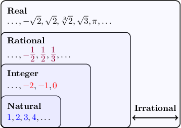
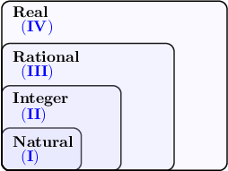

# The Real Number System

Source: https://www.mathacademy.com/topics/2205?courseId=39
Topic ID: 2205

## Prerequisites

- [Surds](./2204-surds.md)
- [Rational Numbers as Finite or Repeating Decimals](./7011-rational-numbers-as-finite-or-repeating-decimals.md)

## Lesson

### Introduction

Every number that can be represented by a point on a number line is called a **real number.**

The **irrational numbers** are numbers that are real but not rational. Irrational numbers cannot be expressed as a ratio of two integers. These include all of the surds, such as

$$

-\sqrt 2, \quad \sqrt 2, \quad \sqrt[3]{2}, \quad \sqrt 3.

$$

Irrational numbers aren't restricted to surds. The most famous example of an irrational number that is not a surd is $\pi$ (pronounced "pie"). The first few digits of $\pi$ are

$$

\pi = 3.141\,592\,653\, \ldots\,.

$$

Any decimal that is not a repeating or terminating decimal is irrational.

We can represent all real numbers using an inclusion diagram, like the one below.

It's important to realize that irrational numbers are *not* contained within the rational numbers or vice-versa. But together, they make up the **real number system**.

Some numbers are not real numbers. For example, we say that $\sqrt{-2}$ is *not a real number* because there is no real number whose square is $-2.$

### Example: Classifying Decimals as Irrational

#### Question

Which of the following is an irrational number?

$$

4, \qquad 3.1415926 \ldots, \qquad \dfrac{5}{13}, \qquad 1.27, \qquad 5.7232323 \ldots

$$

#### Explanation

An irrational number is a number that cannot be written as the ratio of two integers.

With that in mind, let's examine each of our numbers.

- $4$ is a ** number. It can be written as $\dfrac{4}{1}.$

- $3.1415926 \ldots$ is an irrational number. The digits after the decimal point in $3.1415926 \ldots$ extend forever, but there is no regular pattern.

- $\dfrac{5}{13}$ is a ** number.

- $1.27$ is a ** number since it is a terminating decimal.

- $5.7232323\ldots$ extends forever but has a repeating pattern ($23$ repeats forever). Therefore, it's a ** number.

Therefore, of the given choices, only $3.1415926$ is an irrational number.

### Example: Classifying Irrational and Real Numbers

#### Question

Which of the following numbers are irrational?

1. $\sqrt 3$

2. $\dfrac32$

3. $-\dfrac{\sqrt2} 2$

#### Explanation

First, recall the following:

- A rational number is any number that can be written as the ratio of two integers.

- Any real number is irrational if it is not rational.

Now, let's go through each number in turn.

- $\sqrt 3$ is an irrational number. It cannot be expressed as the ratio of two integers.

- $\dfrac32$ is not an irrational number. It is a rational number.

- $-\dfrac{\sqrt2}2$ is an irrational number. It cannot be expressed as the ratio of two integers.

Therefore, the correct answer is "I and III only."

### Example: Placing a Real Number on a Diagram

#### Question

In which section should the number $-\sqrt{15}$ be placed in the diagram above?

#### Explanation

Let's go through each category from top to bottom:

- $-\sqrt{15}$ is a real number $\quad{\color{green}\checkmark}$

- $-\sqrt{15}$ is not a rational number $\quad{\color{red}\times}$

- $-\sqrt{15}$ is not an integer $\quad{\color{red}\times}$

- $-\sqrt{15}$ is not a natural number $\quad{\color{red}\times}$

Therefore, the correct section of the diagram is IV (the real numbers).
