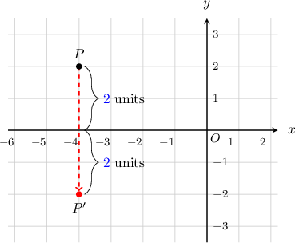
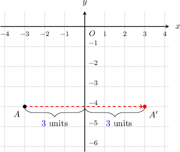
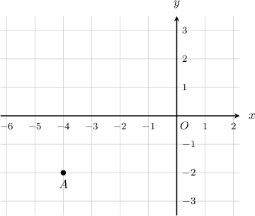
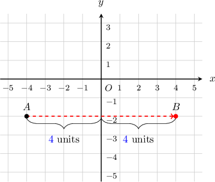
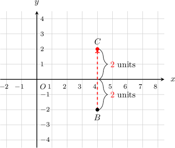
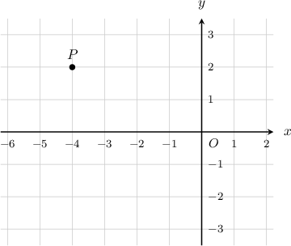
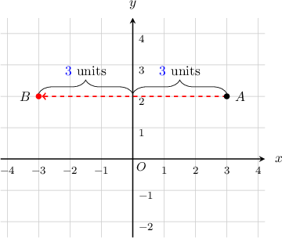
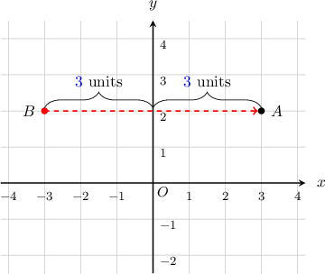
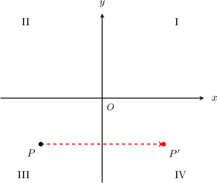

# Reflections of Points in the Coordinate Plane

Source: https://www.mathacademy.com/topics/2461?courseId=39
Topic ID: 2461

## Prerequisites

- [The Cartesian Coordinate System](../prealgebra/92-the-cartesian-coordinate-system.md)

## Lesson

### Introduction

Imagine that the $x$-axis below is a mirror. What would be the coordinates of the point $P(-4,{\color{blue}2})$ after it's reflected in the $x$-axis mirror?

To reflect a point in an axis, we can use the following two steps:

1. First, move the point onto the mirror axis.

2. Then, move the same distance again on the other side of the axis.

The point $P$ has coordinates $(-4,{\color{blue}{2}}).$ So, to reflect $P$ in the $x$-axis, we

- move it ${\color{blue}{2}}$ units down to reach the $x$-axis, and then

- move it ${\color{blue}{2}}$ units down again on the other side of the axis.

The resulting point $P'$ has coordinates $(-4,{\color{blue}{-2}}).$

### Example: Finding the Coordinates of a Point After Reflecting

#### Question

The point $A(-3,-4)$ is reflected in the $y$-axis. What are the coordinates of the resulting point?

#### Explanation

The point $A$ has coordinates $(-{\color{blue}{3}},-4).$ So, to reflect $A$ in the $y$-axis, we

- move it ${\color{blue}{3}}$ units right to reach the $y$-axis, and then

- move it ${\color{blue}{3}}$ units right again on the other side of the axis.

The resulting point $A'$ has coordinates $({\color{blue}{3}},-4).$

### Example: Finding the Coordinates of a Point After Reflecting Twice

#### Question

The point $A$ is reflected in $y$-axis to make a new point $B.$ The point $B$ is then reflected in the $x$-axis to make a new point $C.$ What are the coordinates of $C?$

#### Explanation

The point $A$ has coordinates $(-{\color{blue}{4}},-{\color{red}{2}}).$

To reflect the point $A$ in the $y$-axis, we move it ${\color{blue}{4}}$ units right, and then ${\color{blue}{4}}$ units right again.

The resulting point $B$ has coordinates $({\color{blue}{4}},-{\color{red}{2}}).$

Then, we reflect point $B({\color{blue}{4}},-{\color{red}{2}})$ in the $x$-axis. To reflect the point $B$ in the $x$-axis, we move it ${\color{red}{2}}$ units up, and then ${\color{red}{2}}$ units up again.

The resulting point $C$ has coordinates $({\color{blue}{4}},{\color{red}{2}}).$

### Reflecting Points by Changing the Sign of the Other Coordinate

You may have noticed that when we reflect a point in an axis, the corresponding coordinate remains the same, while the sign of the other coordinate is changed.

In general, changing the sign of the other coordinate is a quicker method of reflecting points! To illustrate, consider the point $P$ from before.

To reflect $P$ in the $x$-axis, we can simply change the sign of the $y$-coordinate. This gives

$$

(-4,{\color{blue}{2}})\longrightarrow (-4,-{\color{blue}{2}}).

$$

Alternatively, to reflect $P$ in the $y$-axis, we can simply change the sign of the $x$-coordinate. We get

$$

({\color{red}-4},2)\longrightarrow ({\color{red}4},2).

$$

### Example: Finding the Coordinates of a Point After Reflecting In the Same Axis Twice

#### Question

The point $A(3,2)$ is reflected in the $y$-axis to make a new point $B.$ The point $B$ is then reflected in the $y$-axis. What are the coordinates of the final point?

#### Explanation

The point $A$ has coordinates $({\color{blue}{3}}, 2).$

****

To reflect the point $A$ in the $y$-axis, we move it ${\color{blue}{3}}$ units left, and then ${\color{blue}{3}}$ units left again.

The resulting point $B$ has coordinates $(-{\color{blue}{3}}, 2).$

To reflect the resulting point $B$ in the $y$-axis, we move it ${\color{blue}{3}}$ units right, and then ${\color{blue}{3}}$ units right again.

Note that after the double reflection in the $y$-axis, we return to the initial point $A.$ It has coordinates $({\color{blue}{3}}, 2).$

****

To reflect $A$ point in the $y$-axis, we change the sign of its $x$-coordinate:

$$

({\color{blue}{3}} , 2) \longrightarrow (-{\color{blue}{3}} , 2)

$$

To reflect reflect the resulting point in the $y$-axis again, we again change the sign of its $x$-coordinate:

$$

(-{\color{blue}{3}} , 2) \longrightarrow ({\color{blue}{3}} , 2)

$$

After the double reflection in the $y$-axis, we return to the initial point $A({\color{blue}{3}}, 2).$

### Example: Locating the Quadrant of a Reflected Point

#### Question

The point $P$ is initially in the third quadrant. Then, it is reflected in the $y$-axis. In which quadrant does the resulting point lie?

#### Explanation

To reflect the point $P$ in the $y$-axis, we move it right to the $y$-axis, and then the same distance right again. We see that the resulting point is in the fourth quadrant.

