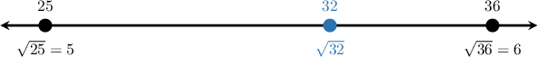
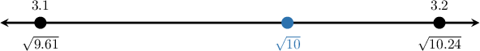
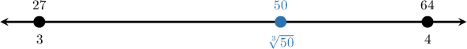
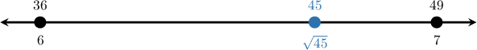

# Approximating Square Roots and Cube Roots

Source: https://www.mathacademy.com/topics/492?courseId=39
Topic ID: 492

## Prerequisites

- [The Cube Root of a Perfect Cube](./1819-the-cube-root-of-a-perfect-cube.md)
- [Subtraction With Unequal Numbers of Decimals](../grade-5/2340-subtraction-with-unequal-numbers-of-decimals.md)
- [Evaluating Exponents With Decimal Bases](../grade-5/2477-evaluating-exponents-with-decimal-bases.md)

## Lesson

### Introduction

Some roots are perfect. For example, and Other roots are not whole numbers, but we can still describe where they belong.

An **approximation** is a nearby value that helps us understand the size of a number. To approximate roots, we compare the number under the radical to nearby perfect powers.

For a square root, we compare to perfect squares. Since we know

For a cube root, we compare to perfect cubes. Since we know

So, the main idea is to find familiar benchmark roots first. Once we know the root’s whole-number interval, we can order roots, refine to decimal intervals, and choose reasonable estimates.

### Finding Whole-Number Bounds for Roots

**Bounds** are values that trap a number between a lower value and an upper value. For roots, **whole-number bounds** are consecutive whole numbers that the root lies between.

To find whole-number bounds, we compare the number under the radical to nearby perfect squares or perfect cubes.

Let's locate The nearby perfect squares are and because

Since is between these perfect squares, we have

Taking the square root of each part gives

So, lies between the consecutive whole numbers and The same idea works for cube roots, except we compare to nearby perfect cubes instead.

### Example: Identifying a Unit Interval for a Root of an Integer

#### Question

Between which two consecutive whole numbers does lie?

#### Explanation

To find which two consecutive whole numbers lies between, we can compare to nearby perfect cubes.

- The closest perfect cube less than is since

- The closest perfect cube greater than is since

This means is between and

Taking the cube root of each part of the inequality gives

Therefore, lies between and

### Ordering Irrational Roots

When we order irrational roots, we can often compare their whole-number intervals first. A root between and is greater than any root between and

Suppose we want to identify the greatest number in this list:

We first bracket each root.

- lies between and since

- lies between and since

- lies between and since

- lies between and since

- lies between and since

The greatest value must be one of the roots between and so it is either or Since we know

Therefore, the greatest number is

**Watch out!** We can compare radicands directly only when the roots are the same kind. For example, comparing and is safe because both are square roots.

### Example: Ordering a Set of Irrational Numbers

#### Question

Which of the following irrational numbers is the greatest?

#### Explanation

To identify the greatest irrational number, we can find the consecutive whole numbers between which each root lies.

- lies between and since and

- lies between and since and

- lies between and since and

- lies between and since and

- lies between and since and

Comparing these bounds, the greatest number must be between and So, it is either or

Since we know that

Therefore, is the greatest number among the given options.

### Finding Decimal Bounds for Roots

**Decimal bounds** are nearby decimal values that trap a root in a smaller interval, such as between two consecutive tenths.

Let's find the two consecutive tenths between which lies. First, we find the whole-number bounds: so

Now, we test tenths between and by squaring them. Since is close to we can test and

Since falls between these square values, we have

Taking square roots gives

Therefore, lies between the consecutive tenths and

### Example: Identifying a Decimal Interval for a Root of an Integer

#### Question

Between which two consecutive tenths does lie?

#### Explanation

To find the two consecutive tenths between which lies, we need to find two numbers with one decimal place whose cubes bracket.

First, let's establish between which two consecutive integers lies. We know that and. Since, we know that.

Next, we can test decimals between and to narrow down the interval:

Since, we can write:

Taking the cube root of each part of the inequality gives:

Therefore, lies between and.

### Estimating Roots

When we **estimate** a root, we choose one nearby decimal value and check that it is reasonable. Bounds tell us the interval; the estimate tells us which value in that interval is closest.

Let's estimate rounded to decimal place. First, we find nearby perfect cubes: so

Because is closer to than to we expect to be closer to than to Now, we test nearby tenths:

So, To decide which tenth is the better estimate, compare distances from

Since is closer to the root is closer to Therefore,

### Example: Estimating a Root of an Integer

#### Question

Estimate the value of rounded to decimal place.

#### Explanation

To estimate we first find the two perfect squares closest to

The closest perfect squares are and

Since we know that the square root of lies between and

Since lies between and we expect to lie between and

Let's test decimals near the middle by squaring them:

We can see that lies between and so

Next, we determine which value is closer to

- The distance from to is

- The distance from to is

Since is much closer to is closer to

Therefore, rounded to decimal place,
