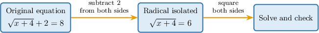
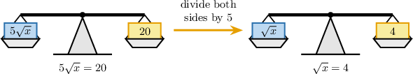
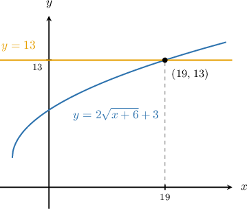
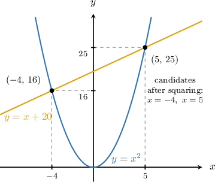

# Solving Radical Equations With Square Roots

Source: https://www.mathacademy.com/topics/590?courseId=39
Topic ID: 590

## Prerequisites

- [Solving Two-Step Equations](../prealgebra/66-solving-two-step-equations.md)
- [Evaluating Numerical Expressions Containing Radicals](./589-evaluating-numerical-expressions-containing-radicals.md)

## Lesson

### Introduction

We can already evaluate square roots like Now, we use that idea inside equations where the unknown is under a square root.

A **radical equation** is an equation that contains a square root expression with a variable inside it. The square root part, such as is the radical expression.

A good first goal is to get the square root by itself. For example, in the square root is not isolated yet because is added outside the radical.

To isolate the radical, we undo the outside addition by subtracting from both sides.

Once the square root is isolated, the next move is to remove the square root without changing the balance of the equation.

### The Squaring Method

The **squaring method** means we isolate the square root, square both sides to remove it, solve the resulting equation, and then check the candidate in the original equation.

Let's solve First, we isolate the radical by adding to both sides.

Now, we square both sides. Squaring a square root returns the expression inside the radical.

Then, we solve the resulting equation.

**Watch out!** Squaring both sides can create an **extraneous solution**, which is a candidate value that solves the new equation but not the original equation. So, we check in the starting equation.

The check succeeds, so is a valid solution.

### Example: Solving an Equation Using the Addition Principle and Squaring

#### Question

Find the value of that satisfies

#### Explanation

We solve the equation by isolating the radical, squaring both sides, and checking the candidate solution.

First, we apply the addition principle, subtracting from both sides to isolate the square root:

Next, we square both sides of the equation to remove the square root. Since the number in the square root is non-negative, the square and the square root cancel each other out:

Now, we apply the addition principle again, subtracting from both sides:

Finally, we must check this candidate value in the original equation to ensure it is valid:

The value satisfies the original equation. Therefore,

### Isolating the Radical Using Multiplication and Division

Sometimes, the square root is attached to a number by multiplication or division. We still isolate the radical first, using the opposite operation.

- If the equation has divide both sides by

- If the equation has multiply both sides by

For example, suppose we want to solve Dividing both sides by keeps the equation balanced and leaves the square root alone.

We isolate the radical first.

Now, we square both sides and check.

Substituting back gives so satisfies the original equation.

The same pattern works when the radical is divided by a number: multiply first to isolate the square root, then square both sides.

### Example: Solving an Equation Using the Multiplication Principle and Squaring

#### Question

Find the value of that satisfies

#### Explanation

First, we isolate the square root by applying the multiplication principle. We multiply both sides of the equation by

Next, we square both sides to remove the square root:

Remember that squaring both sides of an equation can introduce extraneous solutions, so we must always check our result in the original equation. Substituting back into the original equation, we get:

Since this is a true statement, the value satisfies the original equation.

Therefore, the solution is

### Combining Addition and Multiplication to Isolate the Radical

When an equation has both an outside constant and a coefficient on the radical, we undo the outside operations in reverse order.

For the radical part is multiplied by and then is added. So, we first subtract then divide by

Now that the radical is isolated, we square both sides.

Then, we solve for

Finally, we check the candidate in the original equation.

So, is a valid solution.

### Example: Solving an Equation Using the Addition and Multiplication Principles and Squaring

#### Question

Find the value of that satisfies

#### Explanation

To find the value of we need to solve the equation We start by isolating the square root expression on one side.

First, we subtract from both sides of the equation:

Next, we divide both sides by

Now that the radical is isolated, we square both sides to remove the square root:

To solve for we subtract from both sides:

Finally, we check our candidate solution by substituting back into the original equation:

Since this yields a true statement, the value satisfies the original equation.

Therefore,

### Solving Radical Equations That Lead to Quadratics

Sometimes, squaring both sides creates a **quadratic equation**, which is an equation that includes a squared variable such as This can happen when the isolated square root is equal to an expression containing

For example, in the radical is already isolated. Squaring both sides gives

The squared equation can have more than one candidate solution.

We rearrange and factor the quadratic equation.

So, the candidates are and We must check both in the original equation.

For we get so works.

For we get but So, is extraneous.

Therefore, the only valid solution is

### Example: Solving Equations Using the Squaring Method

#### Question

Find the value of that satisfies keeping only the value that satisfies the original equation.

#### Explanation

To solve the equation we square both sides. This allows us to get rid of the radical and gives us a quadratic equation that is easier to solve:

Remember that when solving square root equations, we should always check the obtained values to ensure that they are actually solutions of the original equation.

- First, we check whether the obtained value is a solution of the original equation:

Indeed, the value satisfies the original equation.

- Second, we check whether the obtained value is a solution of the original equation:

The value does ** satisfy the original equation, so we discard it.

Therefore, the only value that satisfies the original equation is
