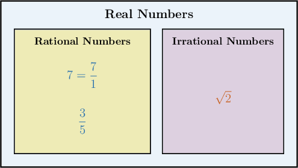

# Classifying Square Roots and Cube Roots as Rational or Irrational

Source: https://www.mathacademy.com/topics/7890?courseId=39
Topic ID: 7890

## Prerequisites

- [The Real Number System](./2205-the-real-number-system.md)
- [Evaluating Exponents With Fractional Bases](../grade-5/2476-evaluating-exponents-with-fractional-bases.md)

## Lesson

### Introduction

Some roots simplify to exact fractions or integers, while others do not. The key is not whether the decimal looks long; the key is whether the value can be written exactly as a ratio of integers.

A **rational number** is any number that can be written exactly as a ratio of two integers, with a nonzero denominator. For example, and are rational.

An **irrational number** cannot be written as a ratio of two integers. Some square roots and cube roots are irrational because the radical cannot be removed exactly.

So, our classification question will usually sound like this: can the root become an integer or fraction with no radical left?

- If the root simplifies to an integer or a fraction, it is rational.

- If the root cannot be written exactly as a ratio of integers, it is irrational.

**Watch out!** A decimal approximation does not decide the classification. For example, but that approximation is not the exact value of

### Classifying Square Roots of Whole Numbers

For square roots of whole numbers, we check whether the number under the radical is a perfect square.

A whole number is a perfect square when it equals for some integer In that case, the square root is an exact integer, so it is rational.

Let's classify two square roots.

First, is a perfect square because So, Since is rational.

Now, consider We compare to nearby perfect squares:

Since lies between and it is not a perfect square. Because is not a perfect square, is irrational.

So, for a whole number the square root is rational exactly when is a perfect square.

### Example: Classifying Square Roots of Whole Numbers as Rational or Irrational

#### Question

Which of the following square roots are irrational?

#### Explanation

Recall the definitions of rational and irrational numbers:

- A rational number is any number that can be written exactly as a ratio of two integers.

- An irrational number is a number that cannot be written as a ratio of two integers.

When we take the square root of a positive whole number, the result is rational only if the whole number is a perfect square (such as and so on). If the whole number is not a perfect square, its square root is an irrational number.

With that in mind, let's examine each of our square roots.

- is a rational number. Since is a perfect square (), we can simplify the square root to an integer: Since can be written as the ratio it is rational, not irrational.

- is an irrational number. The number is not a perfect square (it lies between and). Because it is not a perfect square, its square root is irrational.

- is an irrational number. The number is not a perfect square (it lies between and). Because it is not a perfect square, its square root is irrational.

Therefore, the correct answer is "II and III only."

### Classifying Cube Roots of Whole Numbers

Cube roots use the same idea, but now we check for perfect cubes instead of perfect squares.

A whole number is a perfect cube when it equals for some integer In that case, the cube root is an exact integer, so it is rational.

For example, is a perfect cube because Therefore, Since is rational.

For a non-perfect cube, compare with nearby perfect cubes. For we notice that

Since lies between and it is not a perfect cube. So, is irrational.

When we need to justify that a cube root is rational, we can show three things: the number is a perfect cube, the cube root is an exact integer, and that integer can be written as a ratio of integers.

### Example: Classifying Cube Roots of Whole Numbers as Rational or Irrational

#### Question

Which of the following cube roots are rational?

#### Explanation

A rational number is a number that can be written as the ratio of two integers.

The cube root of a whole number is rational if the number is a perfect cube. If it is not a perfect cube, its cube root is an irrational number (a surd).

With that in mind, let's look at each number in turn.

- is a rational number. Since is a perfect cube, we can evaluate the cube root to obtain an exact integer: This value, is a rational number since it can be written as

- is an irrational number. The number is not a perfect cube (it lies between and). Thus, cannot be evaluated to an exact integer or fraction.

- is a rational number. Since is a perfect cube, we can evaluate the cube root to obtain an exact integer: This value, is a rational number since it can be written as

Therefore, the correct answer is "I and III only".

### Classifying Roots of Fractions

For roots of fractions, we check the numerator and denominator separately.

A square root of a fraction is rational when both the numerator and denominator are perfect squares. A cube root of a fraction is rational when both the numerator and denominator are perfect cubes.

For example, both and are perfect squares because and So,

This root is rational because it equals a ratio of integers.

Now, consider The denominator is a perfect square because but the numerator is not a perfect square. Since both parts are not perfect squares, is irrational.

For cube roots, the same check uses perfect cubes. Since and we get so that cube root is rational.

### Example: Classifying Roots of Fractions as Rational or Irrational

#### Question

Which of the following roots of fractions are irrational?

#### Explanation

A rational number is a number that can be written exactly as the ratio of two integers. An irrational number cannot be written as the ratio of two integers.

To determine whether the square root or cube root of a fraction is rational or irrational, we check whether both the numerator and the denominator are perfect squares or perfect cubes. If they are, we can get rid of the radical symbol and obtain a regular fraction.

Let's examine each candidate in turn.

- Root I is Notice that both and are perfect squares, where and So, we can get rid of the square root symbol and obtain a regular fraction: Because it can be written exactly as the ratio of two integers, is a rational number.

- Root II is The denominator is a perfect square (), but the numerator is ** a perfect square. Thus, we cannot get rid of the square root symbol to obtain a regular fraction. Because it cannot be written exactly as the ratio of two integers, is an irrational number.

- Root III is Notice that both and are perfect cubes, where and So, we can get rid of the cube root symbol and obtain a regular fraction: Because it can be written exactly as the ratio of two integers, is a rational number.

Therefore, the correct answer is "II only."
