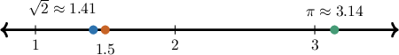
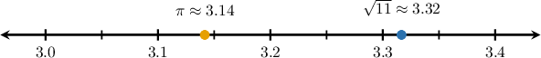
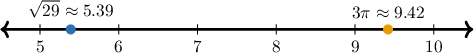
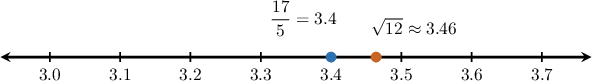
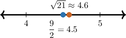
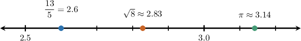
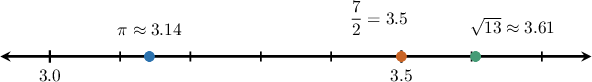

# Comparing and Ordering Real Numbers

Source: https://www.mathacademy.com/topics/7893?courseId=39
Topic ID: 7893

## Prerequisites

- [Approximating Square Roots and Cube Roots](./492-approximating-square-roots-and-cube-roots.md)
- [Ordering Rational Numbers](../grade-6/6744-ordering-rational-numbers.md)
- [Rational Numbers as Finite or Repeating Decimals](./7011-rational-numbers-as-finite-or-repeating-decimals.md)

## Lesson

### Introduction

Every real number has a position on the number line. When we compare two real numbers, the number farther to the right is greater.

Sometimes the same value can be written in different ways. For example, is an exact form, while is a decimal approximation of that value. The exact form keeps the value precise, and the decimal form helps us place it by size.

A useful comparison plan is:

- Keep exact forms when the size is already clear.

- Use decimal approximations when exact forms are hard to compare directly.

- Compare the decimal values from left to right, then state the answer using the original forms.

This is especially helpful when square roots, fractions, decimals, and appear together.

### Using Decimal Approximations to Compare Irrational Numbers

A **decimal approximation** is a decimal value close enough to an exact number to help us compare or locate it.

Let's compare and We already know the common approximation

To estimate we compare to nearby squares. Since and we know is between and Testing decimals closer to we get and

So, is a little greater than and very close to That is enough to compare it with

Since we know

The key is to approximate only as much as the comparison requires.

### Example: Comparing Two Irrational Numbers Using Approximations

#### Question

Using decimal approximations, which is the larger of and

#### Explanation

To compare these two numbers, we evaluate their decimal approximations.

First, let's find a decimal approximation for. Using, we have:

Next, let's approximate. We know that and, so is between and. Let's test decimal values close to by squaring them:

Since is between and, we know that is between and. This confirms the approximation.

Now we can compare the two approximations on a number line:

Since, it must be true that.

Therefore, is the larger number, since and.

### Comparing Rational and Irrational Numbers

When we compare a rational number with an irrational number, we want both values in a form that can be compared directly.

Let's compare and First, write the fraction as a decimal:

Now, compare with For positive numbers, larger numbers have larger square roots. So, we can square and compare it with

Since we know

But so

Therefore, so is greater.

### Example: Comparing Rational and Irrational Numbers

#### Question

Which is greater, or

#### Explanation

To compare and, we can write both numbers in the same form.

First, let's write the fraction as a decimal:

Next, we can estimate the value of by comparing it to perfect squares. We know that and, so is between and.

To get a more precise estimate, we can square:

Since, we know that.

This means that, which is equivalent to.

Therefore, we can conclude that is greater.

### Ordering Real Numbers

Ordering a list means comparing all the values at once, then writing the original numbers in the requested direction.

Let's order and from least to greatest.

First, write or estimate each value in decimal form. The fraction is

For we use nearby squares. Since and is between and Testing tenths gives and

So, is between and Also,

Comparing the decimal values gives

Changing back to the original forms, the order from least to greatest is

### Example: Ordering a List of Real Numbers

#### Question

List and in order from least to greatest.

#### Explanation

To order the numbers from least to greatest, we can estimate their values and write them all as decimals.

First, we write the fraction as a decimal:

Next, we approximate Since is between the perfect squares and is between and To be more precise, we can test decimals between and

Since is between and we know that is between and

Finally, we use the approximate decimal value of

Now, we can plot these values on a number line to compare them.

Comparing the decimal values from left to right, we have:

Changing each decimal back to its original form gives:

Therefore, the correct list from least to greatest is
