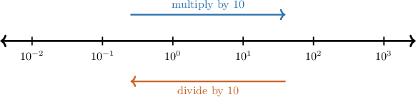

# Estimating and Comparing Real-World Quantities Using Scientific Notation

Source: https://www.mathacademy.com/topics/7895?courseId=39
Topic ID: 7895

## Prerequisites

- [Comparing Numbers in Scientific Notation](./90-comparing-numbers-in-scientific-notation.md)
- [Dividing Numbers in Scientific Notation](./1138-dividing-numbers-in-scientific-notation.md)

## Lesson

### Introduction

Real-world quantities can be extremely large, like the distance from Earth to the Sun, or extremely small, like the width of a grain of sand. Scientific notation helps us describe those sizes without writing long strings of zeros.

An **estimate** is a reasonable value that is close enough for the situation. For example, if a tiny object is about half a millimeter wide, we can write half a millimeter as In scientific notation, that becomes

The number tells us the main digit size, and the power tells us that the value is less than

This lesson focuses on using that power of to judge magnitude. We will estimate quantities, decide which quantities are larger, and explain comparisons like "about times as large" by dividing one scientific-notation quantity by another.

### Scientific Notation and Powers of Ten

A number in scientific notation has the form where and is an integer. The **leading factor** is the number and the exponent gives the **power-of-ten scale**.

Each step to the right on the scale multiplies by Each step to the left divides by So, positive exponents represent large quantities, and negative exponents represent quantities less than

Let's write in scientific notation. First, place the decimal point after the first nonzero digit, giving Then count how many places the decimal point must move to recover

The decimal point moves spaces to the right, so

For a small decimal, the decimal point moves left. For example,

**Watch out!** The leading factor must be at least and less than So, is not written in scientific notation because

### Example: Estimating a Real-World Quantity Using Scientific Notation

#### Question

The wavelength of a certain radio wave is roughly a quarter of a meter. Find the most reasonable estimate of this wavelength in scientific notation, in

#### Explanation

First, we write the wavelength "a quarter of a meter" as a decimal in standard notation:

To write a number in scientific notation, we need to express it in the form

where and is an integer.

To find we place the decimal point directly after the first non-zero digit. In this case, we have the following:

To find we take the number that we just found and count the number of spaces we need to move the decimal point to retrieve the original number.

We can see that the decimal point must move space to the **, so

Finally, our number can be expressed in scientific notation as

Therefore, the most reasonable estimate of the wavelength is

### Comparing Numbers in Scientific Notation

When numbers are written in scientific notation, the power of usually tells us which number is larger before we do any detailed calculation.

Use this comparison strategy.

- First, compare the exponents. The number with the greater exponent has the greater power-of-ten scale.

- If the exponents are the same, compare the leading factors.

For example, suppose four microscopic organisms have lengths

The greatest exponent is because is greater than and So, the largest length must be one of the two numbers with

Now, compare the leading factors:

Therefore, so the organism with length is the longest.

For negative exponents, "greater" still means farther to the right on the number line. Since is closer to than a number on the scale is larger than a number on the scale when the leading factors are between and

### Example: Comparing Two Real-World Quantities Using Scientific Notation

#### Question

Four stars have the following masses in kilograms: and Determine which star is the most massive.

#### Explanation

To find the most massive star, we need to identify the greatest mass among the given numbers:

When comparing numbers in scientific notation, we first compare their powers of ten. The number with the greatest power of ten is the largest.

Notice that our numbers contain different powers of ten:

- contains the th power of ten.

- contains the st power of ten.

- contains the th power of ten.

- contains the th power of ten.

Since is the greatest exponent, the number with this power of ten is the largest.

Therefore, the star with mass is the most massive.

### Finding How Many Times as Large

A **multiplicative comparison** tells us how many times as large one quantity is as another. To find it, we divide the larger quantity by the smaller quantity.

For scientific notation, we can divide the leading factors and the powers of separately. If and are leading factors, then

Suppose a distance to a satellite is about and a flight route is about To estimate how many times as far the satellite is, we divide:

For an estimate, use nearby numbers that are easy to divide:

For the powers of subtract the exponents:

Putting the parts together gives

Therefore, the satellite is about times as far away as the flight route is long. This is reasonable because the power-of-ten part contributes a factor of and the leading-factor quotient is less than

### Example: Expressing How Many Times as Much One Quantity Is Than Another

#### Question

A data center stores about bytes of information and a laptop stores about bytes. How many times as much information does the data center store as the laptop?

#### Explanation

First, we want to find how many times as much information the data center stores as the laptop. This means we need to divide the data center's storage by the laptop's storage:

To divide two numbers in scientific notation, we separate the decimal parts from the powers of and divide them separately:

Next, we evaluate each part:

- For the decimal part, we have

- For the powers of we use the quotient rule for exponents and subtract the exponents:

Putting this together, we have:

Therefore, the data center stores times as much information as the laptop.
