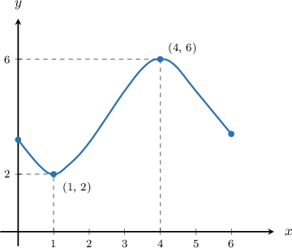
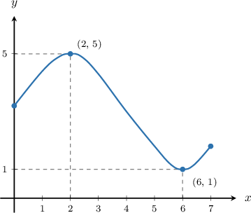
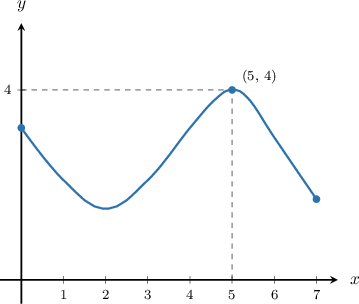
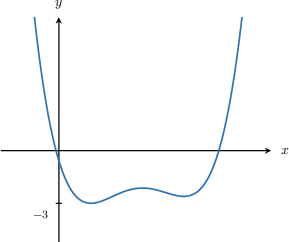
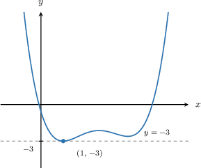
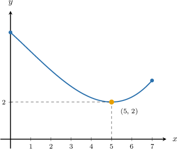
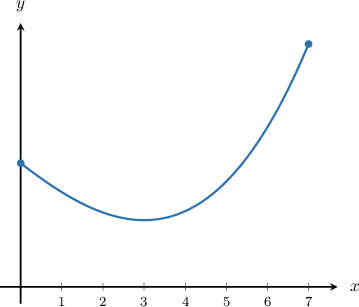
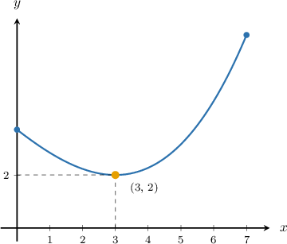

# Identifying Maximum and Minimum Values of a Function

Source: https://www.mathacademy.com/topics/7901?courseId=39
Topic ID: 7901

## Prerequisites

- [Graphs of Functions](./7939-graphs-of-functions.md)

## Lesson

### Introduction

When we read a function from a graph, the -values are inputs and the -values are outputs.

A **maximum value** is the highest output value the function reaches on the graph. A **minimum value** is the lowest output value the function reaches on the graph.

In the graph, the highest point is so the maximum value is The lowest point is so the minimum value is

**Watch out!** The maximum or minimum value is the output, so it comes from the -coordinate. The input where it happens comes from the -coordinate.

So, from a point like the maximum value is and it occurs at

### Finding Maximum and Minimum Values From a Graph

To find a maximum or minimum value from a graph, we look up or down first, not left or right.

- For a maximum value, find the highest point shown on the graph. The maximum value is the -coordinate of that point.

- For a minimum value, find the lowest point shown on the graph. The minimum value is the -coordinate of that point.

Let's read one graph carefully.

The highest point shown is Since the -coordinate is the maximum value is This also tells us the output never rises above on the displayed domain.

The lowest point shown is Since the -coordinate is the minimum value is This also tells us the output never falls below on the displayed domain.

### Example: Identifying the Maximum Value of a Function From Its Graph

#### Question

1. The highest output shown is

2. The output never rises above on the displayed domain.

3. The maximum value occurs at

#### Explanation

To determine which statements are true, we evaluate the maximum value of the function shown in the graph.

First, let's locate the highest point on the curve to find the maximum value.

The highest point on the graph is

The maximum value of the function is the -coordinate of this point, which is This maximum value occurs at the input value

Now, we can examine each statement:

- Statement I is false. The highest output value (the -coordinate) shown on the graph is not Here, is the input value at which the maximum occurs.

- Statement II is true. Because is the maximum value, the output of the function never rises above on the displayed domain.

- Statement III is true. The maximum value ** and it occurs at the input value

Therefore, the correct answer is "II and III only."

### Example: Identifying the Minimum Value of a Function From Its Graph

#### Question

#### Explanation

To find the minimum value of a function from its graph, we look for the lowest output value shown. This corresponds to the -coordinate of the lowest point on the curve.

Looking at the graph, the lowest point is located at

The -coordinate of this point is This means that the output never falls below on the displayed domain.

Therefore, the minimum value of the function is

### Finding the Input Value for a Maximum or Minimum

Sometimes the question asks for the input value where a maximum or minimum occurs. That means we still locate the highest or lowest point, but then we read the -coordinate.

The lowest point on this graph is

The minimum value is the output, so the minimum value is

The input value where the minimum occurs is the -coordinate, so the function reaches its minimum at

**Watch out!** If the question asks, "At which input value?", the answer should look like not The value is the minimum output, while is the input where that output happens.

### Example: Identifying the Input Value at Which a Function Reaches Its Maximum or Minimum

#### Question

#### Explanation

The minimum value of a function is the lowest output (-value) shown on its graph. The input value where this minimum occurs is the -coordinate of that lowest point.

First, we locate the lowest point on the graph.

The lowest point is

Next, we identify the input value for this point. The -coordinate of the point is Note that is the output value, not the input value.

Therefore, the function reaches its minimum at
