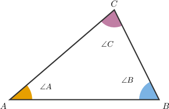
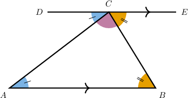
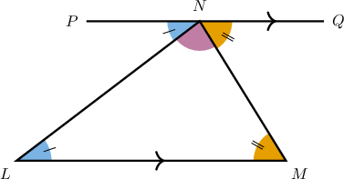
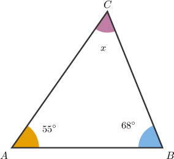
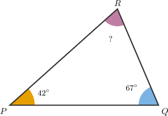
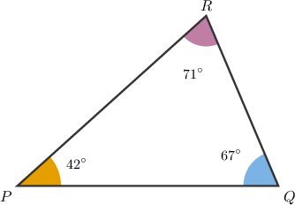
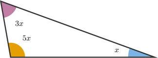
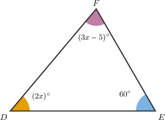

# The Sum of Interior Angles of a Triangle

Source: https://www.mathacademy.com/topics/7907?courseId=39
Topic ID: 7907

## Prerequisites

- [Alternate Angles](./4019-alternate-angles.md)
- [Solving Multi-Step Linear Equations](./13762-solving-multi-step-linear-equations.md)

## Lesson

### Introduction

A triangle has three angles inside it, one at each vertex.

The **interior angles** of a triangle are the angles formed inside the triangle by its sides. In the interior angles are and

The key fact we will use is the **Triangle Angle Sum Theorem**.

*The sum of the measures of the interior angles of any triangle is*

So, for we can write

This means that if we know two interior angles, the third one is not free to be any size. It must be the angle that makes the total exactly

### Proof of the Triangle Angle Sum Theorem

To prove why the three interior angles always add to we can add one helpful line to the triangle.

Draw a line through vertex that is parallel to

Now, the two sides of the triangle act like transversals cutting parallel lines.

- Since the segment is a transversal. So, and are alternate interior angles, which means

- Similarly, the segment is a transversal. So, and are alternate interior angles, which means

The three angles and lie along the straight line Together, they form a straight angle, so

Substituting and gives

### Example: Verifying That the Interior Angles of a Triangle Sum to 180 Degrees

#### Question

Because the line through is parallel to the angle at is congruent to the angle just left of since they are

For the same reason, the angle at is congruent to the angle just right of since they are also

Since these three angles form a along the line through their measures add to

#### Explanation

Notice that the parallel lines and are cut by the transversal The angle at (which is) and the angle just left of (which is) are on opposite sides of the transversal and between the parallel lines. Thus, they are alternate interior angles. Since the lines are parallel, these alternate interior angles are congruent.

Similarly, the parallel lines are cut by the transversal The angle at (which is) and the angle just right of (which is) are alternate interior angles. Therefore, they are also congruent.

Finally, the three adjacent angles and lie together along the straight line Because they form a straight angle, their measures add to

The complete statements are as follows:

Because the line through is parallel to the angle at is congruent to the angle just left of since they are

For the same reason, the angle at is congruent to the angle just right of since they are also

Since these three angles form a along the line through their measures add to

### Using the Triangle Angle Sum to Find a Missing Angle

When two interior angle measures are known, we can use the Triangle Angle Sum Theorem to find the missing angle.

Suppose a triangle has interior angles measuring and

Let be the measure of the missing angle. Since the interior angles of a triangle add to we have

So, the missing interior angle measures

**Watch out!** A missing angle in a triangle must be positive, and the three angles should add back to Here, so the answer is reasonable.

### Example: Finding a Missing Angle of a Triangle

#### Question

#### Explanation

Since the sum of the measures of the interior angles of a triangle is always we can set up an equation to find the measure of the missing interior angle.

Let be the measure of the missing angle:

Therefore, the measure of the missing interior angle is

### Solving for a Variable Using the Triangle Angle Sum

Sometimes, the angle measures are expressions instead of plain numbers. We still use the same total, but now we solve an equation for the variable.

Suppose the interior angles of a triangle measure and

Since the sum of the measures of the interior angles of a triangle is we have

So, the value of is The angle measures would be and and these add to

When an angle is written as an expression like include the whole expression in the sum before combining like terms.

### Example: Solving for an Unknown Quantity Using the Triangle Angle Sum

#### Question

#### Explanation

Since the sum of the measures of the interior angles of a triangle is we have
