# Reflections of Geometric Figures in the Coordinate Plane

Source: https://www.mathacademy.com/topics/7909?courseId=39
Topic ID: 7909

## Prerequisites

- [Graphing Linear Equations](./95-graphing-linear-equations.md)
- [Polygons in the Coordinate Plane](../grade-6/2448-polygons-in-the-coordinate-plane.md)
- [Reflections of Points in the Coordinate Plane](./2461-reflections-of-points-in-the-coordinate-plane.md)

## Lesson

### Introduction

A **reflection** flips a point or figure across a mirror line. The new point or figure is called the **image**.

The mirror line is the **line of reflection**. Every point and its image are the same distance from this line, but on opposite sides.

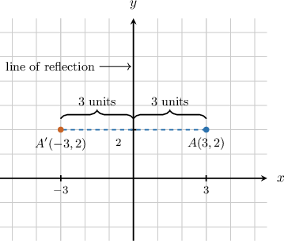

In the picture, the original point and its image line up straight across the mirror line. That equal-distance idea is what keeps a reflected figure the same size and shape.

A reflection is a rigid motion, so lengths and angle measures stay the same. What changes is the orientation: the figure is flipped to the other side of the line of reflection.

Next, we turn this mirror idea into coordinate rules for reflections across the coordinate axes.

### Reflection Rules Across the X-Axis and Y-Axis

For reflections across the coordinate axes, one coordinate stays the same and the other coordinate changes sign.

- Across the -axis, the -coordinate stays the same and the -coordinate changes sign.

- Across the -axis, the -coordinate stays the same and the -coordinate changes sign.

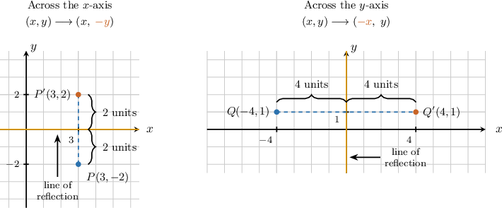

Let's reflect across the -axis. Since the point is reflected across the -axis, we keep the -coordinate and change the sign of the -coordinate.

Therefore, the image is

**Watch out!** Reflecting across an axis does not switch the order of the coordinates. For axis reflections, only one sign changes.

### Example: Reflecting a Point Across the X-Axis or Y-Axis

#### Question

The point is reflected across the -axis. Give the coordinates of its image.

#### Explanation

To reflect a point across the -axis, we change the sign of its -coordinate.

The given point has coordinates

Changing the sign of the -coordinate gives:

Visually, this means we move the point units right to the -axis, and then units right again:

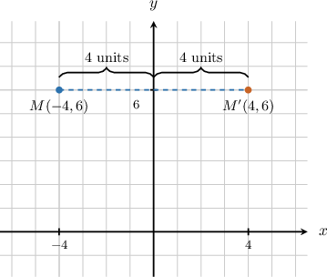

Therefore, the coordinates of the reflected image are

### Reflecting Polygons by Reflecting Vertices

To reflect a polygon, we reflect each vertex and then connect the reflected vertices in the same order.

This works because a polygon is built from its vertices and edges. Once every vertex has an image, the image polygon is determined.

Suppose triangle has vertices and We reflect the triangle across the -axis, so we change the sign of each -coordinate and keep each -coordinate the same.

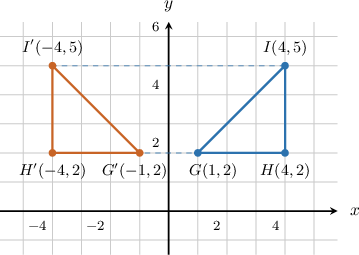

After plotting and we connect them to form triangle The reflected triangle has the same shape and size as the original triangle, but it is flipped across the -axis.

### Example: Reflecting a Polygon Across the X-Axis or Y-Axis

#### Question

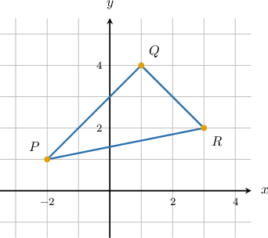

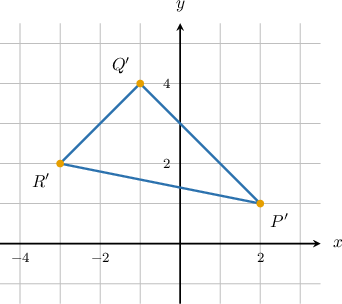

Drawing B:

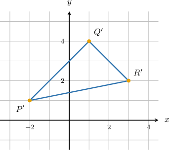

Drawing C:

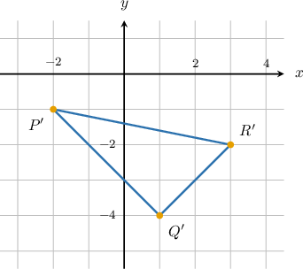

Drawing D:

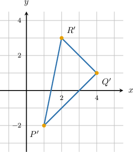

Drawing E:

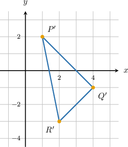

#### Explanation

To reflect a polygon across the -axis, we reflect each of its vertices across the -axis and then connect the reflected vertices.

To reflect a point across the -axis, we change the sign of its -coordinate while keeping its -coordinate the same. This can be represented by the rule:

From the given graph, the vertices of are and

Applying the reflection rule to each vertex, we find the coordinates of the image vertices:

Finally, we identify the drawing that shows the triangle with these vertices, which is Drawing C.

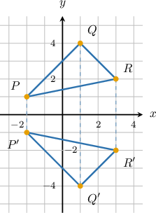

### Reflections Across y = x and y = -x

The diagonal lines and also act like mirror lines.

Their coordinate rules are different from the axis-reflection rules.

- Across the coordinates switch places.

- Across the coordinates switch places and both signs change.

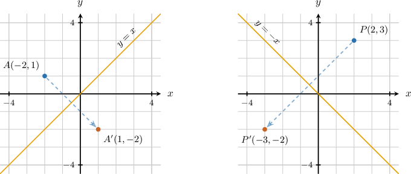

For example, reflecting across gives

For a polygon, we use the same rule on every vertex. If triangle is reflected across then each image vertex is found by switching the coordinates:

For a reflection across we still work vertex by vertex, but we use instead.

### Example: Reflecting a Polygon Across the Lines y = x or y = -x

#### Question

A polygon has vertices and After a reflection across the line what are the coordinates of the image vertices and

#### Explanation

To find the coordinates of the image vertices, we must apply the reflection to each vertex of the original polygon.

Reflection across the line can be represented by the function

We are given the vertices and Applying the reflection function to each vertex, we obtain:

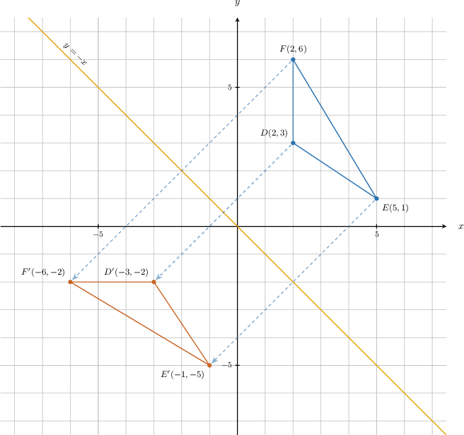

Therefore, the coordinates of the image vertices are and
