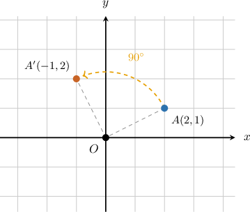
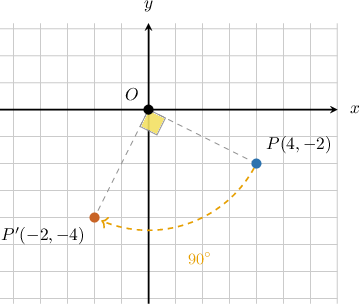
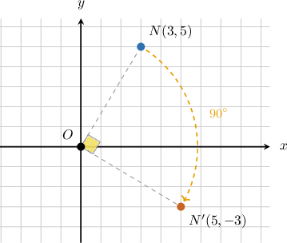
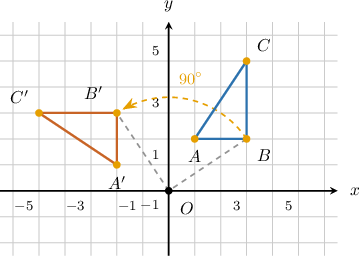
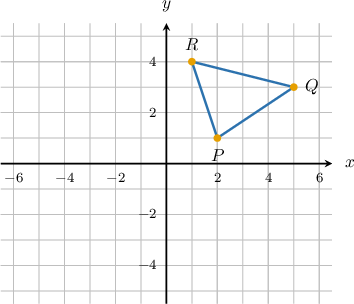
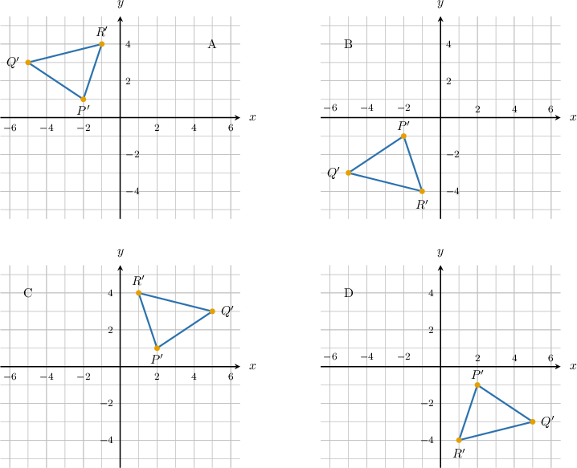
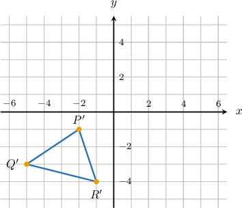
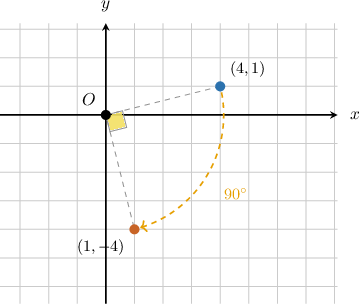
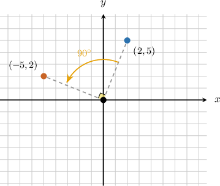

# Rotations of Geometric Figures

Source: https://www.mathacademy.com/topics/7910?courseId=39
Topic ID: 7910

## Prerequisites

- [Congruent Polygons](../prealgebra/1515-congruent-polygons.md)
- [Polygons in the Coordinate Plane](../grade-6/2448-polygons-in-the-coordinate-plane.md)

## Lesson

### Introduction

A point can move around the origin without moving closer to or farther from it. For example, imagine point turning one quarter-turn counterclockwise around the origin.

This motion is called a **rotation**. A rotation turns a figure around a fixed point, called the center of rotation. In this topic, the center of rotation is the origin,

A rotation keeps the size and shape the same. What changes is the position and orientation of the point or figure.

For rotations about the origin, we pay attention to two details.

- The turn size tells us how far the point turns, such as or

- The direction tells us whether the point turns clockwise or counterclockwise.

A counterclockwise rotation moves a point one quadrant counterclockwise. So, in Quadrant I rotates to in Quadrant II.

Next, we will turn this visual idea into coordinate rules.

### Rotation Rules About the Origin

For common rotations about the origin, we can use coordinate rules instead of drawing the full turn every time.

The rules are:

- counterclockwise:

- clockwise:

- :

- counterclockwise:

Notice that a counterclockwise turn lands in the same place as a clockwise turn.

Let's use one rule. Suppose point is rotated clockwise about the origin. For a clockwise rotation, we use

Here, and Applying the rule gives

The image is This also makes visual sense because starts in Quadrant IV, and a clockwise turn moves it into Quadrant III.

### Example: Rotating a Point About the Origin by 90, 180, or 270 Degrees

#### Question

The point is rotated clockwise about the origin. What are the coordinates of its image?

#### Explanation

To find the coordinates of the image after a clockwise rotation about the origin, we can use the coordinate rule:

The original point is so we have and

Applying the rule, we swap the - and -coordinates and change the sign of the new -coordinate:

We can verify this visually. The point is in the first quadrant. A clockwise rotation moves it one quadrant clockwise into the fourth quadrant. The image point is indeed in the fourth quadrant.

Therefore, the coordinates of the image are

### Rotating Polygons About the Origin

To rotate a polygon about the origin, we rotate each of its vertices and then connect the resulting image points in the same order.

Suppose a triangle has vertices and We want to rotate the triangle counterclockwise about the origin.

The coordinate rule for a counterclockwise rotation is

Applying this rule to each vertex, we swap the - and -coordinates and change the sign of the new -coordinate.

Finally, we plot the image points and and connect them in the order The rotated triangle is congruent to the original triangle because a rotation does not change side lengths or angle measures.

### Example: Rotating a Polygon About the Origin by 90, 180, or 270 Degrees

#### Question

#### Explanation

To rotate a polygon about the origin, we rotate each of its vertices and then connect the resulting image points.

The coordinate rule for a rotation about the origin is given by

From the given graph, the vertices of the triangle are,, and.

Applying the rule to each vertex, we change the signs of both the - and -coordinates.

Finally, we plot the image points,, and, and connect them to form the rotated triangle.

Drawing shows the triangle with these vertices.

### Identifying Rotations From Preimages and Images

Sometimes we are given a preimage point and its image, and we need to identify the rotation. A good strategy is to match one pair of corresponding points and compare their coordinates.

Suppose a rotation about the origin maps onto We can check the coordinate pattern.

The original point has coordinates The image is

The pattern matches a clockwise rotation about the origin.

We can also verify this visually. The point is in Quadrant I, and the image is in Quadrant IV. That is one quadrant clockwise.

For a whole figure, we use the same idea. Match a vertex with its image, identify the coordinate pattern or turn direction, and then check that the other corresponding vertices follow the same rotation.

### Example: Identifying the Rotation That Maps One Figure Onto Another

#### Question

A rotation about the origin maps the point onto Which rotation maps the figure onto its image?

#### Explanation

To identify the rotation, we can plot the original point and its image on the coordinate plane.

The original point is which lies in the first quadrant. Its image is which lies in the second quadrant.

Next, we draw line segments connecting the center of rotation, which is the origin, to both points.

Notice that the angle formed by these two segments is Moving from the original point to its image requires turning in the counterclockwise direction.

Alternatively, we can observe the coordinate pattern. The original coordinates are mapped to since This pattern always corresponds to a counterclockwise rotation about the origin.

Therefore, the rotation is a counterclockwise rotation.
