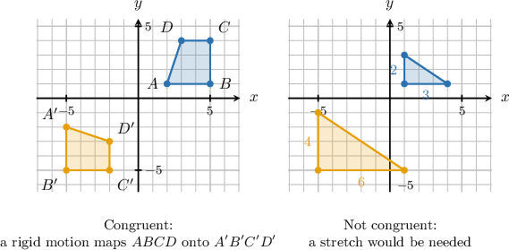
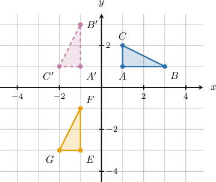
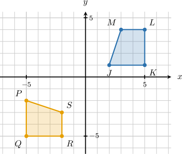
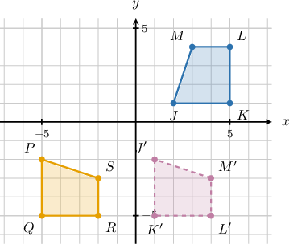
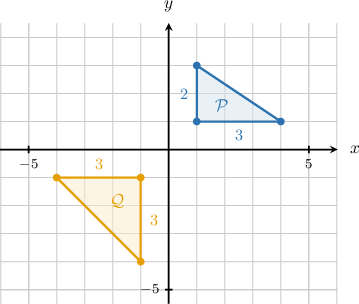
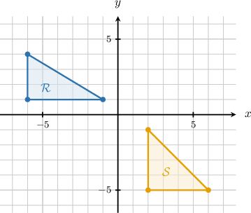
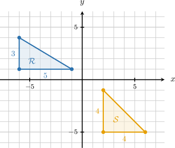
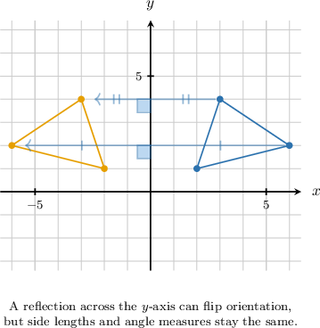
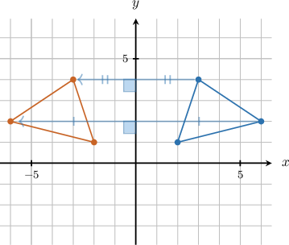

# Congruence Through Rigid Motions

Source: https://www.mathacademy.com/topics/7913?courseId=39
Topic ID: 7913

## Prerequisites

- [Parallel and Perpendicular Lines](../grade-4/3979-parallel-and-perpendicular-lines.md)
- [Applying Sequences of Rigid Motions](./7912-applying-sequences-of-rigid-motions.md)

## Lesson

### Introduction

A figure can slide, turn, or flip and still keep the same size and shape. The key question is whether one figure can be moved so that it matches another figure *exactly*.

Two figures are **congruent through rigid motions** if a translation, rotation, reflection, or sequence of these transformations maps one figure exactly onto the other. A rigid motion does not stretch, shrink, or distort the figure.

In the exact-match case, every vertex of the first figure lands on a matching vertex of the second figure. Those matching vertices are corresponding vertices.

So, when we decide whether two figures are congruent, we look for a rigid motion sequence that maps all corresponding parts onto each other. If any stretch or shrink would be needed, the figures are not congruent.

### Rigid Motions and Congruence

To justify that two figures are congruent, we need more than a visual guess. We can track what happens to the vertices.

A useful plan is:

- Choose a likely rigid motion by comparing the figures' orientation.

- Apply the coordinate rule for that rigid motion.

- If the image is in the correct orientation but not the correct location, use a translation.

- Check that each final vertex matches its corresponding vertex.

Suppose triangle has vertices and We want to map it onto triangle with vertices and

A counterclockwise rotation about the origin uses the rule Then a translation of units down subtracts from each -coordinate.

Each vertex lands on the corresponding vertex, so the two triangles are congruent.

### Example: Identifying Two Figures as Congruent if a Rigid Motion Maps One Onto the Other

#### Question

Two figures are shown in the coordinate plane above. Find a sequence of rigid motions that maps the first figure exactly onto the second, showing that the two figures are congruent.

#### Explanation

To show that the two figures are congruent, we need to find a sequence of rigid motions (translations, rotations, or reflections) that maps the first figure exactly onto the second. Rigid motions preserve both shape and size.

First, notice the orientation of the figures. The first figure has a horizontal bottom side, while the second figure has a vertical left side. This change in orientation suggests a rotation of

Let's test a clockwise rotation about the origin. The rule for this rotation is

Applying this rotation to the vertices of the first figure gives:

We can draw this intermediate figure to see how it aligns with the second figure.

Next, we map the intermediate figure onto the second figure Let's compare their coordinates:

- and

- and

- and

- and

The -coordinates are identical, but each -coordinate in is exactly less than the corresponding -coordinate in This corresponds to a translation of units to the left.

Therefore, the sequence of rigid motions that maps the first figure onto the second is a rotation of clockwise about the origin, followed by a translation of units to the left.

### Showing Figures Are Not Congruent

To show that two figures are *not* congruent, it is enough to find one property that a rigid motion would have to preserve but does not.

Side length is often the easiest property to check. Consider two right triangles on a coordinate grid.

For triangle the horizontal leg is units and the vertical leg is units.

For triangle the horizontal leg is units and the vertical leg is units.

So, the side lengths of triangle include and while the side lengths of triangle include and A rigid motion cannot map a side of length onto a side of length

**Watch out!** Different locations or directions do not prove that figures are not congruent. Translations, rotations, and reflections can change location and direction. A mismatch in a preserved property, such as side length or angle measure, is what rules out congruence.

### Example: Identifying Two Figures as Not Congruent When No Rigid Motion Maps One Onto the Other

#### Question

Consider the two figures shown above. Which of the following statements are true and show that the figures are not congruent?

1. A pair of corresponding side lengths have different measures.

2. A pair of corresponding angles have different measures.

3. A single rotation maps one figure exactly onto the other.

#### Explanation

Two figures are congruent if they have the exact same shape and size. This means that all corresponding side lengths and angle measures must be equal. If figures are congruent, there is a rigid motion (or a sequence of rigid motions) that maps one exactly onto the other.

We can count the grid units to find the lengths of the legs for each triangle.

- Triangle is a right triangle. Its horizontal leg has a length of units, and its vertical leg has a length of units.

- Triangle is also a right triangle. Its horizontal leg has a length of units, and its vertical leg has a length of units.

With this information, let's evaluate each statement.

- Statement I is true. Triangle has legs of lengths and while triangle has legs of lengths and Since they do not have the exact same side lengths, they cannot be congruent.

- Statement II is true. Because triangle has two legs of the same length, it is an isosceles right triangle. This means its two acute angles both measure Triangle has legs of different lengths, so its acute angles do not measure Because they have different angle measures, they cannot be congruent.

- Statement III is false. Because the triangles have different side lengths and angle measures, they are not congruent. Therefore, no rigid motion—including a single rotation—can map one exactly onto the other.

Therefore, only statements I and II are true and show that the figures are not congruent.

### Properties Preserved by Rigid Motions

Rigid motions can change where a figure is in the plane, but they do not change the figure's internal measurements.

This means we can organize the important properties as follows.

We use the preserved properties to justify congruence or non-congruence. If all corresponding lengths and angles can match under rigid motions, the figures may be congruent. If even one required length or angle cannot match, no rigid motion sequence can map one figure exactly onto the other.

### Example: Identifying Which Properties Are Preserved by Rigid Motions

#### Question

Determine the missing entries in the table below to indicate whether each property is preserved or can change under a rigid motion.

#### Explanation

Translations, reflections, and rotations are **. A rigid motion is a transformation that moves a figure without altering its overall shape and size.

- ** Because rigid motions do not stretch, shrink, or distort the figure, the angles between lines, the distances between points, and whether lines are parallel remain unchanged. Therefore, these properties are preserved.

- ** Rigid motions slide, flip, or turn the figure to a new location. Therefore, the position of the figure can change.

- ** A reflection flips a figure across a line, which reverses its left-to-right or top-to-bottom appearance. Therefore, the orientation can change.

The completed table is shown below.
