# Dilations of Figures in the Coordinate Plane

Source: https://www.mathacademy.com/topics/7915?courseId=39
Topic ID: 7915

## Prerequisites

- [Solving One-Step Multiplication and Division Equations](../prealgebra/40-solving-one-step-multiplication-and-division-equations.md)
- [Polygons in the Coordinate Plane](../grade-6/2448-polygons-in-the-coordinate-plane.md)
- [Dilations of Geometric Figures](./7914-dilations-of-geometric-figures.md)

## Lesson

### Introduction

A dilation centered at the origin moves a point along the ray from the origin through that point. The original point is the **preimage**, and the result is the **image**.

If the scale factor is then a point is mapped by multiplying both coordinates by:

Let's dilate the preimage point by a scale factor of

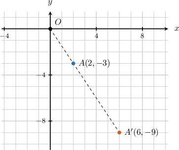

The image point stays on the same ray from the origin, but it is times as far from the origin as Applying the coordinate rule gives

So, the image point is

**Watch out!** The scale factor multiplies both coordinates. We do not add to the coordinates; we multiply the -coordinate and the -coordinate by

### Example: Dilating a Point Centered at the Origin by a Positive Scale Factor

#### Question

Under a dilation centered at the origin with scale factor the point is mapped to its image. Give the coordinates of the image point.

#### Explanation

A dilation centered at the origin with a scale factor of can be represented by the function

Applying this function to the point we have

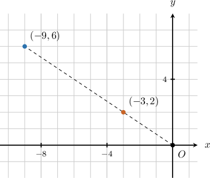

Therefore, the image point is

### Dilating Polygons at the Origin

The same origin-centered dilation rule applies to a polygon one vertex at a time. **Corresponding vertices** are matching original and image vertices, such as and

Suppose triangle has vertices and If we dilate the triangle by a scale factor of centered at the origin, we multiply both coordinates of each vertex by

Applying this rule to the vertices gives

When we connect the image vertices in the same order, the image triangle is

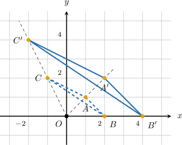

Therefore, the image vertices are and

### Example: Dilating a Polygon Centered at the Origin by a Positive Scale Factor

#### Question

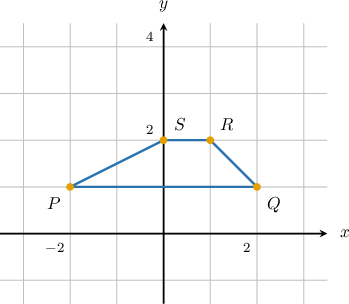

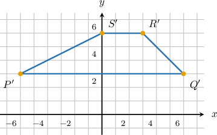

****

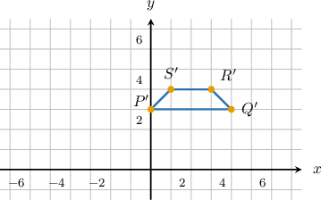

****

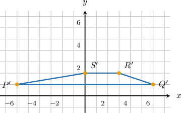

****

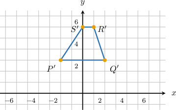

****

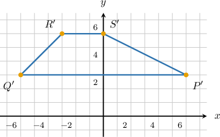

#### Explanation

To dilate a polygon centered at the origin, we first determine the coordinates of its vertices from the graph, and then multiply the - and -coordinates of each vertex by the scale factor.

From the given graph, the coordinates of the vertices of polygon are and

A dilation with center at the origin and a scale factor of can be represented by the function

Applying this function to the vertices, we get the following:

Therefore, the resulting vertices are and

Finally, we connect the image vertices using line segments. Drawing A shows the resulting polygon, plotted below.

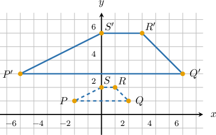

### Finding the Scale Factor From Coordinates

Sometimes we know a point and its image, and we need to find the scale factor. We use the same rule, but now the scale factor is unknown.

Let be the scale factor. A dilation centered at the origin can be represented by

Suppose a dilation maps to

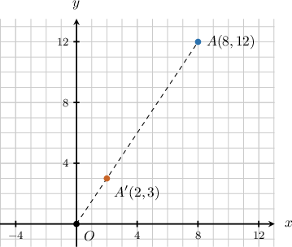

Applying the rule to and equating the result to we get

This gives the system

Solving from the first coordinate gives

We can verify with the second coordinate:

Therefore, the scale factor of the dilation is

### Example: Determining the Scale Factor of a Dilation From Coordinates

#### Question

A dilation centered at the origin maps the point to its image Find the scale factor of the dilation.

#### Explanation

A dilation with center at the origin and a scale factor of can be represented by the function

Applying this function to the point and equating the result to the image we get

Therefore, the scale factor is
