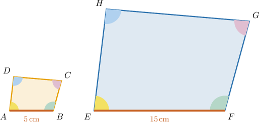
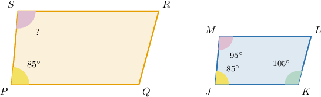
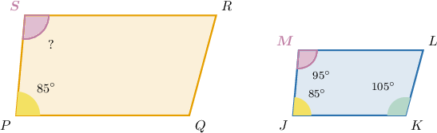
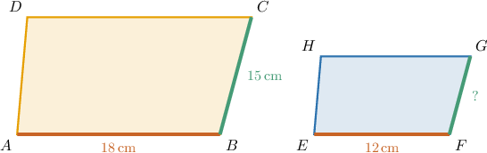
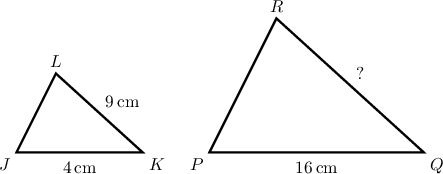
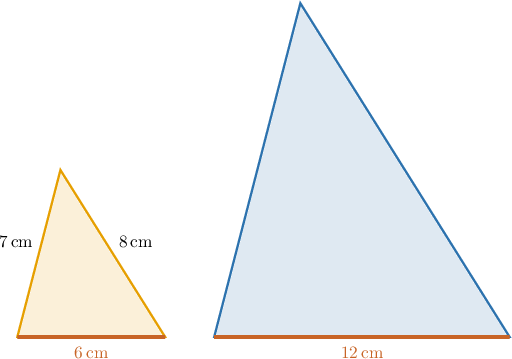

# Calculating Side Lengths and Angles of Similar Polygons

Source: https://www.mathacademy.com/topics/7917?courseId=39
Topic ID: 7917

## Prerequisites

- [Calculating Perimeters and Areas of Scaled Shapes](../grade-7/1235-calculating-perimeters-and-areas-of-scaled-shapes.md)
- [Similar Polygons](./7916-similar-polygons.md)

## Lesson

### Introduction

A scaled copy can look larger or smaller, but it keeps the same shape. That is the key idea behind similar polygons.

In the picture, each vertex in the first polygon matches one vertex in the second polygon. Once we match the vertices, two important things happen.

- Corresponding angle measures stay equal.

- Corresponding side lengths are multiplied by the same scale factor.

So, if one polygon is a scaled copy of another, angles do not change, but lengths do change. For example, if every side length is multiplied by then a side of length becomes while the corresponding angle measure stays the same.

**Watch out!** Similar polygons do not have to be the same size. Same shape is enough; the side lengths may be larger or smaller by a common scale factor.

### Corresponding Parts in Similar Polygons

**Corresponding parts** are the matching sides and matching angles in two similar polygons. The order of the vertices tells us which parts match.

Suppose polygon is similar to polygon with vertices corresponding in that order. We match the vertices like this.

- corresponds to

- corresponds to

- corresponds to

- corresponds to

This means the matching angles have equal measures. For example, corresponds to so

If we are given that then the corresponding angle in the first polygon has the same measure:

When the question asks for an angle in a similar polygon, we first identify the corresponding vertex. Then, we copy the corresponding angle measure.

### Example: Finding a Missing Angle of a Polygon Using a Similar Polygon

#### Question

#### Explanation

In similar polygons, corresponding angles are congruent.

By comparing the two polygons, we can see that they have the same shape and orientation. Vertex in polygon corresponds to vertex in polygon

Therefore, the measure of is equal to the measure of

From the diagram, we are given that

Substituting this value, we get

Therefore,

### Using Scale Factors to Find Side Lengths

When similar polygons have different sizes, corresponding side lengths are multiplied by the same scale factor.

Suppose the larger polygon is similar to the smaller polygon Side corresponds to side and side corresponds to side

To find the scale factor from the larger polygon to the smaller polygon, compare a pair of corresponding sides whose lengths are known:

Now, we use the same scale factor on the corresponding side. Since corresponds to we have

So, the missing corresponding side length is

### Example: Finding a Missing Side Length of a Polygon Using a Similar Polygon

#### Question

Triangle is similar to triangle with vertices corresponding in that order. Side corresponds to and What is the length of

#### Explanation

Since the two triangles are similar, their corresponding side lengths are proportional. This means that we can multiply the side lengths of triangle by a constant ** to get the corresponding side lengths of triangle

To find the scale factor we compare a pair of corresponding sides whose lengths are known. We are given that the side with a length of corresponds to the side with a length of

So, the scale factor is

Now, to find the length of we multiply the length of its corresponding side in triangle (which is) by the scale factor

Therefore, we have

### Calculating Perimeters With Scale Factors

The perimeter of a polygon is the sum of all its side lengths. In similar polygons, every side length is multiplied by the same scale factor, so the whole perimeter is multiplied by that same scale factor.

Suppose a smaller triangle has side lengths and A larger similar triangle has a corresponding side of length matching the side.

First, we find the scale factor from the smaller triangle to the larger triangle:

Next, we find the perimeter of the smaller triangle:

Then, we multiply by the scale factor:

So, the perimeter of the larger triangle is

### Example: Calculating Perimeters of Similar Polygons

#### Question

#### Explanation

The two polygons are similar, which means that their corresponding side lengths are multiplied by the same scale factor.

To find the scale factor, we compare a pair of corresponding sides. From the diagram, the side of the larger polygon corresponds to the side of the smaller polygon.

So, the scale factor from the smaller polygon to the larger polygon is

We could find each missing side length of the larger polygon by multiplying the corresponding side of the smaller polygon by However, because all side lengths scale by the same factor, the full perimeter also scales by that same factor.

First, we calculate the perimeter of the smaller polygon by adding the lengths of all its sides:

Then, to find the perimeter of the larger polygon, we multiply the perimeter of the smaller polygon by the scale factor

Therefore, the perimeter of the larger polygon is
