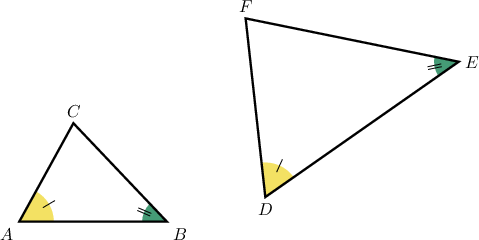
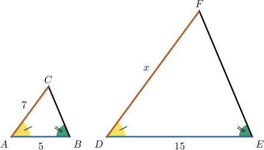
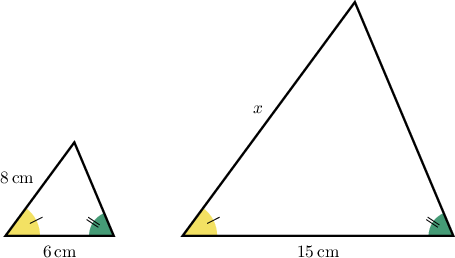
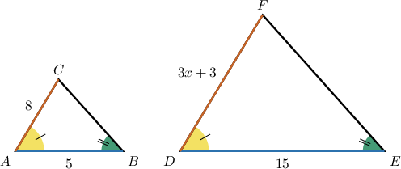
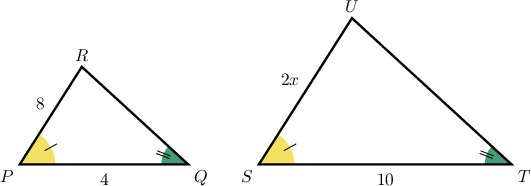
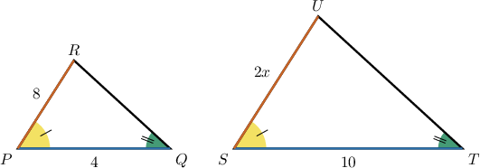

# The Angle-Angle Criterion for Similar Triangles

Source: https://www.mathacademy.com/topics/7919?courseId=39
Topic ID: 7919

## Prerequisites

- [The Sum of Interior Angles of a Triangle](./7907-the-sum-of-interior-angles-of-a-triangle.md)
- [Calculating Side Lengths and Angles of Similar Polygons](./7917-calculating-side-lengths-and-angles-of-similar-polygons.md)

## Lesson

### Introduction

Two triangles can be the same shape even when they are different sizes. When that happens, their matching vertices, angles, and sides line up as corresponding parts.

The key idea is that angles control the *shape* of a triangle. Side lengths can stretch or shrink, but if the angles match in the right order, the triangles have the same shape.

In the diagram, the matching angle marks tell us which vertices correspond.

- The single-tick angles match, so

- The double-tick angles match, so

- The remaining vertices match, so

Once we know the correspondence, we can compare matching sides in the same order. First, we will learn how two angle matches can prove the triangles are similar.

### The Angle-Angle Similarity Criterion

The **angle-angle (AA) similarity criterion** states:

*If two angles of one triangle are congruent to two angles of another triangle, then the two triangles are similar.*

This works because the third angle is forced by the triangle angle sum. So, once two angle pairs match, the third pair must also match.

Suppose one triangle has angles and and another triangle has angles and To compare them, we find the missing angle in the first triangle.

So, the first triangle has angles and The second triangle already has angles and

Since the triangles share two pairs of equal angles, the triangles are similar by the angle-angle criterion.

**Watch out!** One matching angle is not enough. We need two pairs of corresponding angles to use AA similarity.

### Example: Identifying Two Triangles as Similar Using the Angle-Angle Criterion

#### Question

A triangle has angles and and a second triangle has angles and Determine whether the two triangles are similar by the angle-angle criterion.

#### Explanation

To determine whether the two triangles are similar, we can find the missing interior angle of the first triangle. The sum of the interior angles of a triangle is

For the first triangle, the two given angles are and We can find the third angle by subtracting their sum from

Now we know the angles of the first triangle are and The second triangle has given angles of and

Comparing the two triangles, we see that both have an angle and a angle. This means they share two pairs of equal angles.

Recall the angle-angle (AA) similarity criterion: if two angles of one triangle are congruent to two angles of another triangle, then the two triangles are similar. Because these triangles share two pairs of equal angles, they are similar.

### Using Similar Triangles to Find Missing Side Lengths

Once AA tells us two triangles are similar, their corresponding side lengths are proportional. The main job is to match the correct sides before writing the proportion.

Consider two similar triangles with side lengths shown below.

The angle markings help us identify corresponding sides.

- connects the single-tick and double-tick angles, so it corresponds to

- connects the single-tick angle and the unmarked angle, so it corresponds to

Let be the length of We compare larger-triangle sides to smaller-triangle sides in the same order.

Therefore, the missing side length is

**Watch out!** Keep the ratios consistent. If the left side compares larger to smaller, the right side must also compare larger to smaller.

### Example: Finding a Missing Side Length of a Triangle Using the Angle-Angle Criterion

#### Question

Two triangles are similar by the angle-angle criterion. Corresponding sides of and match, and a side of in the smaller triangle corresponds to an unknown side in the larger triangle. What is the length of that unknown side?

#### Explanation

The problem states that the two triangles are similar. Since the triangles are similar, their corresponding sides must be proportional.

We are given two pairs of corresponding sides:

- A side of in the smaller triangle corresponds to a side of in the larger triangle.

- A side of in the smaller triangle corresponds to an unknown side in the larger triangle.

Let be the length of the unknown side. We can set up a proportion comparing the sides of the larger triangle to the sides of the smaller triangle:

Therefore, the length of the unknown side is

### Solving for Variables Using Similarity Proportions

A similarity proportion can also include an algebraic expression. We set up the proportion the same way, then solve the equation for the variable.

Consider these similar triangles.

The corresponding sides are and The side has length so we use that expression in the proportion.

Now, we solve for

So, the value of the variable is The corresponding side length is which is times the matching side length

### Example: Solving for an Unknown Using Two Similar Triangles

#### Question

#### Explanation

We are given that the two triangles are similar. Therefore, the lengths of their corresponding sides must be proportional.

From the diagram, the side of length in the larger triangle corresponds to the side of length in the smaller triangle. Similarly, the side of length corresponds to the side of length We can set up a proportion using the ratios of these corresponding sides:

Now, we solve for
