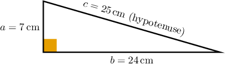
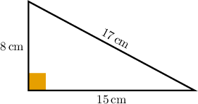
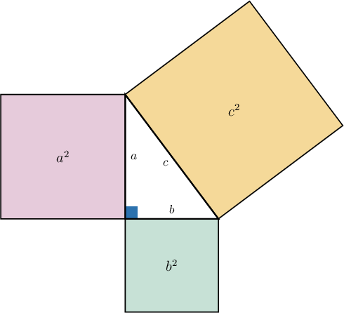
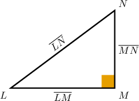
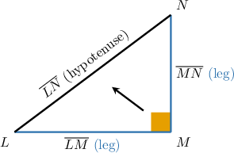

# Understanding and Proving the Pythagorean Theorem

Source: https://www.mathacademy.com/topics/7922?courseId=39
Topic ID: 7922

## Prerequisites

- [Evaluating Expressions With Positive Integer Exponents](../prealgebra/121-evaluating-expressions-with-positive-integer-exponents.md)
- [Areas of Rectangles and Squares](../prealgebra/1352-areas-of-rectangles-and-squares.md)

## Lesson

### Introduction

Right triangles have a special structure. Once a triangle has one angle, the three side lengths are connected in a predictable way.

For example, a right triangle with side lengths and is not just a random triangle. If we square the two shorter lengths and add them, we get

The longest side has length and its square is

So, the two calculations match:

This matching relationship is the main idea we will use. Next, we will name the parts of a right triangle carefully so that we always put each side length in the correct place.

### The Pythagorean Theorem and Right Triangle Parts

In a right triangle, the **legs** are the two sides that meet to form the right angle. The **hypotenuse** is the longest side, and it is always opposite the right angle.

If the legs have lengths and and the hypotenuse has length then the **Pythagorean theorem** states that the sum of the squares of the lengths of the two legs equals the square of the length of the hypotenuse:

Let's verify this relationship for a right triangle with legs and and hypotenuse

First, compute the sum of the squares of the legs:

Next, compute the square of the hypotenuse:

Since both expressions equal we can write

**Watch out!** The hypotenuse is not just any side labeled It must be the side opposite the right angle.

### Example: Verifying the Pythagorean Theorem With Specific Right Triangles

#### Question

A right triangle has legs of length and and a hypotenuse of length Which of the following statements are true?

#### Explanation

We are given a right triangle with legs measuring and and a hypotenuse measuring

Let's analyze each statement in turn.

- Statement I is true. We compute the sum of the squares of the legs:

- Statement II is true. We compute the square of the hypotenuse:

- Statement III is true. Since the sum of the squares of the legs and the square of the hypotenuse both equal they are equal to each other: This confirms the Pythagorean theorem, which states that for any right triangle with legs and and hypotenuse the relationship holds.

Therefore, the correct answer is "I, II, and III."

### An Area-Based Proof of the Pythagorean Theorem

An **area-based proof** is an argument that explains why a statement is true by comparing areas of shapes. For the Pythagorean theorem, we build a square on each side of a right triangle.

The area of a square is the square of its side length. So, if the right triangle has legs and and hypotenuse then:

- The square built on leg has area

- The square built on leg has area

- The square built on the hypotenuse has area

The combined area of the two smaller squares is The area of the largest square is

The area-based proof shows that these two areas are equal, so we obtain

This is why the Pythagorean theorem is not just a pattern from examples. It is a geometric relationship that can be justified using the areas of squares.

### Example: Explaining a Proof of the Pythagorean Theorem Using Areas of Squares

#### Question

The diagram above shows squares built on the sides of a right triangle. What are the missing entries in the following reasoning that explains the area-based proof of the Pythagorean theorem?

The area of the square built on leg is and the area of the square built on leg is So, the combined area of the two smaller squares is

The area of the square built on the hypotenuse is

Since these two areas are equal, we obtain the relationship

#### Explanation

From the diagram, we can read the areas of the squares built on the sides of the right triangle:

- The area of the square built on leg is

- The area of the square built on leg is

So, the combined area of the two smaller squares is

The diagram also shows that the area of the square built on the hypotenuse is

Since these two areas are equal, we equate the expressions to obtain the relationship:

This relationship is the Pythagorean theorem.

### Example: Stating the Pythagorean Theorem and Identifying Hypotenuse and Legs

#### Question

The right triangle above has its right angle at vertex What are the missing entries in the following statements identifying the hypotenuse and the two legs of the triangle?

The side opposite the right angle is the hypotenuse. So, the hypotenuse is

The two sides that form the right angle are the legs. So, the legs are and

#### Explanation

The problem asks us to identify the hypotenuse and the legs of the given right triangle.

In a right triangle, the longest side is called the **, and it is always the side exactly opposite the right angle. Here, the right angle is at vertex so the side opposite to it is

Therefore, the hypotenuse is

The other two sides of the triangle that meet to form the right angle are called the **. In this triangle, the right angle is formed by the sides and

Therefore, the legs are and
