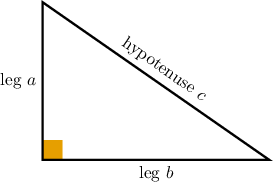
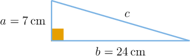
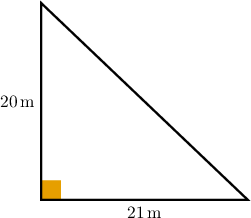
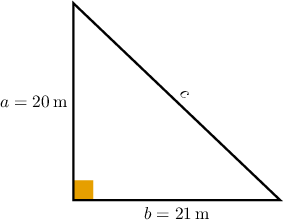
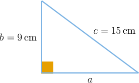
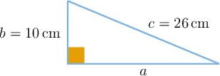
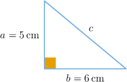

# Applying the Pythagorean Theorem to Find Missing Side Lengths

Source: https://www.mathacademy.com/topics/7923?courseId=39
Topic ID: 7923

## Prerequisites

- [Surds](./2204-surds.md)
- [Solving Equations Using Square Roots](./2280-solving-equations-using-square-roots.md)

## Lesson

### Introduction

A right triangle has one special side: the hypotenuse. It is always the side across from the right angle, and it is always the longest side of the triangle.

The other two sides are the legs. They meet to form the right angle.

When we use the Pythagorean theorem, we usually label the legs as and and the hypotenuse as The relationship is

The most important first step is not squaring or taking a square root. It is identifying which side is Once we know where the hypotenuse is, we can decide whether we are finding the longest side or finding one of the legs.

**Watch out!** Do not choose just because a side is unknown. The value must be the hypotenuse, so it must be across from the right angle.

### Using the Pythagorean Theorem

When the two legs are known, we can use the Pythagorean theorem to find the hypotenuse.

Suppose a right triangle has legs of length and We want to find the hypotenuse.

Here, the given lengths are the legs, so let and Let be the length of the hypotenuse. According to the Pythagorean theorem, we obtain

Substituting in the values for and gives us

The answer makes sense because is longer than both legs.

### Example: Finding the Length of the Hypotenuse Given the Two Legs of a Right Triangle

#### Question

The right triangle above has legs of length and Find the length of the hypotenuse.

#### Explanation

The given lengths are the legs of the right triangle, so let and We need to find the length of the hypotenuse,

According to the Pythagorean theorem, we obtain

Substituting in the values for and gives us

### Finding a Missing Leg

Sometimes, the hypotenuse and one leg are known, and the missing side is the other leg. In that case, we still start with

but now we subtract the known leg's square from the hypotenuse's square.

Suppose a right triangle has a hypotenuse of length and one leg of length We want to find the other leg.

Let and We need to find the missing leg. According to the Pythagorean theorem, we obtain

Substituting in the values for and gives us

The missing leg is This also makes sense because a leg must be shorter than the hypotenuse.

### Example: Finding the Length of a Leg Given the Hypotenuse and the Other Leg

#### Question

A right triangle has a hypotenuse of length and one leg of length What is the length of the other leg?

#### Explanation

To find the length of the other leg, we can first sketch a right triangle with the given dimensions.

Here, we know the lengths of the hypotenuse and one leg. Let and We need to find the length of the missing leg.

According to the Pythagorean theorem, we obtain

Substituting in the values for and gives us

Therefore, the length of the other leg is

### Irrational Side Lengths and Rounding

Not every Pythagorean theorem answer is a whole number. If the number under the square root is not a perfect square, we may leave the answer in exact radical form or round it as a decimal.

Suppose a right triangle has legs of length and Let be the hypotenuse. We find

So, the exact length is Since is not a perfect square, is not a whole number.

If a problem asks for a decimal approximation, we can use a calculator:

Rounded to two decimal places, this is

So, we keep when an exact answer is requested, and we use when a two-decimal-place approximation is requested.

### Example: Finding a Side Length Involving an Irrational Result

#### Question

A right triangle has legs of length and The exact length of the hypotenuse can be written in the form where is an integer. Find the value of

#### Explanation

Let the lengths of the legs of the right triangle be and Let be the length of the hypotenuse.

According to the Pythagorean theorem, we obtain

Substituting in the values for and gives us

The exact length of the hypotenuse is The problem states that the exact length can be written in the form Comparing the two expressions, we obtain
