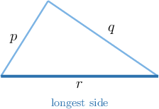
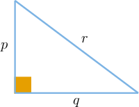
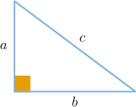

# The Converse of the Pythagorean Theorem

Source: https://www.mathacademy.com/topics/7924?courseId=39
Topic ID: 7924

## Prerequisites

- [Understanding and Proving the Pythagorean Theorem](./7922-understanding-and-proving-the-pythagorean-theorem.md)

## Lesson

### Introduction

We already know the Pythagorean theorem as a statement about right triangles. If a triangle is right, then the squares of the two shorter side lengths add to the square of the longest side length.

That gives us a new kind of question. If we are given only three side lengths, can the same square relationship help us decide whether the triangle is right?

Suppose the side lengths are and The longest side is so that is the side we compare against the other two.

We calculate the two sides of the Pythagorean relationship. The square of the longest side is

The values match. So, this set of side lengths has exactly the relationship we expect from a right triangle. Next, we will state the rule that lets us turn this observation into a conclusion.

### The Converse of the Pythagorean Theorem

A **converse** swaps the *if* and *then* parts of a statement.

For the Pythagorean theorem, the original direction says that a right triangle has a special square relationship. The converse goes the other way: if a triangle has that square relationship, then the triangle is right.

For a triangle with side lengths and where is the longest side, we treat as the candidate hypotenuse.

The **converse of the Pythagorean theorem** states the following.

*If the sum of the squares of the two shorter sides equals the square of the longest side, then the triangle is a right triangle.*

Using the labels and this means

**Watch out!** The longest side must be on the right side of the equation. If is the longest side, then we compare with not with or

### Example: Stating the Converse of the Pythagorean Theorem

#### Question

For a triangle with side lengths and where is the longest side, what are the missing entries in the following statement of the converse of the Pythagorean theorem?

If the sum of the of the two shorter sides equals then the triangle is a triangle.

#### Explanation

The Pythagorean theorem states that if a triangle is a right triangle, then the sum of the squares of the lengths of the two shorter sides (the legs) equals the square of the length of the longest side (the hypotenuse).

For a right triangle with legs and and hypotenuse this is written as

The converse of a statement swaps the ** and ** parts. Therefore, the converse of the Pythagorean theorem states the following:

- If the sum of the squares of the two shorter sides equals the square of the longest side, then the triangle is a right triangle.

We are given side lengths and where is the longest side. The sum of the squares of the two shorter sides is and the square of the longest side is

Therefore, the completed statement is as follows:

If the sum of the of the two shorter sides equals then the triangle is a triangle.

### Applying the Converse of the Pythagorean Theorem

To decide whether three side lengths form a right triangle, we use the converse as a comparison test.

- Identify the longest side. This is the candidate hypotenuse.

- Square the two shorter side lengths and add them.

- Square the longest side.

- If the two results are equal, the triangle is right. If they are not equal, the triangle is not right.

Let's test two sets.

For and the longest side is We compare the sum of the squares of the two shorter sides with the square of the longest side.

Since these side lengths form a right triangle.

For and the longest side is

Since these side lengths do not form a right triangle. A close-looking set is not enough; the squares must match exactly.

### Example: Determining Whether a Triangle Is a Right Triangle Given Three Side Lengths

#### Question

Which of the following sets of side lengths forms a right triangle?

#### Explanation

According to the converse of the Pythagorean theorem, a triangle is a right triangle if and only if the sum of the squares of its two shorter sides equals the square of its longest side.

This relationship is written as: where and are the lengths of the shorter sides, and is the length of the longest side.

To find which set of side lengths forms a right triangle, we can test each given set.

- For the longest side is

Since these side lengths form a right triangle.

- For the longest side is

Since these side lengths do not form a right triangle.

- For the longest side is

Since these side lengths do not form a right triangle.

- For the longest side is

Since these side lengths do not form a right triangle.

- For the longest side is

Since these side lengths do not form a right triangle.

Therefore, the only set of side lengths that forms a right triangle is

### Pythagorean Triples

A **Pythagorean triple** is a set of three positive whole numbers that can be the side lengths of a right triangle.

That means the numbers satisfy the Pythagorean equation where is the largest number in the set.

The set and is a Pythagorean triple because

Since the results are equal, the three whole numbers form a Pythagorean triple.

A near-miss is not a Pythagorean triple. For example, and has the same two shorter numbers, but Since the set and is not a Pythagorean triple.

So, recognizing familiar patterns can help, but the square check is the reliable test.

### Example: Identifying Pythagorean Triples

#### Question

Consider the following sets of whole numbers.

#### Explanation

To determine whether a set of three whole numbers forms a Pythagorean triple, we check if they satisfy the equation where is the largest number in the set.

Let's test each set of numbers:

- For set I, the largest number is We let and and calculate the sum of their squares as follows: Since the equation is not satisfied (). So, set I is not a Pythagorean triple.

- For set II, the largest number is We let and and calculate the sum of their squares as follows: Since the equation is satisfied. So, set II is a Pythagorean triple.

- For set III, the largest number is We let and and calculate the sum of their squares as follows: Since the equation is satisfied. So, set III is a Pythagorean triple.

Therefore, the correct answer is "II and III only".
