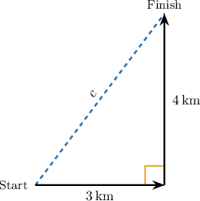
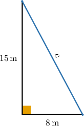
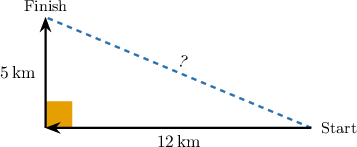
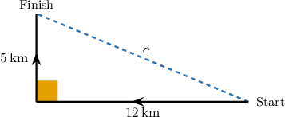
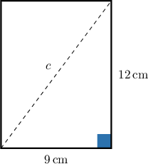
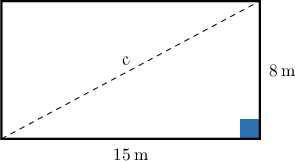
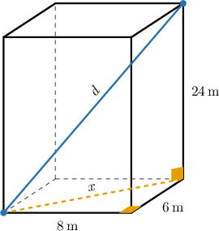
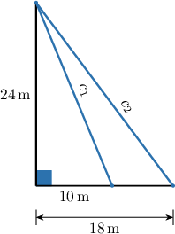

# Solving Real-World Problems Using the Pythagorean Theorem

Source: https://www.mathacademy.com/topics/7925?courseId=39
Topic ID: 7925

## Prerequisites

- [Understanding and Proving the Pythagorean Theorem](./7922-understanding-and-proving-the-pythagorean-theorem.md)
- [Applying the Pythagorean Theorem to Find Missing Side Lengths](./7923-applying-the-pythagorean-theorem-to-find-missing-side-lengths.md)

## Lesson

### Introduction

Many distance questions hide a right triangle. Suppose a cyclist travels east and then north. East and north are perpendicular directions, so the two parts of the trip form the legs of a right triangle.

The **direct distance** from the starting point to the finishing point is the straight-line distance. In the right triangle, that distance is the hypotenuse, so we can let it be

Using the Pythagorean theorem gives

So, the cyclist is from the starting point.

A **model** is a mathematical representation of a situation. Here, the model is the right triangle that represents the trip. Once we build the right triangle correctly, the Pythagorean theorem helps us find the unknown distance and interpret it with the correct units.

### Modeling Real-World Problems With the Pythagorean Theorem

When a situation gives two perpendicular distances, we can translate the words into a right-triangle model.

We use this routine.

Identify the right angle. Look for directions or objects that are perpendicular, such as ground and wall, east and north, or horizontal and vertical.

Label the legs and the hypotenuse. The hypotenuse is always opposite the right angle.

Substitute the leg lengths into the Pythagorean theorem and solve for the unknown length.

For example, suppose a ladder leans against a wall. Its base is from the wall, and its top reaches up the wall.

The wall and ground form a right angle. The ladder is the hypotenuse, so let be the ladder length. We have

Therefore, the ladder is long.

**Watch out!** Do not add the leg lengths and answer The direct slanted distance is the hypotenuse, so we use squares and a square root.

### Example: Finding an Unknown Distance in a Real-World Context Using the Pythagorean Theorem

#### Question

A delivery truck drives west and then north, as shown above. How far is the truck from its starting point?

#### Explanation

To find the distance from the truck's starting point to its finishing point, we can model the truck's path using a right triangle.

Because driving west and driving north are perpendicular directions, the path forms a right angle. The direct distance back to the starting point is the hypotenuse of this right triangle.

Let and be the lengths of the legs, and let be the length of the hypotenuse. According to the Pythagorean theorem, we have

Substituting the given values into the formula gives us

Therefore, the truck is from its starting point.

### Modeling Rectangle Diagonals as Right Triangles

A **diagonal** is a segment that connects two opposite corners of a polygon. In a rectangle, a diagonal forms a right triangle with the length and width of the rectangle.

The adjacent sides of a rectangle meet at right angles, so the length and width are the legs. The diagonal is the hypotenuse.

Suppose a rectangular picture frame is wide and tall. Let be the diagonal length. Using the Pythagorean theorem, we get

Therefore, the diagonal of the picture frame is long.

This answer is reasonable because the diagonal should be longer than either side of the rectangle, and is greater than both and

### Example: Solving Word Problems Involving the Diagonal of a Rectangle

#### Question

A rectangular playground is long and wide. What is the length of the diagonal path across the playground?

#### Explanation

To find the length of the diagonal path, we can model the playground as a rectangle. The length, width, and diagonal form a right triangle, where the diagonal is the hypotenuse.

Let the legs of the right triangle be the length and width of the playground: and We can find the length of the hypotenuse, using the Pythagorean theorem:

Substitute the known values into the theorem:

Taking the positive square root of both sides, we get:

Therefore, the length of the diagonal path is

### Solving Multi-Step Problems With the Pythagorean Theorem

A **multi-step problem** is a problem where we must find one useful measurement before we can find the final answer.

The main question is: What right triangle do we need first?

In a rectangular box, a wire from one bottom corner to the opposite top corner is a **space diagonal**, which is a diagonal through the inside of a three-dimensional box. To find it, we first find the diagonal across the rectangular floor.

Suppose the floor is by and the box is tall. Let be the floor diagonal. Then

Now, the floor diagonal and the height form a new right triangle. If is the space diagonal, then

So, the wire is long.

The same planning idea works for other multi-step situations: combine distances in the same direction before drawing the triangle, or find each hypotenuse first if the question asks for the difference between two cable lengths.

### Example: Solving Multi-Step Word Problems Using the Pythagorean Theorem

#### Question

A cell phone tower tall is supported by a cable attached to the top of the tower and anchored to the ground from its base. A second cable is anchored from the base. Find the difference in length, in meters, between the two cables.

#### Explanation

To find the difference in length between the two cables, we can model the situation with two right triangles. The tower forms the vertical leg of both triangles, the distance along the ground forms the horizontal leg, and the cable forms the hypotenuse.

For the first cable, the legs are and Let be the length of the first cable. According to the Pythagorean theorem, we obtain:

For the second cable, the legs are and Let be the length of the second cable. Again, applying the Pythagorean theorem, we obtain:

Finally, we find the difference in length between the two cables:

Therefore, the difference in length between the two cables is
