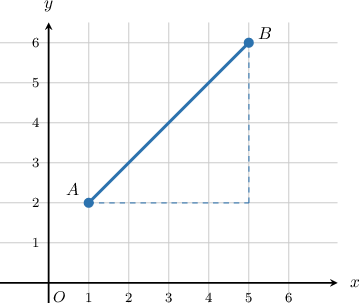
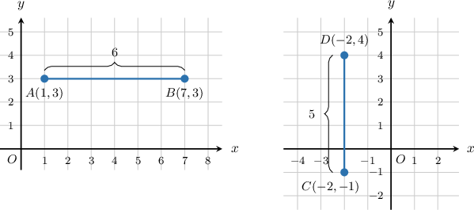
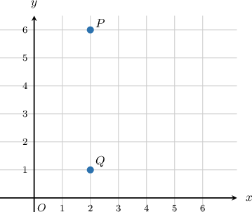
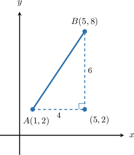
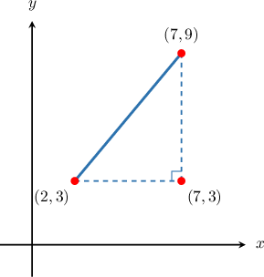
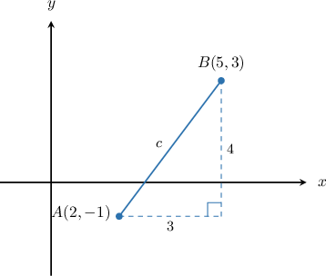
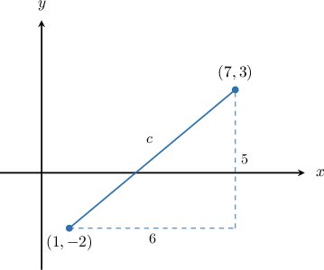

# Finding the Distance Between Two Points Using the Pythagorean Theorem

Source: https://www.mathacademy.com/topics/7926?courseId=39
Topic ID: 7926

## Prerequisites

- [Distances Between Points in the Coordinate Plane](../prealgebra/573-distances-between-points-in-the-coordinate-plane.md)
- [Understanding and Proving the Pythagorean Theorem](./7922-understanding-and-proving-the-pythagorean-theorem.md)
- [Applying the Pythagorean Theorem to Find Missing Side Lengths](./7923-applying-the-pythagorean-theorem-to-find-missing-side-lengths.md)

## Lesson

### Introduction

Suppose two points are plotted on a coordinate grid. We can measure how far apart they are by paying attention to the squares between them.

When two points lie on the same horizontal line or the same vertical line, the distance between them is a straight count across the grid.

When the points are not lined up horizontally or vertically, the segment connecting them is diagonal. The **straight-line distance** is the length of that direct segment between the two points.

The key idea is to break a diagonal distance into easier horizontal and vertical parts. We will start by finding those horizontal and vertical distances from coordinates.

### Finding Horizontal and Vertical Distances

A **horizontal distance** measures how far we move left or right. A **vertical distance** measures how far we move up or down.

Distances are never negative, so we use absolute differences.

For example, the points and have the same -coordinate, so they lie on the same horizontal line. Their horizontal distance is

The points and have the same -coordinate, so they lie on the same vertical line. Their vertical distance is

So, to find a horizontal distance, compare the -coordinates. To find a vertical distance, compare the -coordinates.

### Example: Finding the Horizontal or Vertical Distance Between Two Points

#### Question

Using the grid above, find the vertical distance between the points and

#### Explanation

Both points have the same -coordinate, so the segment from to is **.

That means the vertical distance is the difference between the -coordinates:

So, the vertical distance between and is

### Setting Up a Right Triangle

When two points are not on the same horizontal or vertical line, we can connect them with **axis-aligned** legs. Axis-aligned means parallel to the coordinate axes, so one leg is horizontal and the other is vertical.

Let's use the points and The segment from to becomes the hypotenuse of a right triangle.

One useful corner of the triangle is because it uses the -coordinate of and the -coordinate of

The horizontal leg runs from to so its length is

The vertical leg runs from to so its length is

**Watch out!** The leg lengths come from coordinate differences, not from the coordinates themselves. Here, the legs are and not and

### Example: Setting Up a Right Triangle Between Two Points in the Coordinate Plane

#### Question

For the points and what are the missing entries in the statements below describing the right triangle whose hypotenuse connects the two points and whose legs are axis-aligned?

The horizontal leg has length found from the difference in the of the two points.

The vertical leg has length found from the difference in the of the two points.

The two legs meet at the point where they form a right angle.

#### Explanation

To describe the right triangle whose hypotenuse connects the points and we can visualize them on a coordinate plane.

First, we draw a horizontal line segment from and a vertical line segment from These two legs meet at the point forming the right angle of the triangle.

The horizontal leg connects the points and Its length is the distance between these two points, which we find by taking the difference in their -coordinates:

The vertical leg connects the points and Its length is the distance between these two points, which we find by taking the difference in their -coordinates:

Therefore, we can complete the statements as follows:

The horizontal leg has length found from the difference in the of the two points.

The vertical leg has length found from the difference in the of the two points.

The two legs meet at the point where they form a right angle.

### Using the Pythagorean Theorem to Find Distance

Once the horizontal and vertical legs are known, the straight-line distance is the hypotenuse of the right triangle.

For the points and the horizontal change is and the vertical change is Let be the straight-line distance from to

Now, we apply the Pythagorean theorem.

So, the straight-line distance between and is units.

If is not a perfect square, we can write the answer as a square root and then round when the question asks for a decimal.

### Example: Calculating the Distance Between Two Points Using the Pythagorean Theorem

#### Question

Find the straight-line distance between the points and rounded to two decimal places.

#### Explanation

To find the straight-line distance between two points, we can draw a right triangle where the segment connecting the points is the hypotenuse, and then apply the Pythagorean theorem.

First, we plot the points and and draw the right triangle.

Next, we find the lengths of the horizontal and vertical legs of the triangle by finding the difference between the coordinates.

- The length of the horizontal leg is the difference between the -coordinates:

- The length of the vertical leg is the difference between the -coordinates:

Now, we apply the Pythagorean theorem, where and are the lengths of the legs and is the length of the hypotenuse:

Using a calculator, we find that

Therefore, the straight-line distance is approximately units, rounded to two decimal places.
