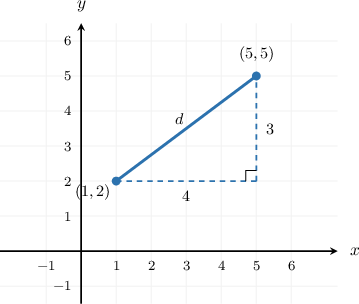
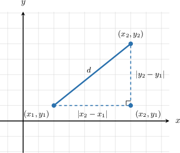
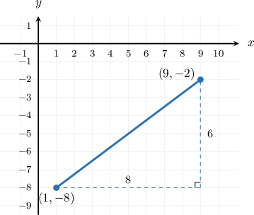
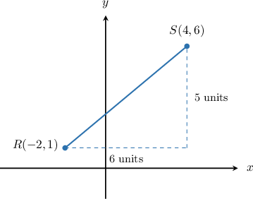

# The Distance Formula

Source: https://www.mathacademy.com/topics/7927?courseId=39
Topic ID: 7927

## Prerequisites

- [Evaluating Numerical Expressions Containing Radicals](./589-evaluating-numerical-expressions-containing-radicals.md)
- [Finding the Distance Between Two Points Using the Pythagorean Theorem](./7926-finding-the-distance-between-two-points-using-the-pythagorean-theorem.md)

## Lesson

### Introduction

Suppose we want to find the length of the segment connecting and The segment is slanted, so we cannot just subtract the -coordinates or just subtract the -coordinates.

The **horizontal difference** is how far the points are apart left-to-right. Here, it is

The **vertical difference** is how far the points are apart up-and-down. Here, it is

These two differences form the legs of a right triangle, and the slanted segment is the hypotenuse. Using the Pythagorean theorem gives

So, we get

So, the distance between the points is units. The next step is to write this same right-triangle idea as a formula we can use for any two points.

### The Distance Formula

The **distance formula** gives the distance between two points and in the coordinate plane:

This formula is the Pythagorean theorem written with coordinates.

- The expression is the horizontal difference.

- The expression is the vertical difference.

- Squaring each difference makes the sign no longer matter, because the length of a leg is nonnegative.

- Taking the square root gives the length of the hypotenuse, which is the distance between the two points.

So, the formula follows the same pattern as The coordinate differences act like the two legs, and acts like the hypotenuse.

### Example: Stating the Distance Formula and Connecting It to the Pythagorean Theorem

#### Question

For two points and what are the missing entries in the following statement of the distance formula and its connection to the Pythagorean theorem?

Each part comes from the Pythagorean theorem where the horizontal difference is one leg and the vertical difference is the other leg. Here, the distance plays the role of the so the quantity under the square root plays the role of

#### Explanation

To find the distance between two points and we can picture a right triangle where the segment connecting the points is the hypotenuse.

The horizontal leg of this triangle has a length equal to the absolute horizontal difference, and the vertical leg has a length equal to the absolute vertical difference,

Using the Pythagorean theorem, we substitute the lengths of the legs for and

Taking the square root of both sides gives the length of the hypotenuse which is the distance

By matching this to the given statements:

- The first part of the formula under the square root is

- The second part is

- Since corresponds to the distance plays the role of the

- The quantity under the square root, corresponds to the sum of the squares of the legs, so it plays the role of

### Using the Distance Formula

To use the distance formula, we first decide which point is and which point is Then we substitute carefully and simplify.

Let's find the distance between and We can let be and be

So, the distance can be calculated as follows:

If a decimal approximation is requested, we use a calculator and round:

Therefore, the distance between the points is units, or approximately units. If the endpoints are named, such as and we write the same length as instead of

### Example: Using the Distance Formula to Find the Distance Between Two Points

#### Question

Using the distance formula, find the distance between the points and

#### Explanation

In this case, we have and

So, the distance can be calculated using the distance formula, as follows:

Therefore, the distance between the points is

### Example: Using the Distance Formula to Find the Length of a Line Segment Given Its Endpoints

#### Question

A line segment has endpoints and Find the length of segment rounded to two decimal places.

#### Explanation

The endpoints of the line segment are and

To find the length we use the distance formula:

Now, we approximate the value using a calculator: rounded to two decimal places.
