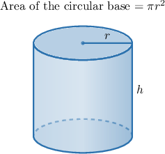
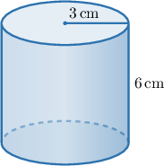
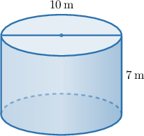
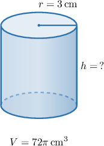
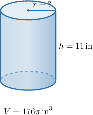

# Volumes of Cylinders

Source: https://www.mathacademy.com/topics/7929?courseId=39
Topic ID: 7929

## Prerequisites

- [The Area of a Circle](../grade-7/522-the-area-of-a-circle.md)
- [Solving Equations Using Square Roots](./2280-solving-equations-using-square-roots.md)

## Lesson

### Introduction

A **cylinder** is a three-dimensional figure with two parallel, identical circular bases. We can think of its volume as the space made by stacking copies of the circular base through the height of the cylinder.

The key idea is the same as for prisms: volume comes from multiplying the area of the base by the height.

For a cylinder, the base is a circle. If the radius of the circular base is then the base area is If the height is then the volume is

Here, is the volume, is the radius of the circular base, and is the height of the cylinder.

Because volume measures three-dimensional space, the answer is measured in cubic units, such as or Next, we will use this formula to calculate actual volumes.

### Example: Stating the Formula for the Volume of a Cylinder

#### Question

Which of the following statements about calculating the volume of a cylinder are true?

1. The area of the circular base is

2. The volume is measured in cubic units.

3. The volume is found by multiplying the area of the circular base by the height.

#### Explanation

Let's analyze each statement in turn.

- Statement I is true. Since the base of a cylinder is a circle, its area is given by the formula for the area of a circle,

- Statement II is true. Volume is the amount of three-dimensional space an object occupies, so it is always measured in cubic units (such as or).

- Statement III is true. A cylinder is a three-dimensional figure with two parallel, identical circular bases. Its volume is found by multiplying the area of its base by its height.

Therefore, the correct answer is "I, II, and III."

### Calculating the Volume of a Cylinder

To calculate the volume of a cylinder, we substitute the radius and height into

Let's find the volume of a cylinder with radius and height

Substituting and we get

So, the volume is If a question asks for a decimal approximation, we approximate only at the end:

So, the decimal approximation is about

**Watch out!** The formula uses the radius, not the diameter. If the diameter is given, divide it by first to find the radius.

### Example: Finding the Volume of a Cylinder Given Its Radius and Height

#### Question

A cylinder has diameter and height Find its volume, rounded to two decimal places, in cubic meters.

#### Explanation

The volume of a cylinder with radius and height is given by

We are given that the diameter of the cylinder is The radius of a circle is half its diameter. So, the radius of the cylinder's base is

Substituting and into the volume formula, we get

Therefore, the volume is approximately rounded to two decimal places.

### Solving for a Missing Dimension

We can also use the cylinder volume formula when one dimension is missing. The starting point is still

If the height is missing, divide by If the radius is missing, divide by first, then take the positive square root.

Now, suppose a cylinder has volume and radius We want to find its height.

Substituting and we get

Therefore, the height of the cylinder is

When the missing value is the radius, remember that a radius is a length, so we use the positive square root. If the question asks for the diameter, double the radius after solving.

### Example: Finding a Dimension of a Cylinder Given Its Volume

#### Question

A cylinder has a volume of and a height of What is its radius?

#### Explanation

To find the unknown radius, we use the formula for the volume of a cylinder.

The volume of a cylinder with radius and height is given by

Substituting and into the formula and solving for we get

Therefore, the radius of the cylinder is
