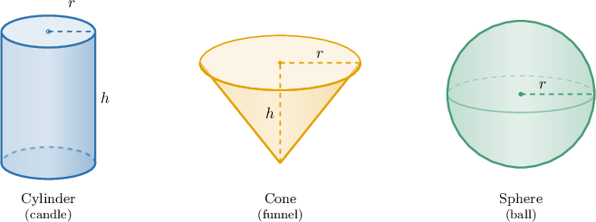
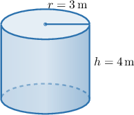
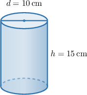
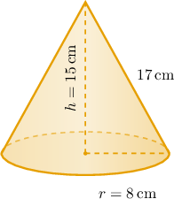
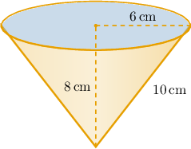
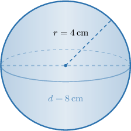
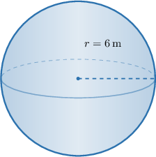

# Solving Real-World Problems Involving Volumes of Cylinders, Cones, and Spheres

Source: https://www.mathacademy.com/topics/7932?courseId=39
Topic ID: 7932

## Prerequisites

- [Volumes of Cones](./7930-volumes-of-cones.md)
- [Volumes of Spheres](./7931-volumes-of-spheres.md)

## Lesson

### Introduction

When we solve a volume problem from a real situation, we first translate the story into a geometric solid.

A **geometric model** is a simpler shape we use to represent a real object. For example, a candle can be modeled by a cylinder, a funnel can be modeled by a cone, and a ball can be modeled by a sphere.

After we choose the model, we look for the measurements that match the formula. Most volume formulas use a radius and sometimes a height

The final answer should use cubic units because volume measures how much space a solid takes up. So, if the lengths are in the volume is in If the lengths are in the volume is in

Our goal is to keep the context attached to the calculation: choose the solid, identify the needed measurements, compute the volume, and interpret what the number means.

### Choosing the Right Volume Formula

The formula depends on the shape of the object.

- For a cylinder, use

- For a cone, use

- For a sphere, use

For the first problems, we focus on cylinders. A cylinder has two circular bases, so the radius is the radius of one circular base, and the height is the distance between the bases.

Suppose a cylindrical container has radius and height

Using the cylinder formula, we get

So, the container holds about If a problem gives the diameter instead of the radius, we first divide the diameter by to find

### Example: Solving Real-World Problems Involving the Volume of a Cylinder

#### Question

A cylindrical candle has a diameter of and a height of Find the volume of wax it contains, rounded to the nearest cubic centimeter.

#### Explanation

First, we can sketch a diagram of the cylindrical candle.

The volume of a cylinder with radius and height is given by the formula

We are given that the diameter of the candle is Since the radius is half the diameter, we have

Substituting the radius and the given height into the volume formula, we get

Now, we evaluate the volume and round to the nearest cubic centimeter (the nearest whole number):

Therefore, the candle contains approximately cubic centimeters of wax.

### The Volume of a Cone

A cone also has a circular base, but it narrows to one point. Because of that, a cone with the same radius and height as a cylinder has only one-third as much volume.

The volume of a cone is where is the radius of the base and is the vertical height of the cone.

**Watch out!** The height in the formula is the vertical height, not the slant height along the side.

Suppose a conical party hat has radius slant height and vertical height

We use and so

So, the party hat has a volume of about The slant height helps describe the side of the cone, but it is not used in this volume formula.

### Example: Solving Real-World Problems Involving the Volume of a Cone

#### Question

A conical funnel has a radius of and a slant height of giving it a vertical height of What is the volume of the funnel, rounded to the nearest cubic centimeter?

#### Explanation

To find the amount of space inside the funnel, we calculate its volume. The volume of a cone is given by the formula where is the radius of the base and is the vertical height of the cone.

We are given that the radius is and the vertical height is Note that the slant height of is extra information that is not needed for the volume formula.

Substituting the radius and vertical height into the formula, we get:

Using a calculator to evaluate the expression, we get

Finally, we round the volume to the nearest cubic centimeter:

Therefore, the volume of the funnel is approximately

### The Volume of a Sphere

A sphere is completely round, so its volume depends only on the radius.

The volume of a sphere is where is the radius of the sphere.

If a problem gives the diameter, we first find the radius by dividing by Suppose a spherical ornament has diameter Then

Now, we substitute into the sphere formula.

So, the ornament has a volume of about Since the radius is cubed, using the diameter by mistake would make the answer much too large.

### Example: Solving Real-World Problems Involving the Volume of a Sphere

#### Question

A spherical water storage tank has a diameter of Find the volume of water it can hold when full, rounded to two decimal places, in cubic meters.

#### Explanation

The tank is spherical, so we use the formula for the volume of a sphere: where is the radius.

We are given that the diameter of the tank is The radius is half of the diameter. So, the radius is

Substituting into the volume formula gives

Rounding to two decimal places, the volume of water the tank can hold is approximately
