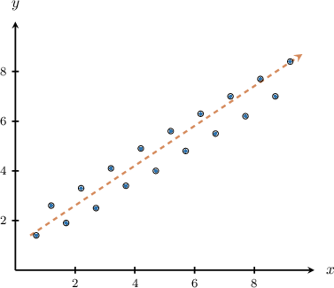
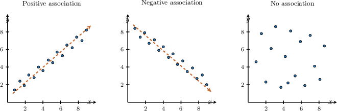
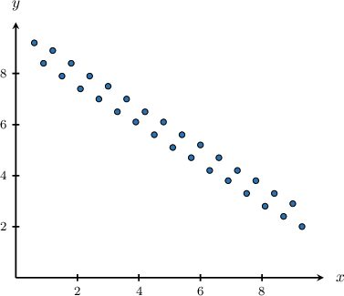
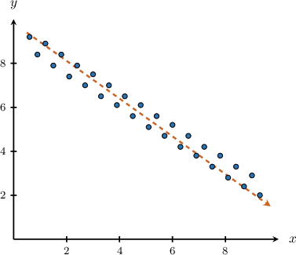
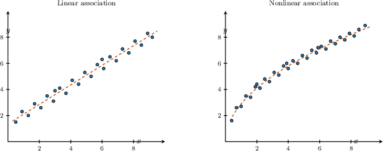
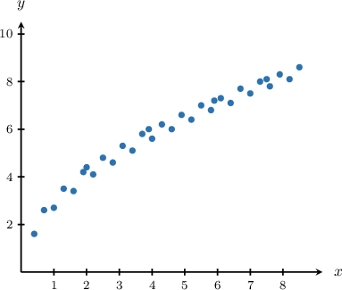
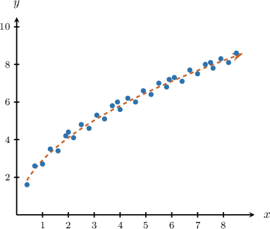
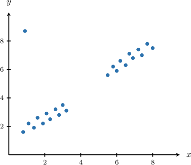
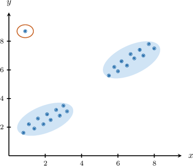

# Describing Patterns of Association in Scatter Plots

Source: https://www.mathacademy.com/topics/7933?courseId=39
Topic ID: 7933

## Prerequisites

- [Outliers](../prealgebra/2517-outliers.md)
- [Scatter Plots](./2585-scatter-plots.md)
- [Identifying Where a Function Is Increasing or Decreasing](./7900-identifying-where-a-function-is-increasing-or-decreasing.md)
- [Linear Functions Versus Nonlinear Functions](./7903-linear-functions-versus-nonlinear-functions.md)

## Lesson

### Introduction

A scatter plot shows paired numerical data as points. Each point has an -value and a -value, so we can look for an overall pattern in how the two variables move together.

An **association** is a relationship between two variables shown by the overall pattern of the points in a scatter plot.

When we describe an association, we focus on the *overall trend*, not on one point at a time. We ask questions like these.

- As increases, do the -values tend to increase?

- As increases, do the -values tend to decrease?

- Do the points look scattered with no clear upward or downward pattern?

A few points may not follow the pattern exactly. That is okay. We are looking for what the points tend to do as a group.

Next, we will name the three main direction patterns we can see in a scatter plot.

### Positive, Negative, and No Association

We describe the *direction* of an association by watching what usually happens to as increases.

- A **positive association** means that as increases, tends to increase. The points usually move upward from left to right.

- A **negative association** means that as increases, tends to decrease. The points usually move downward from left to right.

- **No association** means there is no clear pattern connecting larger -values with larger or smaller -values.

**Watch out!** A positive association does not mean every point is higher than the one before it. A negative association does not mean every point is lower than the one before it. We describe the overall direction of the cloud of points.

So, when we identify direction, we scan from left to right and describe what the -values tend to do overall.

### Example: Identifying Positive, Negative, or No Association in a Scatter Plot

#### Question

As the horizontal variable increases in the scatter plot above, the vertical variable tends to decrease. Which type of association does this describe?

#### Explanation

To determine the type of association, we examine the relationship between the two variables.

The problem states that as the horizontal variable increases, the vertical variable tends to decrease. We can also observe this in the scatter plot, where the points generally trend downwards from left to right.

When one variable tends to decrease as the other increases, the variables have a **.

Therefore, this describes a negative association.

### Linear and Nonlinear Association

Direction is only one part of describing a scatter plot. We also describe the *shape* of the overall pattern.

A **linear association** means the points tend to cluster around an approximately straight-line pattern. The points do not need to lie exactly on one line.

A **nonlinear association** means the points tend to follow a noticeably curved pattern instead of an approximately straight line.

To describe a scatter plot completely, we can combine direction and shape. For example, if the points rise from left to right and follow a curve, we would describe the association as positive and nonlinear.

**Watch out!** "Positive" and "linear" describe different features. Positive tells us the direction. Linear tells us the shape.

### Example: Identifying Linear or Nonlinear Association in a Scatter Plot

#### Question

Determine whether the association shown in the scatter plot above is positive or negative, and whether it is linear or nonlinear.

#### Explanation

To describe the association in the scatter plot, we examine the overall direction and shape of the data points.

- First, as the values of increase (moving from left to right), the values of also tend to increase. Because the variables increase together, this indicates a **.

- Second, the points follow a noticeably curved path rather than an approximately straight line. Because the overall pattern is curved, this indicates a **.

Therefore, the association is positive and nonlinear.

### Clusters and Outliers

Sometimes the overall pattern is easier to describe after we notice groups of points and points that do not fit the pattern.

A **cluster** is a group of data points that are close together. A scatter plot may have one main cluster or several separate clusters.

An **outlier** is a data point that lies far away from the main pattern of the data.

When we describe a scatter plot with clusters and outliers, we can use this plan.

- First, identify the main cluster or clusters.

- Next, describe the association shown by the main group of points.

- Finally, decide whether any outlier strengthens, weakens, or changes the apparent association.

In the visual, the two main groups suggest an overall positive association. The single point far above the lower-left group does not follow that pattern, so it weakens the overall description.

So, clusters help us see the main pattern, while outliers help us explain why the pattern may look less tight.

### Example: Identifying Clustering and Outliers in a Scatter Plot

#### Question

Describe the clusters and outliers in the scatter plot above and their effect on the overall association.

#### Explanation

Looking at the scatter plot, we can see two distinct groups of points. Therefore, the plotted points form two clusters. There is also one point at that stands far apart from the rest of the data as an outlier.

Next, we analyze the relationship within each group of points. In both the lower-left and upper-right clusters, higher values of tend to go with higher values of This means each cluster shows a positive association.

Finally, we consider how the outlier affects the overall relationship. The two clusters suggest an overall positive association. However, the isolated point sits at a small value of but a very large value of which does not follow this upward trend. Because it deviates from the main pattern, it weakens the overall positive association suggested by the clusters.
