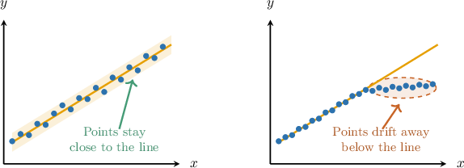
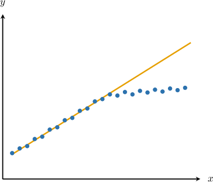
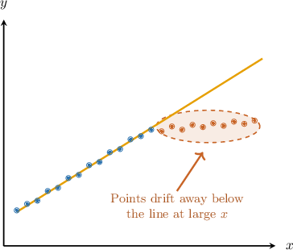
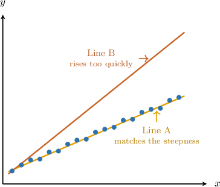
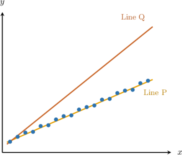
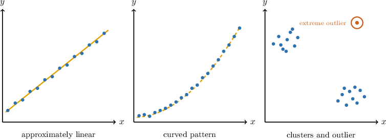
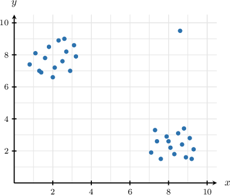
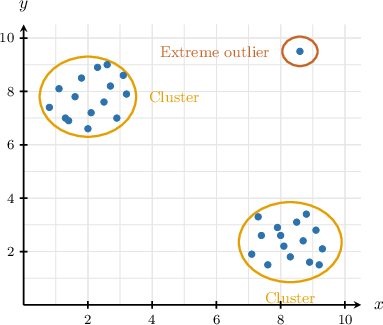

# Informally Assessing the Fit of a Trend Line to a Scatter Plot

Source: https://www.mathacademy.com/topics/7934?courseId=39
Topic ID: 7934

## Prerequisites

- [Trend Lines](./2609-trend-lines.md)
- [Describing Patterns of Association in Scatter Plots](./7933-describing-patterns-of-association-in-scatter-plots.md)

## Lesson

### Introduction

A trend line is useful only if it represents the overall pattern in a scatter plot. Here, we are judging **fit**: how well a trend line matches the data points.

A trend line fits well when the points lie generally near the line across the full range of the data, not just in one small part of the graph.

In the left plot, the points stay close to the line from small values of to large values of That line is a good fit.

In the right plot, the line and the points both rise from left to right, so the line captures the overall direction. But at large values of the points drift away and stay below the line. That means the line does not fit well across the full range.

**Watch out!** A trend line can capture the direction of the data and still be a poor fit if the points are consistently far from the line in one region.

### Example: Comparing the Closeness of a Trend Line to Data Points in a Scatter Plot

#### Question

Which of the following statements are true regarding how well the trend line fits the scatter plot above?

1. The line captures the overall direction of the data.

2. The points lie generally near the line across the full range of the data.

3. The points are consistently far from the line at large values of the horizontal variable.

#### Explanation

To determine how well the trend line fits the scatter plot, we evaluate each statement.

- ** Both the data points and the trend line show an overall upward trend from left to right. Even though the straight line does not closely fit the curved pattern of the data, it successfully captures this overall positive direction. Thus, Statement I is true.

- ** Looking at the scatter plot, the data points are close to the line for small values of However, as increases, the points level off and fall consistently below the line. Because they do not stay near the line across the full range of the data, Statement II is false.

- ** As noted above, at large values of the points drift away from the line and stay well below it. Thus, the points are consistently far from the line in this region, making Statement III true.

Since only statements I and III are true, the correct answer is "I and III only."

### Comparing Candidate Trend Lines

When two candidate trend lines are drawn for the same scatter plot, we compare which line follows the data better overall.

A good trend line should pass through or near the center of the data points across the full range of the scatter plot. It should also match the direction and steepness suggested by the data.

In this plot, Line A is the better fit. It rises at about the same rate as the points and stays near the middle of the data cloud.

Line B is not the better fit, even if it passes close to one or two points. It rises too quickly, so it becomes far above most of the points as increases.

So, when we compare candidate trend lines, we should ask:

- Which line stays closer to the points overall?

- Which line better matches the direction and steepness of the data?

- Is a line being chosen only because it passes through one point?

Passing through a single data point does not automatically make a line a good model.

### Example: Choosing the Better-Fitting Trend Line Between Two Candidates for the Same Scatter Plot

#### Question

Two candidate trend lines are shown on the scatter plot above. Which line is the better fit for the data, and why?

#### Explanation

To evaluate how well a trend line fits the data, we must check if it follows the overall pattern of the scatter plot. A good trend line should capture both the direction and the steepness of the data.

Let's look at the two candidate lines:

- Line P follows the overall upward trend of the data points. It passes roughly through the middle of the scatter plot, capturing the steepness of the relationship.

- Line Q passes through the first data point, but it does not capture the overall steepness of the data. It rises much more quickly than the data points do.

Passing through a single data point (or having a specific -intercept) does not automatically make a line a good model if it ignores the rest of the data. Because Line Q is too steep, it is not a good fit.

Therefore, Line P is the better fit because it matches both the direction and the steepness of the data, while Line Q rises too quickly.

### When a Linear Trend Line Is Not Appropriate

A linear trend line is a straight-line model, so it is appropriate only when the data points roughly follow a straight-line pattern.

Sometimes, a scatter plot has features that make one straight line misleading.

We should be cautious about using a linear trend line when we see any of these patterns:

- The points curve upward or downward. A curved pattern is nonlinear, so a straight line may miss the changing rate of increase or decrease.

- The points separate into distant groups, or **clusters**. A **cluster** is a group of points that are close to each other but separated from other points.

- A single extreme outlier lies far from the rest of the data. An outlier can pull a trend line away from the main pattern.

A positive or negative association is not enough by itself. Before using a linear trend line, we check whether the data look approximately linear and whether clusters or extreme outliers would make the line misleading.

### Example: Identifying Whether a Trend Line Is Appropriate for a Given Scatter Plot

#### Question

Which of the following statements are true regarding whether a linear trend line is appropriate for the scatter plot above?

1. The data separate into two distant clusters with no points between them.

2. The data show strong curvature that a straight line cannot capture.

3. A single extreme outlier would distort a linear model of the data.

#### Explanation

A linear trend line is used to model data that roughly follows a straight-line pattern. However, certain features can make a single straight line an inappropriate model.

Let's examine the given scatter plot and evaluate each statement.

- Statement I is true. The points clearly separate into two distant groups, or **: one in the upper left and another in the lower right. There are no data points in the space between them. A single trend line might not accurately represent both isolated clusters.

- Statement II is false. The data points do not show strong curvature. Curvature would mean the points follow a smooth, bending path, but these points are simply gathered in distinct groups.

- Statement III is true. There is a single point in the upper right that lies far away from the rest of the data. This point is an **. Outliers can pull a trend line away from the main pattern of the data, distorting the linear model.

Since the data is split into distant clusters and contains an extreme outlier, a linear trend line is not appropriate.

Therefore, the correct answer is "I and III only."
