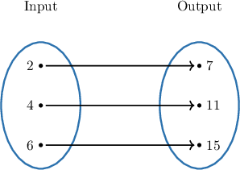
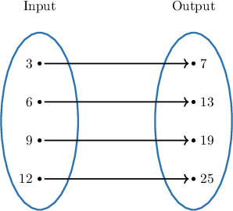
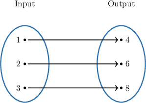
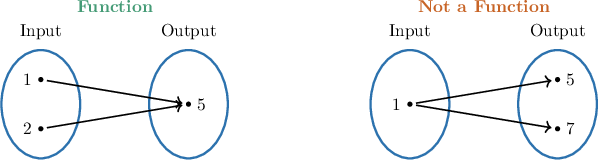

# Visual Representations of Functions

Source: https://www.mathacademy.com/topics/7938?courseId=39
Topic ID: 7938

## Prerequisites

- [Introduction to Functions](./7937-introduction-to-functions.md)

## Lesson

### Introduction

A function can be shown in more than one way. One useful picture is a function machine: a value goes in, a rule is applied, and a value comes out.

In this machine, the value goes into the rule The rule gives So, the **input** is and the **output** is

A **mapping diagram** shows the same kind of idea with arrows. The inputs are usually listed on the left, the outputs are usually listed on the right, and each arrow tells us which output is paired with an input.

When we read a mapping diagram, we follow the arrow from left to right. For example, if the arrow starts at and ends at then the input is paired with the output

**Watch out!** The rule, such as is not the input or the output. It is the instruction that changes an input into an output.

### Example: Identifying Inputs and Outputs of a Function From a Diagram

#### Question

The inputs are the numbers and the outputs are the numbers The input is paired with the output

#### Explanation

A mapping diagram represents a function by showing how inputs and outputs are paired.

- The set on the left contains the **** of the function. In this diagram, the inputs are and

- The set on the right contains the **** of the function. In this diagram, the outputs are and

Arrows show which output is assigned to each input. Following the arrow from the input we see that it points to the output Therefore, the input is paired with the output

The complete statements are as follows:

The inputs are the numbers and the outputs are the numbers The input is paired with the output

### Translating Between Mapping Diagrams and Tables

A table and a mapping diagram can represent the same function if they show the same input-output pairs.

In an input-output table, each column lines up one input with one output.

From the table, we read the pairs by column:

- The input is paired with the output

- The input is paired with the output

- The input is paired with the output

To make a matching mapping diagram, we keep those exact pairings and draw one arrow for each column.

So, translating between a table and a mapping diagram does not mean making a new function. It means showing the same pairs in a different representation.

### Example: Representing a Function With a Mapping Diagram or Table

#### Question

The input-output table above defines a function. Determine the missing entries in the mapping diagram below so that it shows the same input-output pairings.

Each row of the table below shows one input paired with its output, matching the input-output table above.

#### Explanation

To complete the mapping diagram, we need to match each input to its corresponding output from the given table. In the table, each column shows an input paired with its output.

- The table pairs the input with the output So, we draw an arrow from to

- The table pairs the input with the output So, we draw an arrow from to

- The table pairs the input with the output So, we draw an arrow from to

- The table pairs the input with the output So, we draw an arrow from to

This gives us the completed mapping diagram:

### The Definition of a Function

A **function** is a rule that assigns exactly one output to each input.

The phrase “exactly one” is the important part. An input may share an output with another input, but one input cannot point to two different outputs in the same function.

We also use dependency language to describe functions in real situations. The **input** is the quantity we choose or start with, and the **output** is the quantity determined by that input.

For example, suppose the total cost of movie tickets depends on the number of tickets bought.

- The number of tickets is the input.

- The total cost is the output.

- The total cost depends on the number of tickets.

If buying tickets has one specific total cost, and buying tickets has one specific total cost, then the relationship can be described as a function. Each allowed input is paired with exactly one output.

### Example: Describing a Function as a Rule Assigning One Output to Each Input

#### Question

The total pay of a babysitter depends on the number of hours worked. Determine the missing entries in the statements below, which describe this relationship as a rule that assigns exactly one output to each input, indicating which quantity depends on the other.

The is the input, and the is the output.

This relationship is a function because each is paired with output.

Therefore, the pay the number of hours worked.

#### Explanation

First, we must determine which quantity is the input and which is the output. Since the pay is determined by how long the babysitter works, the number of hours is the independent variable and the pay is the dependent variable.

- The is the input, and the is the output.

A mathematical rule is a function if and only if each input is mapped to precisely one output. In this context, for any specific number of hours worked, the babysitting job will have a single, specific pay.

- This relationship is a function because each is paired with output.

Because the output is determined by the input, we say that the output depends on the input.

- Therefore, the pay the number of hours worked.
