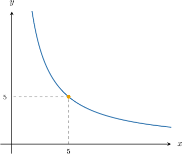

# Inverse Variation

Source: https://www.mathacademy.com/topics/2273?courseId=127
Topic ID: 2273

## Prerequisites

- [Fractions of Fractions](../grade-7/323-fractions-of-fractions.md)
- [Solving Rational Equations Containing One Fractional Term](../algebra-i/1415-solving-rational-equations-containing-one-fractional-term.md)
- [Understanding Proportional Relationships Using Graphs](../grade-7/2552-understanding-proportional-relationships-using-graphs.md)
- [Understanding Proportional Relationships From Descriptions](../grade-7/2554-understanding-proportional-relationships-from-descriptions.md)

## Lesson

### Introduction

Suppose that we're making a juice drink with a fixed amount of pure orange and the rest water.

The more water that we add, the less that we'll be able to taste the orange.

More precisely, the concentration of pure orange $y$ (in grams per liter) varies **inversely** with the volume $x$ (in liters) of water added. We can express this idea using an **inverse variation equation** as follows:

$$

y= \dfrac{k}{x}

$$

The constant $k$ is called the **constant of variation** or **constant of proportionality.**

Notice that:

- If $x$ is small (i.e., there is not much water), then $y$ is large (i.e., there is a high concentration of orange).

- If $x$ is large (i.e., there is lots of water), then $y$ is small (i.e., there is a low concentration of orange).

To find the constant of variation $k$, we need to plug in some data.

For example, suppose we know that the concentration is $y = 200\, \textrm{g/L}$ when $x = 4\,\textrm L$ of water has been added. Plugging this into our relationship and solving for $k,$ we have

$$

\begin{aligned}𝑦 & =\frac{𝑘}{𝑥} \\ 200 & =\frac{𝑘}{4} \\ 200⋅4 & =𝑘 \\ 800 & =𝑘\end{aligned}

$$

Therefore, the relationship between $y$ and $x$ is

$$

y = \dfrac {800} x.

$$

Finally, notice that we can rewrite the above relationship as

$$

xy = 800.

$$

### Example: Finding an Inverse Variation Equation Given One Data Point

#### Question

In an inverse variation, $y=5$ when $x=8.$ Find an equation that relates $x$ and $y.$

#### Explanation

Since $y$ varies inversely with $x,$ we use the equation

$$

y=\dfrac{k}{x}.

$$

Next, we use the data $y=5$ when $x=8$ to find $k\mathbin{:}$

$$

\begin{aligned}5 & =\frac{𝑘}{8} \\ 5⋅8 & =𝑘 \\ 40 & =𝑘\end{aligned}

$$

Therefore, our inverse variation equation is

$$

y = \dfrac{40}{x}.

$$

### Example: Finding a Second Data Point Given Another Data Point

#### Question

If $y$ varies inversely with $x$ and $y=15$ when $x=\dfrac{3}{5}$, find the value of $y$ when $x=3.$

#### Explanation

Since $y$ varies inversely with $x,$ we use the equation

$$

y=\dfrac{k}{x}.

$$

We are told that $y=15$ when $x=\dfrac{3}{5}.$ We substitute this data into the equation to find $k\mathbin{:}$

$$

\begin{aligned}15 & =\frac{𝑘}{(\frac{3}{5})} \\ 15⋅(\frac{3}{5}) & =𝑘 \\ \frac{45}{5} & =𝑘 \\ 9 & =𝑘\end{aligned}

$$

So, the inverse variation is given by

$$

y = \dfrac{9}{x}.

$$

Finally, substituting the value of $x=3$ into this equation gives

$$

y=\dfrac{9}{3} = 3.

$$

### Alternative Formulations

If $y$ varies inversely with $x,$ then we can also say that $y$ is **inversely proportional** to $x.$ We can express this mathematically as

$$

y \propto \dfrac{1}{x},

$$

where $\propto$ is the proportionality symbol.

The following statements are equivalent:

- $y = \dfrac{k}{x}$ for some constant $k$

- $y$ varies inversely with $x$

- $y$ is inversely proportional to $x$

- $y \propto \dfrac{1}{x}$

### Example: Determining Whether a Table Represents an Inverse Variation

#### Question

Consider the table above. Which of the following statements is true?

1. $y$ is inversely proportional to $x$ with constant of variation $k=8.$

2. $y$ is inversely proportional to $x$ with constant of variation $k=16.$

3. $y$ is not inversely proportional to $x.$

#### Explanation

If $y$ varies inversely with $x,$ then we must have

$$

y = \dfrac{k}{x},

$$

for some constant $k.$ Note that we can rewrite the above equation as follows.

$$

x \cdot y = k

$$

So, we will compute $x\cdot y = k$ for each row in the table. If we get the same value of $k$ for each row, then we can conclude that $y$ is inversely proportional to $x.$

The results are all the same: in each row, we have $k=8.$ Therefore, $y$ varies inversely with $x,$ and the constant of variation is $k=8.$

Therefore, the correct answer is "I only."

### Example: Finding an Inverse Variation Equation Given a Graph

#### Question

The graph above shows the relation between $x$ and $y.$ Given that $y$ varies inversely with $x$, find the inverse variation equation between $x$ and $y.$

#### Explanation

Since $y$ varies inversely with $x,$ we use the equation

$$

y = \dfrac{k}{x}.

$$

In the graph, we notice a point with $x=5$ and $y=5.$ We substitute this data into the equation to find $k\mathbin{:}$

$$

\begin{aligned}5 & =\frac{𝑘}{5} \\ 5⋅5 & =𝑘 \\ 25 & =𝑘\end{aligned}

$$

Therefore, the inverse variation equation is given by

$$

y = \dfrac{25}{x}.

$$
