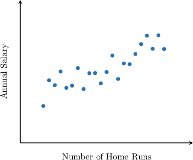
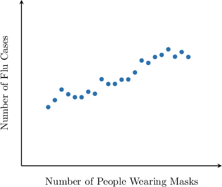
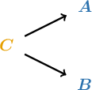
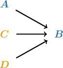
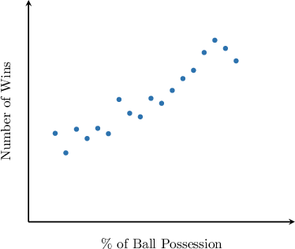

# Correlation vs. Causation

Source: https://www.mathacademy.com/topics/3589?courseId=127
Topic ID: 3589

## Prerequisites

- [Linear Correlation](../algebra-i/734-linear-correlation.md)

## Lesson

### Introduction

The scatter plot below compares data on the number of home runs and the annual salary of several baseball players.

Our scatter plot shows a *correlation* between the number of home runs $({\color{RoyalBlue}A})$ and the annual salary $({\color{RoyalBlue}B}),$ which suggests the following **possible interpretation**:

*An increase in the number of home runs causes an increase in salary.*

In this instance, this sounds like a reasonable thing. We can visualize this situation as follows:

To better understand relationships like this, we must first understand the difference between **correlation** and **causation**:

- Correlation means a relationship/pattern exists between the outputs of two events.

- Causation means that one event causes the other event to occur.

However, correlation is *not* causation! Let's consider another example that illustrates this.

### Reverse Causation

Suppose there is a correlation between the number of people who wear medical face masks in public $({\color{RoyalBlue}A})$ and the number of seasonal flu cases $({\color{RoyalBlue}B})$.

Although there is a clear correlation, this does *not* mean that an increase in the number of face masks $({\color{RoyalBlue}A})$ causes an increase in the number of flu cases $({\color{RoyalBlue}B}).$

One possible explanation is the following:

*An increase in the number of flu cases causes an increase in the number of people wearing face masks in public.*

We can visualize this statement as follows:

This type of scenario is called **reverse causation**. So, we should always be careful about what causes what.

The connection between correlation and causation is generally more complicated than it seems. Let's see one more example.

### Outside Causations

Sometimes, when we look for causation between ${\color{RoyalBlue}A}$ and ${\color{RoyalBlue}B},$ it turns out that there is a third variable ${\color{SandyBrown}C}$ that causes both ${\color{RoyalBlue}A}$ and ${\color{RoyalBlue}B}.$

For example, perhaps there is a correlation between the number of ice creams sold $({\color{RoyalBlue}A})$ and the number of people who used the pool $({\color{RoyalBlue}B})$ at a particular resort over several summers.

In this scenario, rather than one of these variables causing the other, it may be the weather $({\color{SandyBrown}C}),$ a **third variable** (also called a confounding variable), that influences both ${\color{RoyalBlue}A}$ and ${\color{RoyalBlue}B}.$

Therefore, from correlation alone, we cannot definitely rule out a third variable, nor can we conclude that one correlated variable causes the other.

### Example: Causation vs. Outside Causations

#### Question

There is a correlation between "colder outside temperatures" and "increased canned soup sales". Which of the following statements is most supported by this information?

1. An increase in canned soup sales **** the outside temperature to drop.

2. When the outside temperature is colder, people **** more canned soup.

3. A third factor, such as the time of year (for example, winter), could influence **** outside temperature and canned soup sales.

#### Explanation

The statement tells us that there is a correlation between colder outside temperatures and increased canned soup sales, meaning that when the outside temperature is colder, people tend to buy more canned soup.

However, correlation alone does **** show causation. It only provides evidence that the two variables tend to ****.

- Statement I is not supported because it claims a cause-and-effect relationship, which is not guaranteed by a correlation alone.

- Statement II is supported because it restates the correlation carefully: when it is colder, canned soup sales tend to be higher.

- Statement III is supported because a correlation can occur if a third factor influences both variables, and the information given does not rule out an outside cause.

Therefore, the correct answer is only II and III.

### Coincidence

When looking for causation between two variables, it could be the case that there is no reasonable causal connection between them. In that case, one possible explanation is that the correlation is **coincidental**. This can be visualized as follows:

For example, suppose the number of hot dogs sold at a baseball game $({\color{RoyalBlue}A})$ is correlated with the number of runs scored by the team $({\color{RoyalBlue}B}).$ What can we conclude from this?

From this correlation alone, we cannot conclude that ${\color{RoyalBlue}A}$ causes ${\color{RoyalBlue}B}$ or that ${\color{RoyalBlue}B}$ causes ${\color{RoyalBlue}A}$. We also cannot conclude that ${\color{RoyalBlue}A}$ does not cause ${\color{RoyalBlue}B}$ or that ${\color{RoyalBlue}B}$ does not cause ${\color{RoyalBlue}A}$.

Although coincidence is one possible explanation, the information given is not enough to conclude that the correlation is **definitely** coincidental.

### Example: Identifying Causation vs. Coincidence

#### Question

A store observes that an increase in the number of people purchasing cool beverages is correlated with an increase in the number of people purchasing newspapers.

Which of the following statements is most supported by this information?

1. An increase in the number of people purchasing newspapers **** an increase in the number of people purchasing cool beverages.

2. The correlation between the number of people purchasing cool beverages and the number of people purchasing newspapers could be ****.

3. An increase in the number of people purchasing cool beverages is **** with a decrease in the number of people purchasing newspapers.

#### Explanation

The statement tells us that there is a positive correlation between people purchasing cool beverages in a store and those buying newspapers, meaning that when more people purchase cool beverages, more people buy newspapers.

However, correlation alone does **** show causation. It only provides evidence that the two variables tend to ****.

- Statement I is not supported because it claims a cause-and-effect relationship, which is not guaranteed by a correlation alone.

- Statement II is supported because a correlation can happen by coincidence or because of other factors. The information given does not rule out coincidence or other explanations.

- Statement III is not supported because it restates the correlation in the wrong direction: the given information describes a positive correlation, but the statement claims a negative association.

Therefore, the correct answer is only II.

### Multiple Causations

Finally, it might be the case that many variables, besides ${\color{RoyalBlue}A},$ cause ${\color{RoyalBlue}B}.$ This can be visualized as follows:

For example, there is a correlation between the average speed of cars $({\color{RoyalBlue}A})$ and the number of car accidents $({\color{RoyalBlue}B})$ on a certain highway. Does ${\color{RoyalBlue}A}$ cause ${\color{RoyalBlue}B}$ here?

The answer might be a bit more complicated. It could be that there are multiple possible causes. For example, the speed $({\color{RoyalBlue}A})$, the road conditions $({\color{SandyBrown}C})$, and the weather conditions $({\color{SandyBrown}D})$, among other factors, may all influence the number of accidents on a highway $({\color{RoyalBlue}B}).$

However, from the correlation alone, we cannot conclude that ${\color{RoyalBlue}A}$ causes ${\color{RoyalBlue}B}$, and we cannot definitely rule out these other possible causes, nor can we conclude that they are the actual causes.

### Example: Identifying Causation vs. Multiple Causations

#### Question

The above scatter plot shows the relationship between the percentage of possessions per game and the number of wins of teams in the NBA.

Which statement is most reasonable based on the scatter plot?

1. Teams with a higher percentage of possessions per game **** have more wins, though other factors could also affect the number of wins.

2. A higher percentage of possessions per game and a higher percentage of shot attempts from 3-point range are factors that **** the number of wins.

3. A higher percentage of possessions per game is the **** of an increase in the number of wins.

#### Explanation

The scatter plot shows a clear positive association: teams with a higher percentage of possession generally also have more wins.

However, a scatter plot by itself does **** establish causation. It only provides evidence of a ****, meaning the two variables tend to ****.

- Statement I is supported because it restates the relationship carefully using “****,” and it allows that other factors could also affect the number of wins without claiming any specific cause-and-effect relationship.

- Statement II is not supported because it asserts that specific factors **** the number of wins, which is a causation claim not established by the scatter plot alone.

- Statement III is not supported because it claims a cause-and-effect relationship (and even says it is the only cause), which is not guaranteed by the scatter plot alone.

Therefore, the correct answer is "I only."
