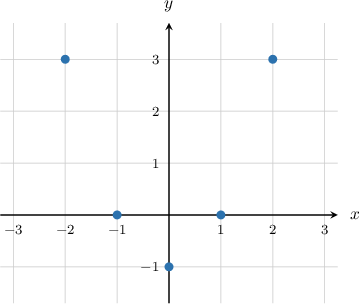
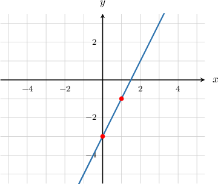
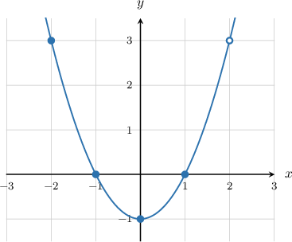
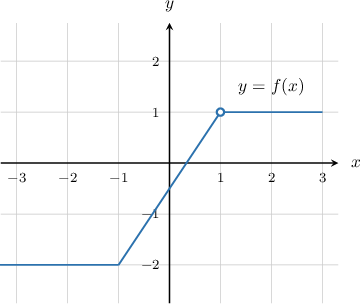

# Graphs of Functions

Source: https://www.mathacademy.com/topics/3821?courseId=127
Topic ID: 3821

## Prerequisites

- [Visual Representations of Functions](../algebra-i/631-visual-representations-of-functions.md)

## Lesson

### Introduction

We can plot a function $f(x)$ by setting $y=f(x).$

To demonstrate, let's consider the function

$$

f(x) = x^2-1,

$$

where $x$ is any number taken from the set $\{-2, -1, 0, 1,2 \}.$

First, we create a table containing the input values:

Given a value of $x,$ we can find the corresponding $y$-value by substituting $x$ into the formula $y=x^2-1.$ For example,

- if $x=-2$ then $y=(-2)^2-1=3,$

- if $x=-1$ then $y=(-1)^2-1=0,$

- $\cdots$

Continuing in the same way, we get the following values:

Finally, we plot these $(x,y)$ pairs in the $xy$-plane:

We don't connect the points since $f(x)$ is defined only for values of $x$ contained within the set $\{-2,-1,0,1,2\}.$

Let's now take a look at an example where $x$ is unrestricted.

### Example: Plotting a Function

#### Question

What is the graph of $y = f(x),$ where $f(x) = 2x - 3?$

#### Explanation

Recall that the graph of $y = 2x - 3$ is a straight line, and two distinct points can determine any straight line.

So, given any two distinct values of $x,$ we can find the corresponding $y$-values by substituting $x$ into the formula $y = 2x - 3.$ For example,

- if $x = 0$ then $y = 2(0) - 3 = -3,$ which gives the point $(0,-3),$ and

- if $x = 1$ then $y = 2(1) - 3 = -1,$ which gives the point $(1,-1).$

Finally, we plot these $(x,y)$ pairs in the $xy$-plane and draw a line through them. This gives the following graph.

### Evaluating Functions Using Graphs

Consider the function $y=f(x),$ shown below.

We can determine the values of this function at particular points by reading them off its graph.

- Since the graph passes through the point $(-2,3),$ we know that $f(-2) = 3.$

- Since the graph passes through the point $(-1,0),$ we know that $f(-1) = 0.$

- Since the graph passes through the point $(0,-1),$ we know that $f(0) = -1.$

Notice that the point $(2,3)$ is shown with an empty circle. This means that the function is **undefined** at the point where $x=2.$

### Example: Evaluating a Function Given Graphically

#### Question

The function $y = f(x)$ is shown above. Calculate $f(-2) + f(1).$

#### Explanation

We can find the necessary function values using the graph.

From the graph, we note the following:

- When $x=-2,$ we have $y=-2.$ So, $f(-2)=-2.$

- When $x=1,$ the function is **** because the function has an open circle at this point.

Therefore, since $f(1)$ is undefined, the sum $f(-2)+f(1)$ is undefined too.
