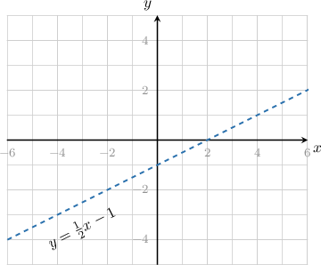
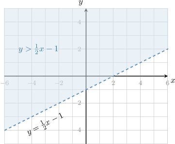
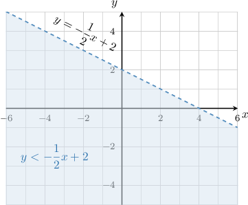
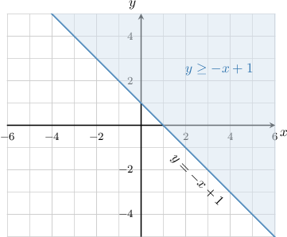
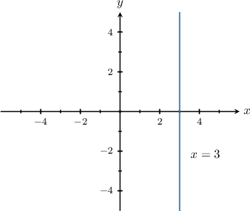
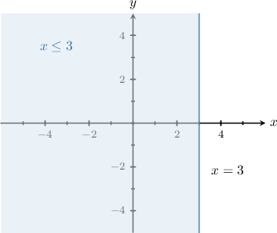
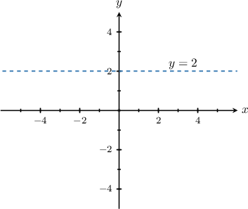
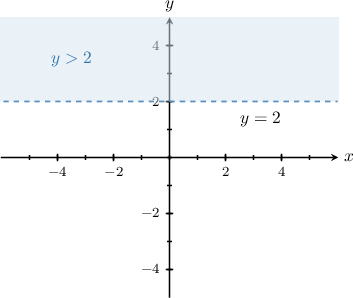
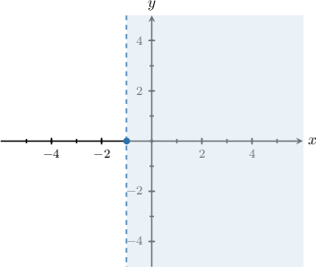

# Further Graphing of Two-Variable Linear Inequalities

Source: https://www.mathacademy.com/topics/3822?courseId=127
Topic ID: 3822

## Prerequisites

- [Graphing Strict Two-Variable Linear Inequalities](../algebra-i/665-graphing-strict-two-variable-linear-inequalities.md)
- [Properties of Lines Given in Standard Form](../algebra-i/3725-properties-of-lines-given-in-standard-form.md)
- [Graphing Non-Strict Two-Variable Linear Inequalities](../algebra-i/3827-graphing-non-strict-two-variable-linear-inequalities.md)
- [Further Solving Linear Inequalities](../grade-7/4034-further-solving-linear-inequalities.md)

## Lesson

### Introduction

When solving linear inequalities in two variables, we sometimes need to write the inequality in a more convenient form before sketching its solutions.

As an example, let's consider the following inequality:

$$

x-2y < 2

$$

This is a two-variable inequality, so we can represent its solutions by shading a region in the $xy$-plane.

Our first step usually is to sketch the corresponding straight line. However, that isn't easy in this case because the corresponding line $x-2y = 2$ is not in slope-intercept form.

Therefore, the first step is to express our inequality in slope-intercept form. Remember that we must always flip the direction of the inequality sign whenever we divide by a negative quantity:

$$

\begin{aligned}𝑥−2𝑦 & <2 \\ 𝑥−2𝑦−𝑥 & <2−𝑥 \\ −2𝑦 & <2−𝑥 \\ −2𝑦 & <−𝑥+2 \\ 𝑦 & >\frac{1}{2}𝑥−1\end{aligned}

$$

Next, we proceed as usual. We start by drawing the corresponding straight line

$$

y=\dfrac12 x-1.

$$

Since the inequality involves a *strictly greater than* $(>)$ sign, the line is **not** part of the solution. Therefore, we draw a **dashed line**.

Finally, we must decide whether to shade above or below the line. The inequality

$$

y > \dfrac12 x-1

$$

refers to the $y$-values that are *greater than* those on the line $y=\dfrac12x-1,$ so we shade *above* the line.

### Example: Identifying the Graph of a Strict Inequality Given in Standard Form

#### Question

Sketch the solutions to the inequality $x+2y < 4$ in the $xy$-plane.

#### Explanation

First, we convert the inequality into slope-intercept form:

$$

\begin{aligned}𝑥+2𝑦 & <4 \\ 2𝑦 & <−𝑥+4 \\ 𝑦 & <−\frac{1}{2}𝑥+2\end{aligned}

$$

Now, we proceed as usual. We start by drawing the corresponding straight line

$$

y=-\dfrac{1}{2}x+2.

$$

Since the inequality involves a 'strictly less than' sign, the line $y=-\dfrac{1}{2}x+2$ itself is ** part of the solution. Therefore, we draw a dashed line.

Then, we must decide whether to shade above or below the line. The inequality

$$

y < -\dfrac{1}{2}x+2

$$

refers to the $y$-values that are ** those on the line $y = -\dfrac{1}{2}x+2,$ so we shade ** the line.

### Example: Identifying the Graph of a Non-Strict Inequality Given in Standard Form

#### Question

Sketch the solutions to the inequality $-x-y \leq -1$ in the $xy$-plane.

#### Explanation

First, we convert the inequality into slope-intercept form:

$$

\begin{aligned}−𝑥−𝑦 & ≤−1 \\ −𝑦 & ≤𝑥−1 \\ 𝑦 & ≥−𝑥+1\end{aligned}

$$

Now, we proceed as usual. We start by drawing the corresponding straight line

$$

y=-x+1.

$$

Since the inequality involves a 'greater than **' sign, the line $y=-x+1$ itself is part of the solution. Therefore, we draw a **.

Then, we must decide whether to shade above or below the line. The inequality

$$

y \geq -x+1

$$

refers to the $y$-values that are ** or equal to those on the line $y=-x+1,$ so we shade ** the line.

### Vertical Lines

Sometimes, two-variable inequalities may not explicitly involve a $y$-variable at all. Nonetheless, we can still represent their solutions in the $xy$-plane.

As an example, let's sketch the solutions to the following inequality in the $xy$-plane:

$$

x \leq 3

$$

We start by sketching the corresponding straight line $x=3.$ Since we have a 'less than *or equal to*' inequality, the line itself is part of the solution. Therefore, we draw a *solid* line:

Then, we need to decide whether to shade to the left or the right of the line. Now, our inequality

$$

x \leq 3

$$

refers to all points whose $x$-value is *less than* or equal to those on the line $x=3.$ Therefore, we shade to the *left* of the line.

### Horizontal Lines

Similarly, two-variable inequalities may not explicitly involve an $x$-variable. But again, we can still represent their solutions in the $xy$-plane.

As an example, let's sketch the solutions to the following inequality in the $xy$-plane:

$$

y \gt 2

$$

We start by sketching the corresponding straight line $y=2.$ Since we have a 'greater than' inequality, the line itself is *not* part of the solution. Therefore, we draw a *dashed* line:

Then, we need to decide whether to shade above or below the line. Now, our inequality

$$

y \gt 2

$$

refers to all points whose $y$-value is *greater than* those on the line $y=2.$ Therefore, we shade *above* the line.

### Example: Inequalities Involving Horizontal and Vertical Lines

#### Question

Find the inequality that describes the shaded region shown below.

#### Explanation

The border-line is a vertical line passing through the point $(-1,0).$ Therefore, the line has the equation

$$

x=-1.

$$

Now, we need to decide which inequality symbol to use.

- Since the line is **, we will use a ** inequality.

- Since the shaded region is to the ** of the line, the inequality refers to the $x$-values that are ** those on the line $x=-1.$

Therefore, the corresponding inequality is

$$

x > -1.

$$
