# Identifying Angle Postulates

Source: https://www.mathacademy.com/topics/5100?courseId=127
Topic ID: 5100

## Prerequisites

- [Angle Criteria for Parallel Lines](../grade-8/1512-angle-criteria-for-parallel-lines.md)

## Lesson

### Introduction

In this lesson, we'll begin our journey of constructing geometric proofs.

First, we recall some definitions:

- **Congruent segments:** *Two segments are congruent if they have the same length.*

- **Congruent angles:** *Two angles are congruent if their measures are equal.*

- **Supplementary angles:** *Two angles are supplementary if their measures add to $180^\circ.$*

### Angle Postulates

A **postulate** is a mathematical statement that is assumed to be true and does not require proof.

Postulates are statements that mathematicians have decided are self-evident. They are used as starting points to prove other results.

Several postulates are used within the system of plane geometry (also called **Euclidian geometry** or **two-dimensional geometry**). Let's review the important angle postulates we've already met.

- The **linear pair postulate:** *If two angles form a linear pair, then they are supplementary.* The diagram below shows a linear pair of angles. Since these angles form a linear pair, the linear pair postulate *guarantees* that the sum of their measures equals $180^\circ$ (i.e., they're supplementary).

- The **angle addition postulate:** *If a ray divides an angle into two adjacent angles, the sum of the measures of the two smaller angles equals the measure of the larger angle.* In the diagram below, the ray $\overrightarrow{SR}$ divides the angle $\angle PST$ into two adjacent angles, $\angle PSR$ and $\angle RST$. The angle addition postulate guarantees that

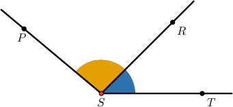

- The **right angle postulate:** *All right angles are congruent.*

In the diagram below, $\angle BAC$ and $\angle EDF$ are right angles. The right angle postulate states that all right angles are congruent. In other words, any two right angles have the same measure, regardless of their location or how they are formed:

$$

m \angle BAC = m\angle EDF

$$

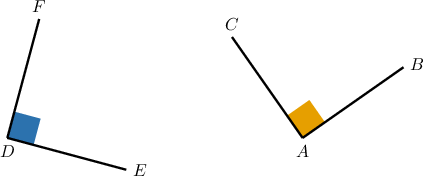

### Example: Identifying Instances of Angle Postulates

#### Question

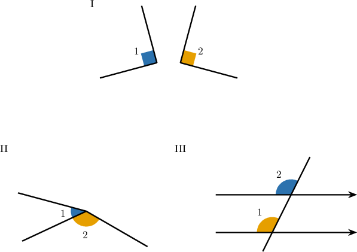

Consider the above diagrams. In which one can we apply the angle addition postulate to $\angle 1$ and $\angle 2$?

#### Explanation

The angle addition postulate says that if a ray divides an angle into two adjacent angles, the sum of the measures of the two smaller angles equals the measure of the larger angle.

Let's go through the diagrams:

- In diagram I, $\angle 1$ and $\angle 2$ are not adjacent.

- In diagram II, a ray divides a larger angle into adjacent angles $\angle 1$ and $\angle 2.$

- In diagram III, $\angle 1$ and $\angle 2$ are not adjacent.

So diagram II is the only diagram in which we can apply the angle addition postulate.

### The Corresponding Angles Postulate

Let's state the **corresponding angles postulate.**

*If a transversal cuts two parallel lines, then the corresponding angles are congruent.*

Consider the diagram below, showing two *parallel* lines (indicated by the arrows) cut by a transversal.

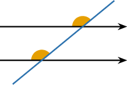

Since the two lines are parallel, this *guarantees* that the corresponding angles are congruent. Let's add some angle markers to show this.

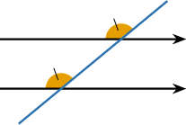

We can write this as follows:

$$

\textrm{Lines are parallel}\quad \Longrightarrow\quad \textrm{Corresponding angles are congruent}

$$

The symbol $\Longrightarrow$ has a formal mathematical meaning. Informally for our purposes, $A\Longrightarrow B$ means that if $A$ is true, then $B$ **must** also be true.

### Example: Identifying Instances of the Corresponding Angles Postulate

#### Question

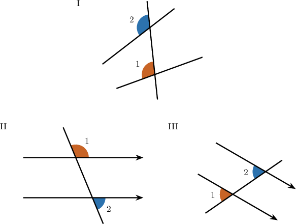

Consider the above diagrams. In which one can we apply the corresponding angles postulate to conclude that $\angle 1$ and $\angle 2$ are congruent?

#### Explanation

The corresponding angles postulate says that when a transversal intersects two parallel lines, the corresponding angles formed are congruent.

Let's go through the diagrams:

- In diagram I, there is a transversal cutting two lines, but the lines are not parallel.

- In diagram II, there is a transversal cutting two parallel lines, but $\angle 1$ and $\angle 2$ are not corresponding.

- In diagram III, $\angle 1$ and $\angle 2$ are corresponding angles formed by a transversal cutting two parallel lines.

So, diagram III is the only diagram in which we can apply the corresponding angles postulate to $\angle 1$ and $\angle 2.$

### The Converse Corresponding Angles Postulate

Let's state the **converse corresponding angles postulate**.

*If a transversal cuts two lines and the corresponding angles are congruent, then the lines are parallel.*

Consider the diagram below, which shows two lines cut by a transversal and two *congruent* corresponding angles.

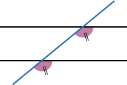

Since the corresponding angles are congruent, this *guarantees* that the lines are parallel. Let's add some arrows to show this.

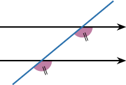

We can write this as follows:

$$

\textrm{Corresponding angles are congruent}\quad \Longrightarrow\quad \textrm{Lines are parallel}

$$

### The Postulate vs. Its Converse

It's crucial that you understand the difference between the corresponding angles postulate and its converse. This is very important!

- The corresponding angles postulate tells us that *if* two lines are parallel, *then* the corresponding angles are congruent. Notice that we added angle markers to the diagram on the right.

- The **converse** tells us that *if* two corresponding angles are congruent, *then* the lines are parallel. Notice that we added arrows to the diagram on the right.

Take a moment to make sure you really understand the difference!

### Example: Identifying Instances of the Converse Corresponding Angles Postulate

#### Question

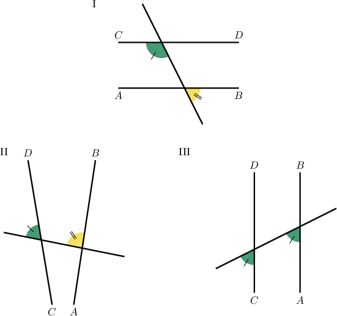

Consider the above diagrams. In which one can we apply the converse corresponding angles postulate to the colored angles to conclude that $\overleftrightarrow{AB}$ and $\overleftrightarrow{CD}$ are parallel?

#### Explanation

The converse corresponding angles postulate says that if a transversal cuts two lines such that the corresponding angles are congruent, then the lines are parallel.

Let's go through the diagrams:

- In diagram I, a transversal cuts the two lines $\overleftrightarrow{AB}$ and $\overleftrightarrow{CD}$, but the marked angles are not corresponding (and also not congruent).

- In diagram II, a transversal cuts the two lines $\overleftrightarrow{AB}$ and $\overleftrightarrow{CD}$, but the marked angles are not congruent.

- In diagram III, a transversal cuts the two lines $\overleftrightarrow{AB}$ and $\overleftrightarrow{CD}$, and the marked angles are corresponding and congruent.

So, diagram III is the only diagram in which we can apply the converse corresponding angles postulate to the marked angles.

### Example: Identifying Which Postulate Applies

#### Question

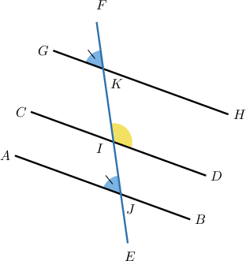

Given that $\angle FKG \cong \angle IJA$, by which theorem or postulate does it follow that $\overset{\longleftrightarrow}{AB}$ and $\overset{\longleftrightarrow}{GH}$ are parallel?

#### Explanation

When a transversal cuts a pair of lines, we get four pairs of corresponding angles.

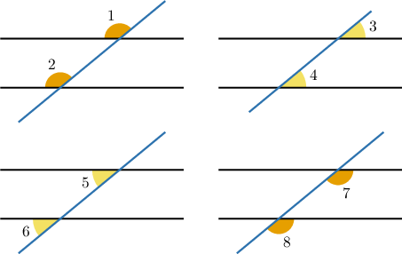

So, in the given diagram, $\angle FKG$ and $\angle IJA$ are corresponding angles.

The **** states that if a transversal cuts two lines and the corresponding angles are congruent, then the lines are parallel.

Therefore, $\overset{\longleftrightarrow}{AB}$ and $\overset{\longleftrightarrow}{GH}$ are parallel by the converse corresponding angles postulate.
