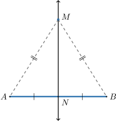
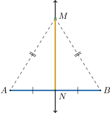
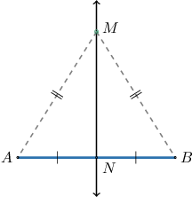
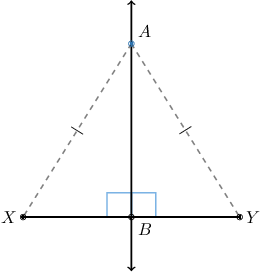
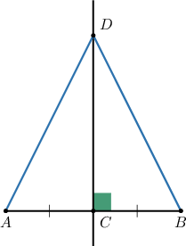

# Further Proving Perpendicular Line Theorems

Source: https://www.mathacademy.com/topics/5273?courseId=127
Topic ID: 5273

## Prerequisites

- [Proving Perpendicular Line Theorems](../geometry/5135-proving-perpendicular-line-theorems.md)

## Lesson

### Introduction

In this lesson, we'll learn how to prove the converse perpendicular bisector theorem and consolidate our knowledge of all the perpendicular line theorems we've seen.

Let's begin by stating the converse perpendicular bisector theorem:

*If a point is equidistant from the endpoints of a segment, then it lies on the perpendicular bisector of the segment.*

In addition to the tools we've already used, we'll need to use the linear pair perpendicular theorem. We state this below:

*If two lines intersect to form a linear pair of congruent angles, then the lines are perpendicular.*

We proved this theorem in a previous lesson.

### The Converse Perpendicular Bisector Theorem

Consider the diagram below, where $N$ is a point on $\overline{AB}$ such that $AN = BN,$ and $M$ is a point distinct from $N$ such that $AM = BM.$

Suppose we wish to prove that the converse perpendicular bisector theorem holds.

*$\overset{\longleftrightarrow}{MN}$ is the perpendicular bisector of $\overline{AB}.$*

Our strategy for proving this result is as follows:

- We already know that $\overleftrightarrow{MN}$ bisects $\overline{AB},$ so all we need to do is prove that it is perpendicular to $\overline{AB}$.

- We can show that the two smaller triangles are congruent. This means that $\angle MNA$ and $\angle MNB$ are congruent by CPCTC.

- However, since these angles form a linear pair, they must be right angles. Therefore, the line and segment are perpendicular.

To construct a formal proof, we proceed as follows:

- **Step 1**: We are given that $\overline{AN} \cong \overline{BN}$ and $\overline{AM} \cong \overline{BM}.$

- **Step 2**: By the *reflexive property of congruence*, we have that $\overline{MN} \cong \overline{MN}.$ Let's add this to our diagram.

- **Step 3**: From steps 1 and 2 respectively, we have that So, $\triangle{AMN}$ and $\triangle{BMN}$ have three congruent sides. Therefore, by the *SSS criterion*, these triangles are congruent.

- **Step 4**: Since $\triangle{\color{red}A}{\color{blue}M}N \cong \triangle{\color{red}B}{\color{blue}M}N,$ we have $\angle{\color{blue}M}N{\color{red}A} \cong \angle{\color{blue}M}N{\color{red}B}$ by CPCTC.

- **Step 5**: Since $\angle{MNA}$ and $\angle{MNB}$ form a linear pair of congruent angles, we have that $\overline{AB}$ and $\overset{\longleftrightarrow}{MN}$ are perpendicular by the *linear pair perpendicular theorem*.

- **Step 6**: Finally, in steps 1 and 5 respectively, we showed that Therefore, by the *definition of perpendicular bisector*, we conclude that $\overset{\longleftrightarrow}{MN}$ is the perpendicular bisector of $\overline{AB}.$

### Stating the Full Proof Using the Two-Column Format

The table below shows our proof of the converse perpendicular bisector theorem in a two-column format.

We can also prove this theorem using the HL criterion. Let's see an example.

### Example: Proving the Converse Perpendicular Bisector Theorem

#### Question

The point $A,$ which does not lie on the segment $\overline{XY},$ is at the same distance from $X$ and $Y.$ The point $B$ between $X$ and $Y$ is such that $\overset{\longleftrightarrow}{AB}$ and $\overline{XY}$ are perpendicular.

Consider the following statement:

**

The table below provides proof of this statement. Select the correct options in the table to complete the proof.

#### Explanation

A sketch of the information is shown above, and the correct proof is below.

Let's examine the rows of the table with missing parts in turn.

- Consider row 5. From row 4, we have that $AX = AY.$ Therefore, by the definition of congruent segments, these segments are congruent.

- Consider row 6. From the diagram, we have that $\overline{AB}$ is a side of $\triangle{ABX}$ and $\triangle{ABY}.$ And by the reflexive property of congruence, $\overline{AB} \cong \overline{AB}.$

- Consider row 7. From rows 2 and 3, we get that $\triangle{ABX}$ and $\triangle{ABY}$ are right triangles. On the other hand, from rows 5 and 6, we have Therefore, by the HL criterion, $\triangle{ABX} \cong \triangle{ABY}.$

### Example: Constructing Complete Proofs of the Perpendicular Line Theorems

#### Question

In the diagram above, $\overset{\longleftrightarrow}{CD}$ is the perpendicular bisector of $\overline{AB}.$

Consider the following statement:

**

The table below provides proof of this statement. Fill in the missing reasons and thus complete the proof.

#### Explanation

The correct proof is below.

Let's examine each row in turn.

1. We're given that $\overset{\longleftrightarrow}{CD}$ is the perpendicular bisector of $\overline{AB}.$ Then, by the definition of perpendicular lines, the angles formed by the intersection of $\overset{\longleftrightarrow}{CD}$ and $\overline{AB}$ have a measure of $90^\circ.$ So, we have that $m\angle{DCB} = 90^\circ.$

2. Notice that $\angle{DCB}$ and $\angle{DCA}$ form a linear pair. Therefore, these angles are supplementary by the linear pair postulate.

3. From row 2, $\angle{DCB}$ and $\angle{DCA}$ are supplementary. Therefore, $m\angle DCB +m\angle DCA = 180^\circ$ by the definition of supplementary angles.

4. From row 3, $m\angle DCB +m\angle DCA = 180^\circ.$ By the addition principle, we can subtract $m\angle{DCB}$ from both sides of this equation:

5. From rows 1 and 4, $m\angle DCB = 90^\circ$ and $m\angle DCA =180^\circ - m\angle DCB.$ Therefore, by substituting the first into the second,

6. From rows 1 and 5, we have $m\angle DCB = 90^\circ = m\angle DCA.$ Therefore, by the transitive property of equality,

7. From row 6, $\angle{DCB}$ and $m\angle{DCA}$ have the same measure. Therefore, these angles are congruent by the definition of congruent angles.

8. From the given information, $\overset{\longleftrightarrow}{CD}$ is the perpendicular bisector of $\overline{AB}$ and $C$ lies on $\overline{AB}.$ By the definition of a perpendicular bisector, we have

9. The reflexive property of congruence states that every segment is congruent to itself. Then, $\overline{CD} \cong \overline{CD}$ by the reflexive property of congruence.

10. From rows 8, 7, and 9, we have Therefore, by the SAS criterion, $\triangle{DCB} \cong \triangle{DCA}.$

11. From row 10, $\triangle{{\color{red}D}C{\color{red}B}} \cong \triangle{{\color{red}D}C{\color{red}A}}.$ Then, $\overline{DB} \cong \overline{DA}$ by CPCTC.
