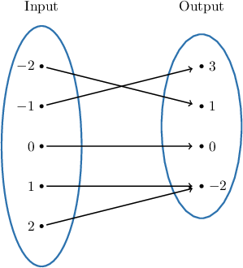
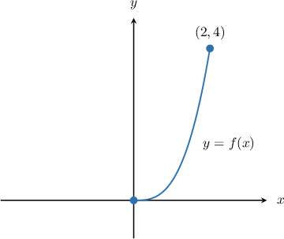
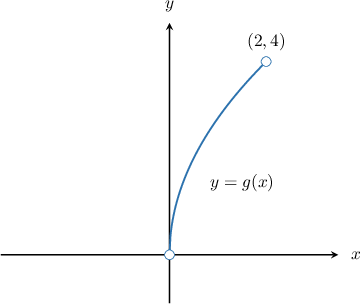
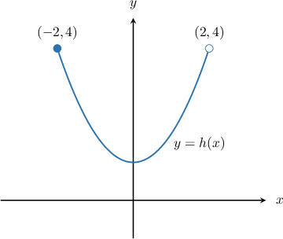
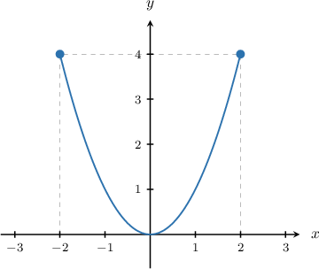
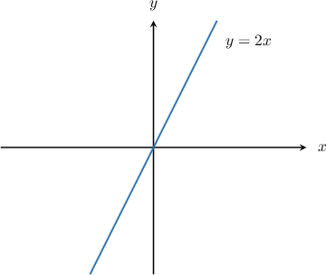
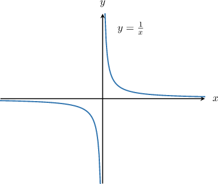
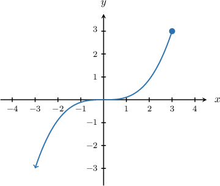

# The Domain of a Function

Source: https://www.mathacademy.com/topics/802?courseId=127
Topic ID: 802

## Prerequisites

- [Unions of Intervals](../algebra-i/458-unions-of-intervals.md)
- [Graphs of Functions](../algebra-i/3821-graphs-of-functions.md)

## Lesson

### Introduction

The **domain** of a function is the set of all input values for which it is defined.

For example, consider the function represented by the mapping diagram below.

The domain corresponds to the set of values in the "Input" set. Therefore, the domain of this function is

$$

\{-2,-1,0,1,2\}.

$$

Let's now consider a situation where a function is defined using a table.

### Example: Determining the Domain of a Function From a Mapping Diagram or Table

#### Question

What is the domain of the function $f(x)$ defined by the following table?

#### Explanation

The domain is the set of all input values for which the function is defined. In the table, this corresponds to the set of $x$-values in the first row:

$$

\{ -2,-1,0,2,4,6\}

$$

### Functions Defined on Closed Intervals

Let's consider the function $f(x),$ shown below.

Note the following:

- The function is not defined for $x<0,$ nor is it defined for $x > 2.$

- The function has filled circles at $x=0$ and $x=2,$ so it is defined at both of these points.

- In addition, the function is defined for every value of $x$ between $0$ and $2.$

Therefore, the domain of this function is

$$

0 \leq x \leq 2.

$$

We can also express the domain using interval notation:

$$

x\in [0,2]

$$

The square brackets $[\:]$ indicate that the endpoints $x=0$ and $x=2$ are included in the domain.

### Functions Defined on Open Intervals

Now consider the function $y=g(x),$ shown below.

Note the following:

- The function is not defined for $x<0,$ nor is it defined for $x > 2.$

- The function has open circles at $x=0$ and $x=2,$ so it is *not* defined at either of these points.

- However, the function is defined for every value of $x$ between $0$ and $2.$

Therefore, the domain of this function is

$$

0 \lt x \lt 2,

$$

which we can write using interval notation as

$$

x\in (0,2).

$$

The parentheses $(\:)$ indicate that the endpoints $x=0$ and $x=2$ are excluded from the domain.

### Functions Defined on Semi-Open Intervals

It's possible for a function to have one endpoint included in the domain and another endpoint excluded.

For example, consider the function is $y=h(x),$ shown below.

The endpoint $x=-2$ is included in the domain, but the endpoint $x=2$ is excluded. Therefore, the domain of $h(x)$ is

$$

-2 \leq x \lt 2,

$$

which we can write using interval notation as

$$

x\in[-2, 2).

$$

### Example: Determining the Finite Domain of a Function From Its Graph

#### Question

What is the domain of the function shown below?

#### Explanation

The function above is defined for values between $x=-2$ and $x=2.$

- Since there is a closed circle at $x=-2,$ this point is included in the domain.

- Since there is a closed circle at $x=2,$ this point is also included in the domain.

Therefore, the domain of this function is

$$

-2 \leq x \leq 2.

$$

Using interval notation, we can write this as

$$

x \in [-2,2].

$$

### The Domain of a Function Given as a Graph

Consider the function $f(x)=2x,$ shown below.

No matter which number $x$ we pick as an input, $f(x)$ always will return an output. Therefore, we can write the domain of this function as

$$

x\in (-\infty,\infty).

$$

Let's compare this to the function $g(x) = \dfrac 1 x,$ shown below:

We cannot substitute the value $x=0$ into the function $g(x)$ because division by zero is undefined. Therefore, $x=0$ is not part of the domain of $g(x).$ However, we can use any other number $x$ as input for $g(x).$ Therefore, the domain of $g(x)$ is

$$

x\in (-\infty, 0)\cup (0,\infty).

$$

This notation means that any number *apart from zero* can be used as an input for $g(x).$

### Example: Determining the Infinite Domain of a Function From Its Graph

#### Question

What is the domain of the function shown above?

#### Explanation

The function above is defined for all values of $x$ that are less than $x = 3.$

In addition, since there is a closed circle at $x = 3,$ this point is included in the domain.

Therefore, the domain of this function is $x \leq 3,$ which we can write as $x \in (-\infty, 3].$
