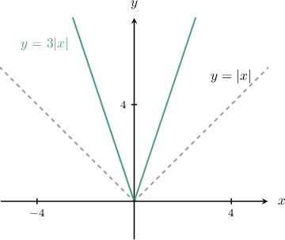
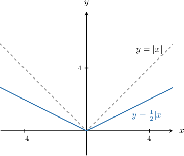
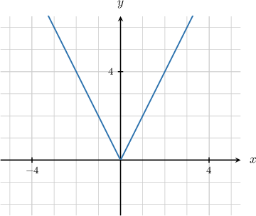
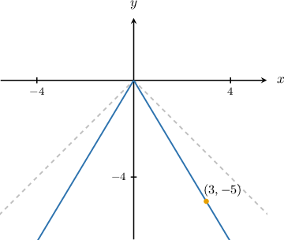
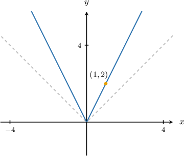

# Stretches of Absolute Value Graphs

Source: https://www.mathacademy.com/topics/1244?courseId=132
Topic ID: 1244

## Prerequisites

- [Rules of Absolute Value](../algebra-i/75-rules-of-absolute-value.md)
- [Vertical Reflections of Absolute Value Graphs](../algebra-i/452-vertical-reflections-of-absolute-value-graphs.md)

## Lesson

### Introduction

Let's have a look at the diagram below.

The green curve $y = 3|x|$ represents a **vertical scaling** of $y = |x|$ by a factor of $3.$ It takes all of the $y$-coordinates on $y=|x|$ and multiplies them by $3.$ This has the effect of **stretching** the curve upwards.

Now consider the following diagram:

The blue curve $y = \dfrac 1 2 \left |x\right|$ is a vertical scaling of $y = |x|$ by a factor of $\dfrac{1}{2}$. It takes all of the $y$-coordinates on $y=|x|$ and multiplies them by $\dfrac{1}{2}.$ This has the effect of squashing, or **compressing**, the curve downwards.

In general, the curve

$$

y = k|x|

$$

is a vertical scaling of the curve $y=|x|$ by a scale factor of $k$ units. If $k>1$ we have stretching, and if $0 < k < 1$ we have compression (squashing).

### Example: Graphs of Scaled Absolute Value Functions

#### Question

The graph of $y=k|x|$ is shown below. What is the value of $k?$

#### Explanation

To find the value of $k,$ we can pick a point on the curve $y=k|x|$ and substitute it into the equation.

Notice that the curve passes through the point $(1,2).$ So, we can substitute $x=1$ and $y=2$ into the equation and solve for $k,$ as follows:

$$

\begin{aligned}𝑦 & =𝑘|𝑥| \\ 2 & =𝑘⋅|\,1\,| \\ 2 & =𝑘⋅1 \\ 2 & =𝑘\end{aligned}

$$

Therefore, $k =2.$

### Example: Graphs of Scaled and Reflected Absolute Value Functions

#### Question

Sketch the graph of $y = -\dfrac53|x|.$

#### Explanation

To get the graph of $y=-\dfrac53|x|,$ we proceed as follows:

- Take the graph of $y=-|x|.$

- Stretch the graph vertically by a scale factor of $\dfrac53$ to get the graph of $y=-\dfrac53|x|.$

The result is the solid blue curve, shown above.

Notice that the point $(3,-5)$ lies on the curve because when $x=3,$ we have

$$

\begin{aligned}𝑦 & =−\frac{5}{3}⋅|3| \\ & =−\frac{5}{3}⋅3 \\ & =−5.\end{aligned}

$$

### Example: Graphing a Scaled Absolute Value Function Using the Rules of Absolute Value

#### Question

Plot the graph of $y = |2x|.$

#### Explanation

First, let's re-write the equation using the rules of absolute value, as follows:

$$

\begin{aligned}𝑦 & =|2𝑥| \\ & =|2|⋅|𝑥| \\ & =2|𝑥|\end{aligned}

$$

Now, to plot the graph of $y=2|x|,$ we proceed as follows:

- Take the graph of $y=|x|.$

- Stretch it vertically by a scale factor of $2$ to get the graph of $y=2|x|.$

The result is the solid blue curve, shown below.

Notice that the point $(1,2)$ lies on the curve because when $x=1,$ we have

$$

\begin{aligned}𝑦 & =|2⋅1| \\ & =|2| \\ & =2.\end{aligned}

$$
