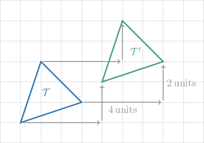
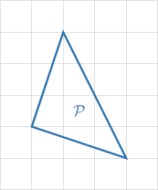
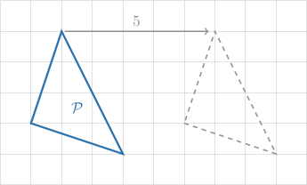
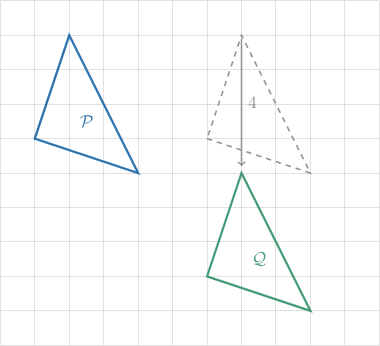
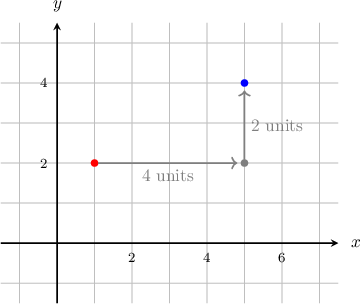
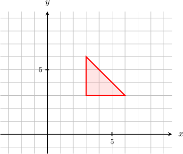
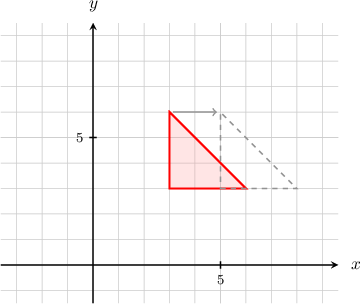
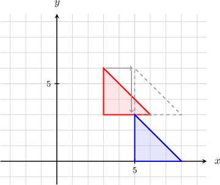
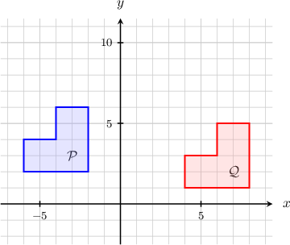
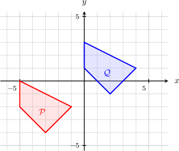

# Translations of Geometric Figures

Source: https://www.mathacademy.com/topics/1516?courseId=132
Topic ID: 1516

## Prerequisites

- [The Cartesian Coordinate System](../grade-6/92-the-cartesian-coordinate-system.md)
- [Introduction to Functions](../algebra-i/470-introduction-to-functions.md)
- [Polygons](../grade-7/1317-polygons.md)

## Lesson

### Introduction

In geometry, a **translation** means moving an object to the left, right, upwards, or downwards without rotating, resizing, or anything else.

Let's take a look at the two triangles $\mathcal T$ and $\mathcal T'$ shown below.

A few things to note:

- The original shape, $\mathcal T,$ is called the **preimage**. The shape $\mathcal T',$ the result of the translation, is called the **image**. In our case, the preimage $\mathcal T$ has been translated $4$ units to the right and $2$ units upward.

- It's important to realize that *every point* on $\mathcal T$ is translated to a point on $\mathcal T'.$ The diagram shows the triangle's vertices being translated, but the same translation applies to every point on each side of the triangle as well.

- A translation is a type of **transformation**. There are other types of transformations that we'll learn more about later.

### Example: Finding the Image of a Translated Polygon

#### Question

The triangle $\mathcal{P}$ (shown below) is shifted $5$ units to the right and $4$ units downward to give the triangle $\mathcal{Q}.$ Plot the resulting triangle.

#### Explanation

First, we must translate each point of the triangle $5$ units to the right. To accomplish this, we can translate each vertex $5$ units to the right and then draw in the line segments between the new vertices.

Next, we must translate each point of the resulting triangle $4$ units downward. Again, we translate the vertices and then draw in the line segments between the new vertices. The diagram below shows the resulting triangle.

### Translating Objects Using Functions

Consider the transformation that translates the point $Q(1,2)$ by $4$ units to the right and $2$ units up, as shown below.

We can express this transformation by writing it as a function, as follows:

$$

T(x,y) = (x+4,y+2)

$$

The function above takes a point as its input and gives another point as output. Let's check it with our point $Q(1,2){:}$

$$

\begin{aligned}𝑇(1,2)=(1+4,2+2)=(5,4)\,✓\end{aligned}

$$

Any translation of $a$ units to the right and $b$ units up can be written using any of the following notations:

$$

\begin{aligned}(𝑥,𝑦)↦(𝑥+𝑎,𝑦+𝑏) \\ 𝑇(𝑥,𝑦)=(𝑥+𝑎,𝑦+𝑏)\end{aligned}

$$

If $a$ is negative, then the function translates the point $(x,y)$ by $|a|$ units to the left. If $b$ is negative, then the function translates the point $(x,y)$ by $|b|$ units downwards.

### Example: Applying Translations Defined Using Functions

#### Question

The triangle shown below is translated using the function $f(x,y) = (x+2,y-3).$ Plot the resulting triangle.

#### Explanation

The translation $f(x,y) = (x+2, y-3)$ is a shift by $2$ units to the right and $3$ units downward.

First, we must translate each point $2$ unit to the right. To accomplish this, we can translate each vertex $2$ units to the right and then draw in the line segments between the new vertices.

Next, we must translate each point of the resulting figure $3$ units downward. Again, we translate the vertices and then draw in the line segments between the new vertices. The diagram below shows the resulting triangle.

### Example: Solving for Missing Values in the Functional Representation of a Translation

#### Question

The translation $(x,y) \mapsto(x+p, y+q)$ maps the polygon $\mathcal{P}$ to the polygon $\mathcal{Q}$ as shown above. What are the values of $p$ and $q?$

#### Explanation

Every point belonging to $\mathcal{P}$ is translated in the same way. Therefore to determine the values of $p$ and $q,$ we can consider any point of the polygon.

Let's consider the vertex $(-2,2).$ Under the translation, it moves to $(8,1).$ So, we have

$$

(-2, 2) \mapsto (-2+p, 2+q)= (8,1).

$$

We establish the values of $p$ and $q$ by considering the $x$- and $y$-coordinates of the above transformation.

- Looking at the $x$-coordinates, we must have $-2+p = 8,$ so $p=10.$

- Looking at the $y$-coordinates, we must have $2+q=1,$ so $q=-1.$

Therefore, $p=10$ and $q=-1.$

### Example: Finding the Functional Representation of a Translation

#### Question

A translation $f$ maps the polygon $\mathcal P$ to the polygon $\mathcal Q,$ as shown above. What is the functional representation of $f?$

#### Explanation

Note that if we translate the polygon $\mathcal{P}$ by $5$ units to the right and $3$ units upward, then we get the polygon $\mathcal{Q}.$

Therefore, the functional representation of the transformation is

$$

f(x,y)= (x+5,y+3).

$$
