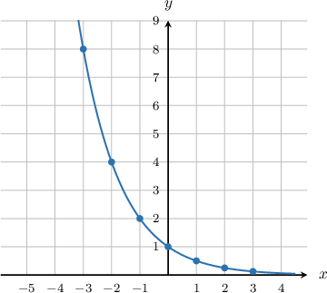
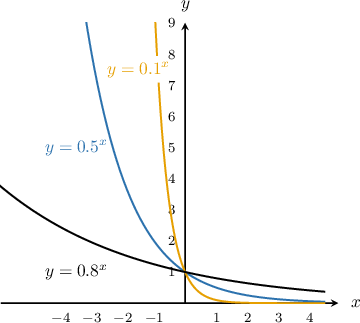
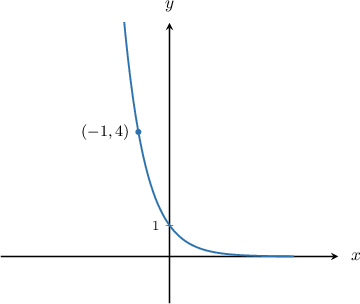
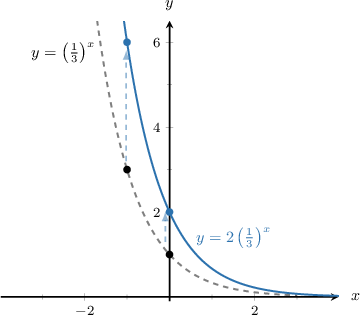
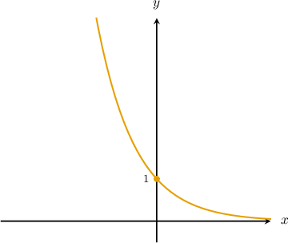
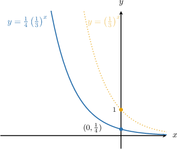
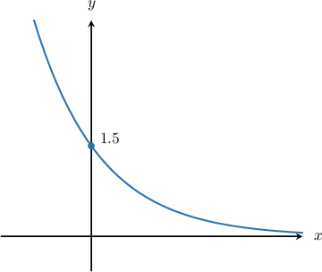

# Graphing Exponential Decay Functions

Source: https://www.mathacademy.com/topics/1531?courseId=132
Topic ID: 1531

## Prerequisites

- [Exponential Functions](../algebra-i/1153-exponential-functions.md)
- [Increasing and Decreasing Functions](../algebra-i/1628-increasing-and-decreasing-functions.md)
- [The Range of a Function: Advanced Cases](../algebra-i/3728-the-range-of-a-function-advanced-cases.md)

## Lesson

### Introduction

Suppose we wish to plot the graph of First, we create a table of values:

Now, we can plot the graph:

Note the following key points:

1. The graph has a -intercept at

2. The graph is decreasing.

3. For, the graph grows very rapidly as decreases. Symbolically, we can write as

4. For, the graph gets very close to zero as increases. However, it never actually reaches zero, so the graph has a horizontal asymptote Symbolically, we can write as

5. The domain is, and the range is

These key points apply to *any* exponential curve with These graphs always have the same general shape:

### Example: Sketching the Graph of an Exponential Decay Function

#### Question

Plot the graph of $y=\left(\dfrac{1}{4} \right)^x.$

#### Explanation

The graph of $y=\left(\dfrac{1}{4}\right)^x$ has a $y$-intercept at $(0,1),$ grows rapidly for $x<0,$ and approaches the asymptote $y=0$ for $x>0.$

When $x=-1,$ we have $y=\left(\dfrac{1}{4}\right)^{-1} =4.$ Therefore, another point on the graph is $\left(-1, 4\right).$

We draw the graph through these points as follows:

### Example: Identifying True Statements Regarding an Exponential Decay Curve

#### Question

Which of the following statements are true in relation to the function $f(x) = (0.2)^x?$

1. The domain is $x\in(-\infty,\infty)$ and the range is $y\gt 0.$

2. The graph of $y=f(x)$ passes through the point $\left(1,0.2\right).$

3. $f(x) \to -\infty$ as $x \to -\infty.$

#### Explanation

Let's go through the statements one by one.

- Statement I is true. The function $f(x) = (0.2)^x$ is defined for all input values $x,$ and, the set of possible outputs consists of all the positive numbers.

- Statement II is true. When we evaluate the function at $x=1,$ we have

- Statement III is false. As $x$ decreases, the function value gets larger and larger, approaching ** infinity. Therefore $f(x) \to \infty$ as $x \to -\infty.$

In conclusion, only statements I and II are true.

### Vertical Stretching and Compression

Multiplying an exponential decay function by a positive number **scales** the graph in the vertical direction.

For example, the curve represents a vertical scaling of by a factor of It takes all of the -coordinates on and multiplies them by This has the effect of **stretching** the curve upwards.

Notice that the horizontal asymptote at remained the same, and the -intercept moved from to

On the other hand, the curve represents a vertical scaling of by a factor of It takes all of the -coordinates on and multiplies them by This has the effect of **compressing** the curve downwards.

In general, for *any* vertically stretched or compressed exponential curve

- the horizontal asymptote at remains the same, and

- the -intercept moves from to

### Example: Plotting a Vertically Scaled Exponential Decay Function

#### Question

Plot the graph of

#### Explanation

First we plot the graph of

Then, we scale this graph by a factor of The -intercept becomes and the resulting graph is as follows:

### Example: Identifying the Scaling Constant From a Graph

#### Question

The graph below shows $y=k\left(\dfrac{2}{5}\right)^x.$ What is the value of $k?$

#### Explanation

To plot the graph of $y=k\left(\dfrac25\right)^x$ we take the graph of $y=\left(\dfrac 25\right)^x$ and stretch it vertically by a scale factor of $k.$ Under the action of this transformation, the $y$-intercept is mapped from $(0,1)$ to $(0,k).$

Comparing the point $(0,1.5)$ on the graph to $(0,k),$ we see that we must have $k=1.5.$
