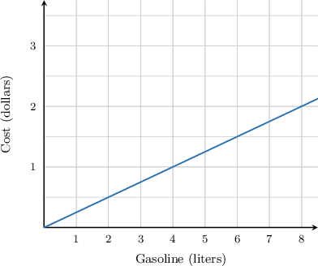
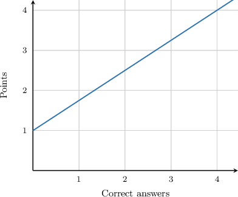
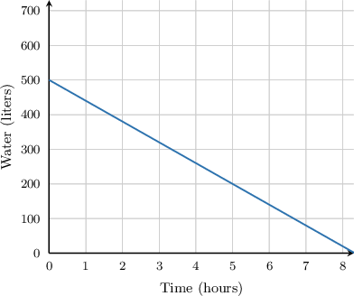
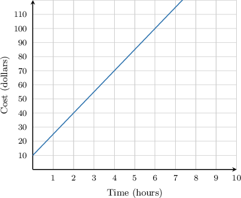
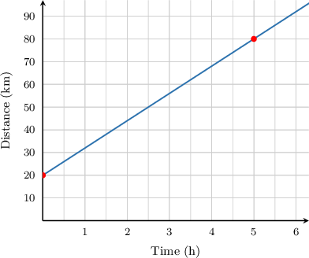

# Analyzing and Interpreting Graphs of Linear Equations

Source: https://www.mathacademy.com/topics/1588?courseId=132
Topic ID: 1588

## Prerequisites

- [Modeling With Linear Equations in Two Variables](../algebra-i/653-modeling-with-linear-equations-in-two-variables.md)
- [Equations of Lines in Slope-Intercept Form](../algebra-i/1240-equations-of-lines-in-slope-intercept-form.md)
- [Selecting Units for Rates of Change](../algebra-i/2231-selecting-units-for-rates-of-change.md)

## Lesson

### Introduction

The following diagram shows the dependence between the amount of gasoline put into a car and the total cost. We will use this graph to calculate the price per liter of gas.

To calculate the price per liter of gas, all we need to do is calculate the slope of the line. To see why, notice that the units of the slope are

$$

\dfrac{\textrm{units of }y}{\textrm{units of }x} = \dfrac{\textrm{dollars}}{\textrm{liters}},

$$

or dollars per liter. So the slope gives us the total number of dollars that we need to spend per liter of fuel.

To calculate the slope, we make use of the fact that the line passes through the points $(0,0)$ and $(8,2).$ So the slope $m$ of the line is

$$

m = \dfrac{y_1-y_0}{x_1-x_0} = \dfrac{2 \textrm{ dollars}-0\textrm{ dollars}}{8\textrm{ liters}-0\textrm{ liters}} = \dfrac{2\textrm{ dollars}}{8\textrm{ liters}} = 0.25 \textrm{ dollars/liter}.

$$

Therefore, it costs $0.25$ per liter of gasoline to fill up the car.

### Example: Interpreting the Unit Rate Given a Graph

#### Question

The graph above shows the relation between the number of correct answers and the total number of points obtained in a test. How many points are awarded per correct answer?

#### Explanation

The graph has a $y$-intercept at $(0,1),$ which means $1$ point is awarded even when there are $0$ correct answers. So, the test starts with $1$ point.

To find the number of points awarded per correct answer, notice that the units of the slope are

$$

\dfrac{\textrm{Points}}{\textrm{Correct answers}},

$$

or points per correct answer. So, to calculate the number of points awarded per correct answer, all we need to do is calculate the slope of the line.

Since the line passes through the points $(0,1)$ and $(4,4)$, we find its slope as follows:

$$

\begin{aligned}𝑚 & =\frac{𝑦_{2}−𝑦_{1}}{𝑥_{2}−𝑥_{1}} \\ & =\frac{4−1}{4−0} \\ & =\frac{3}{4} \\ & =0.75 points/correct answer\end{aligned}

$$

So, each correct answer is worth $0.75$ points.

### Example: Interpreting the Unit Rate and Intercept Given a Graph With Negative Rates

#### Question

The graph above shows the number of liters of water in a tank. Determine the rate at which the tank leaks.

#### Explanation

To find the number of liters of water leaking per hour, notice that the units of the slope are

$$

\dfrac{\textrm{liters}}{\textrm{hour}},

$$

or liters per hour. So, to calculate the number of liters of water leaking per hour, we need to calculate the slope of the line.

Since the line passes through the points $(0,500)$ and $(5,200)$, we find its slope as follows:

$$

\begin{aligned}𝑚 & =\frac{𝑦_{2}−𝑦_{1}}{𝑥_{2}−𝑥_{1}} \\ & =\frac{200−500}{5−0} \\ & =−60 liters/hour\end{aligned}

$$

Notice that the result is ** because the number of liters is **.

So, the tank leaks $60$ liters of water per hour.

### Example: Interpreting the Unit Rate and Intercept Given a Graph

#### Question

The graph above represents the hourly cost of renting a tennis court at a particular club. What is the actual cost of renting a court?

#### Explanation

The graph has a $y$-intercept at $(0,10),$ which means that the cost is $ 10$ even when no time has been elapsed. So, the club charges an initial fee of $ 10.00.$

To find the cost per hour, notice that the units of the slope are

$$

\dfrac{\textrm{dollars}}{\textrm{hours}},

$$

or dollars per hour. So, to calculate the cost per hour, we need to calculate the slope of the line.

Since the line passes through the points $(0,10)$ and $(2,40)$, we find its slope as follows:

$$

\begin{aligned}𝑚 & =\frac{𝑦_{2}−𝑦_{1}}{𝑥_{2}−𝑥_{1}} \\ & =\frac{40−10}{2−0} \\ & =\frac{30}{2} \\ & =15 dollars/hour\end{aligned}

$$

So, the cost of renting a tennis court is $ 10.00$ plus $ 15.00$ per hour.

### Example: Fitting a Graph to Given Information

#### Question

James is $20$ kilometers away from the gym. He jogs in the opposite direction to the gym at a constant speed of $12\,\textrm{km/h}.$ Sketch a graph that describes how far from the gym James will be after $x$ hours.

#### Explanation

To model the given situation, we will use the slope-intercept form

$$

y=mx+b,

$$

where $y$ is the total distance, and $x$ represents the time in hours. We fill in the information from the problem:

- At the beginning (when $x=0$), James is $20$ kilometers away from the gym. So, our graph will pass through the point $(0,20).$ This means that the $y$-intercept is $b=20.$

- Since James runs at a constant speed of $12\,\textrm{km/h}$, the slope must be $m=12.$

Substituting the values from above, we get the equation

$$

y=12x+20.

$$

To graph this equation, we can pick two points and draw a line through them. One point can be the $y$-intercept $(0,20).$ We can find another point by substituting some $x$-value, say $x=5,$ into the equation:

$$

\begin{aligned}𝑦 & =12𝑥+20 \\ 𝑦 & =12(5)+20 \\ 𝑦 & =80\end{aligned}

$$

We plot the points $(0,20)$ and $(5,80)$ and draw a line through them:

