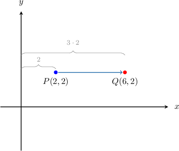
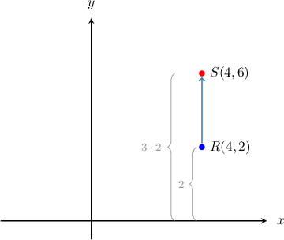
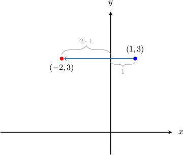
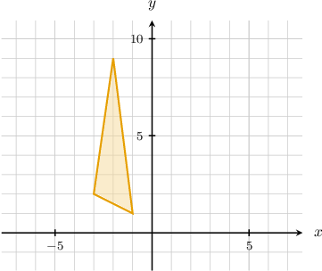
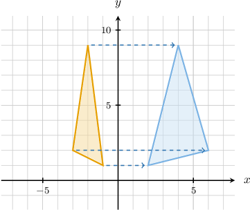
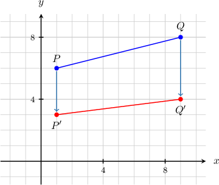

# Stretches of Geometric Figures

Source: https://www.mathacademy.com/topics/2217?courseId=132
Topic ID: 2217

## Prerequisites

- [Reflections of Geometric Figures in the Cartesian Plane](../geometry/1518-reflections-of-geometric-figures-in-the-cartesian-plane.md)

## Lesson

### Introduction

Suppose that we take the point $P(2,2)$ and pull it perpendicular to the $y$-axis so that its distance from the $y$-axis is increased by a factor of $3.$ The resulting point is $Q(6,2),$ as shown below.

Note the following:

- The $x$-coordinate is multiplied by $3,$ but the $y$-coordinate remains fixed.

- The distance of $P$ from the $y$-axis is $2,$ and the distance of $Q$ from the $y$-axis is $3\cdot 2 = 6.$

We call this type of transformation a **stretch of factor $\mathbf 3$ and invariant $\mathbf y$-axis**. The phrase "invariant $y$-axis" means that the $y$-coordinate does not change.

In general, a stretch of factor $k$ and invariant $y$-axis can be represented by the function

$$

(x,y) \mapsto (kx, y).

$$

**Remember**: Since the $y$-coordinate does not change, it's only the $x$-coordinate that we multiply by $k.$

### Stretches With Invariant X-Axis

Now suppose that we take the point $R(4,2)$ and stretch it perpendicular to the $x$-axis so that its distance from the $x$-axis is increased by a factor of $3.$ The resulting point is $S(4,6),$ as shown below.

Note the following:

- The $y$-coordinate is multiplied by $3,$ but the $x$-coordinate remains fixed.

- The distance of $R$ from the $x$-axis is $2,$ and the distance of $S$ from the $x$-axis is $3\cdot 2 = 6.$

We call this type of transformation a **stretch of factor $\mathbf 3$ and invariant $\mathbf x$-axis**. The phrase "invariant $x$-axis" means that the $x$-coordinate does not change.

In general, a stretch of factor $k$ and invariant $x$-axis can be represented by the function

$$

(x,y) \mapsto (x, ky).

$$

### Example: Representing Stretches Using Functions

#### Question

What function represents a stretch of factor $4$ and invariant $x$-axis?

#### Explanation

Applying a stretch of factor $k$ and invariant $x$-axis to a point means that the $y$-coordinate of the point should be multiplied by $k.$

The following function represents this transformation:

$$

(x,y)\mapsto (x,ky).

$$

Since the stretch factor is $4,$ the function representing the given transformation is

$$

(x,y) \mapsto \left(x,4y\right).

$$

### Example: Stretching a Point

#### Question

A stretch of factor $-2$ and invariant $y$-axis is applied to the point $(1,3).$ What is the resulting point?

#### Explanation

Applying a stretch of factor $-2$ and invariant $y$-axis to a point means that the $x$-coordinate of the point should be multiplied by $-2.$

The following function represents this transformation:

$$

(x,y) \mapsto \left(-2x,y\right)

$$

Therefore, the resulting point is

$$

(1,3) \mapsto \left(-2\cdot 1 , 3\right) = (-2,3).

$$

Notice that the negative stretch factor has the effect of reflecting the point in the $y$-axis. So the point $(1,3)$ has been stretched by a factor of $2$ in the $x$-direction ** reflected in the $y$-axis.

### Example: Stretching a Polygon

#### Question

A stretch of factor $-2$ and invariant $y$-axis is applied to the polygon shown above. What is the resulting polygon?

#### Explanation

Applying a stretch of factor $-2$ and invariant $y$-axis to a point means that the $x$-coordinate of the point should be multiplied by $-2.$

The following function represents this transformation:

$$

(x,y) \mapsto \left(-2x,y\right)

$$

To stretch a polygon, we

- find the images of the vertices, and then

- draw segments connecting the image vertices.

So, our three vertices $(-1,1)$, $(-3,2)$, $(-2,9)$ are mapped to the following points by the stretch:

$$

\begin{aligned}(−1,1)↦(−2⋅(−1),1)=(2,1) \\ (−3,2)↦(−2⋅(−3),2)=(6,2) \\ (−2,9)↦(−2⋅(−2),9)=(4,9)\end{aligned}

$$

Therefore, we obtain the following result:

### Example: Determining the Stretch Factor

#### Question

The image of the segment $\overline{PQ}$ under the action of a stretch of factor $k$ and invariant $x$-axis is the segment $\overline{P'Q'},$ as shown above. What is the value of $k?$

#### Explanation

Applying a stretch of factor $k$ and invariant $x$-axis to a point means that the $y$-coordinate of the point should be multiplied by $k.$

The following function represents this transformation:

$$

(x,y) \mapsto \left(x,ky\right)

$$

Since the points $P(1,6)$ and $Q(9,8)$ are mapped to the points $P'(1,3)$ and $Q'(9,4),$ respectively, by the stretch, we must have

$$

\begin{aligned}(1,6) & ↦(1,𝑘⋅6)=(1,3), \\ (9,8) & ↦(9,𝑘⋅8)=(9,4).\end{aligned}

$$

So, we have

$$

\begin{aligned}(1,6𝑘) & =(1,3), \\ (9,8𝑘) & =(9,4).\end{aligned}

$$

Equating the $y$-coordinates, we get

$$

\begin{aligned}6𝑘=3 & \,⇒\,𝑘=\frac{1}{2}, \\ 8𝑘=4 & \,⇒\,𝑘=\frac{1}{2}.\end{aligned}

$$
