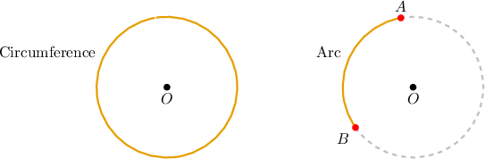
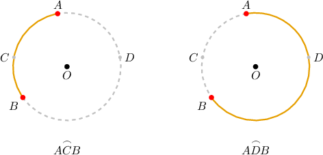
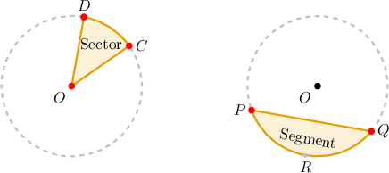
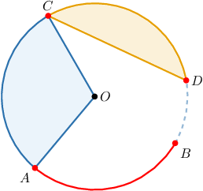

# Arcs, Segments, and Sectors of Circles

Source: https://www.mathacademy.com/topics/3565?courseId=132
Topic ID: 3565

## Prerequisites

- [Circles](../geometry/1404-circles.md)

## Lesson

### Introduction

Let's consider yet more important parts of a circle:

- The **circumference** of a circle is used to describe the perimeter of the circle, as shown in the left diagram below.

- An **arc** is a part of the circumference which is enclosed between two points on a circle. In the right diagram below, we have the arc $\overset{\frown}{AB}.$

If an arc is denoted using only two letters, we are referring to the *shortest* arc. However, to avoid ambiguity, we can use three letters. For example, in the diagram below, $\overset{\frown}{ACB}$ is the arc to the left and $\overset{\frown}{ADB}$ is the arc to the right.

### Circular Segments and Sectors

Finally, we have two more elements of a circle to remember:

- A **circular sector** is the region bounded by an arc of the circle and two radii which connect the center of the circle with the endpoints of the arc. In the left diagram below, we have the circular sector $OCD.$

- A **circular segment** is the region bounded by an arc of the circle and the chord that connects the endpoints of the arc. In the right diagram below, we have the circular segment $PQ.$

### Example: Identifying Parts of a Circle

#### Question

Which elements of a circle are depicted below?

#### Explanation

Here, we have the following:

- a circular segment which is enclosed between the chord $\overline{CD}$ and the corresponding arc $\overset{\frown}{CD},$

- a circular sector $OAC,$ which is formed by the two radii $\overline{OA}$ and $\overline{OC}$ and the corresponding arc $\overset{\frown}{AC},$ and

- an arc $\overset{\frown}{AB}.$

### Example: Completing a True Statement Regarding Circles

#### Question

What should be substituted into the blank spaces in the following sentence to make it a true statement?

"**"

#### Explanation

First, $\overline{AB}$ is a line segment whose endpoints lie on a circle. So, $\overline{AB}$ is a ** of the circle.

The region enclosed between $\overline{AB}$ and the corresponding arc $\overset{\frown}{AB}$ is a circular **.

Therefore, the correct mathematical statement is the following:

"**"
