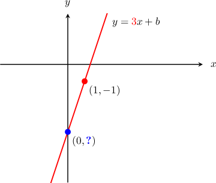
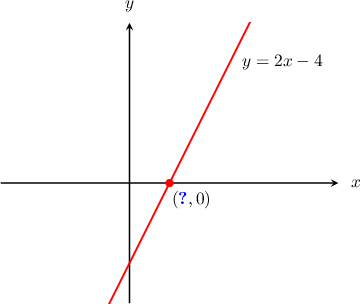

# Properties of Lines Given in Slope-Intercept Form

Source: https://www.mathacademy.com/topics/398?courseId=132
Topic ID: 398

## Prerequisites

- [Equations of Lines in Slope-Intercept Form](../algebra-i/1240-equations-of-lines-in-slope-intercept-form.md)

## Lesson

### Introduction

The **$y$-intercept** of a line is where the line intersects the $y$-axis. For instance, consider the line that passes through the point $(1,-1)$ and has a slope of $3.$ How can we find the $y$-intercept of this line?

We already know values for $x$, $y$ and $m,$ so we can just substitute them into the equation $y=mx+b$ and then solve for $b$:

$$

\begin{aligned}𝑦 & =𝑚𝑥+𝑏 \\ (−1) & =(3)(1)+𝑏 \\ −1 & =3+𝑏 \\ 𝑏 & =−4\end{aligned}

$$

So, the $y$-intercept is ${\color{blue}b}=-4.$ The coordinates of the $y$-intercept are $(0,-4).$

### Example: Finding the Y-Intercept of a Line Given a Point on the Line and Its Slope

#### Question

Find the $y$-intercept of the line that passes through the point $(-1, 4)$ and has a slope of $2.$

#### Explanation

Since the line passes through the point $(-1,4)$ and its slope is $2$, we substitute $x=-1$, $y=4,$ and $m=2$ into the equation in slope-intercept form:

$$

\begin{aligned} y &= mx + b \\(4) &= (2)(-1) + b \\4 &= -2 + b \\6 &= b \end{aligned}

$$

So, the $y$-intercept is $b=6.$ The coordinates of the $y$-intercept are $(0,6).$

### Example: Finding the Equation of a Line That Passes Through Two Points

#### Question

Find the equation of the line that passes through the points $(-2,4)$ and $(10,10).$

#### Explanation

We will write the equation of the line in the slope-intercept form $y=mx+b.$ So, we need to work out the slope $m$ and the $y$-intercept $b.$

First, we calculate the slope $m$ using the given points:

$$

\begin{aligned}𝑚=\frac{𝑦_{2}−𝑦_{1}}{𝑥_{2}−𝑥_{1}}=\frac{10−4}{10−(−2)}=\frac{6}{12}=\frac{1}{2}\end{aligned}

$$

Substituting the slope $m=\dfrac 1 2$ into the slope-intercept formula $y=mx+b,$ we reach

$$

y = \dfrac 1 2 x + b.

$$

We now need to find the $y$-intercept $b.$ We can find this by substituting the coordinates of a point on the line. Any point will do, so let's substitute $(10,10)\mathbin{:}$

$$

\begin{aligned}𝑦 & =\frac{1}{2}𝑥+𝑏 \\ 10 & =\frac{1}{2}⋅10+𝑏 \\ 10 & =5+𝑏 \\ 𝑏 & =10−5 \\ 𝑏 & =5\end{aligned}

$$

Therefore, the equation of the line is $y=\dfrac 1 2 x + 5.$

### Finding the X-Intercept of a Straight Line

The **$x$-intercept** of a line is where the line intersects the $x$-axis. For instance, consider the line $y = 2x - 4$. How can we find the $x$-intercept of this line?

At the $x$-intercept, the $y$-coordinate is equal to $0.$ So, we can substitute $y=0$ into the equation and then solve for $x\mathbin{:}$

$$

\begin{aligned}𝑦 & =2𝑥−4 \\ (0) & =2𝑥−4 \\ 4 & =2𝑥 \\ 2 & =𝑥 \\ 𝑥 & =2\end{aligned}

$$

Therefore, the $x$**-intercept** is $x=2.$ The coordinates of the $x$-intercept are $(2,0).$

### Example: Finding the X-Intercept of a Line Given a Point and a Slope

#### Question

Calculate the $x$-intercept of the line that passes through the point $(-3,2)$ and has a slope of $-\dfrac{1}{2}.$

#### Explanation

First, we need to find the equation of the line. We know that $m=-\dfrac{1}{2},$ so we can write the equation of the line as $y=-\dfrac{1}{2}x + b.$

It remains to find the $y$-intercept of the line. We can do that by substituting the point $(-3,2)$ into the equation and solving for $b$ as follows:

$$

\begin{aligned}𝑦 & =−\frac{1}{2}𝑥+𝑏 \\ (2) & =−\frac{1}{2}(−3)+𝑏 \\ 2 & =\frac{3}{2}+𝑏 \\ \frac{1}{2} & =𝑏\end{aligned}

$$

So, the equation of the line is $y=-\dfrac{1}{2}x+\dfrac{1}{2}.$

At the $x$-intercept, the $y$-coordinate is equal to $0.$ So, we can substitute $y=0$ into the equation and then solve for $x\mathbin{:}$

$$

\begin{aligned}𝑦 & =−\frac{1}{2}𝑥+\frac{1}{2} \\ 0 & =−\frac{1}{2}𝑥+\frac{1}{2} \\ \frac{1}{2}𝑥 & =\frac{1}{2} \\ 𝑥 & =1\end{aligned}

$$

Therefore, the $x$-intercept is $x=1.$ The coordinates of the $x$-intercept are $(1,0).$

### Example: Finding the Intercept of a Horizontal or Vertical Line

#### Question

A vertical line $l$ passes through the point $(-6,3).$ Calculate the coordinates of the $x$-intercept of $l.$

#### Explanation

On any vertical line, all points have the same $x$-coordinate.

The $x$-coordinate of the point $(-6,3)$ is $-6,$ so the $x$-coordinate of the $x$-intercept is also $-6.$

Therefore, the coordinates of the $x$-intercept are $(-6,0).$
