# Partitioning Line Segments

Source: https://www.mathacademy.com/topics/527?courseId=132
Topic ID: 527

## Prerequisites

- [Horizontal and Vertical Lines](../grade-8/97-horizontal-and-vertical-lines.md)
- [Writing Ratios Using Fractions](../grade-6/552-writing-ratios-using-fractions.md)
- [Distances Between Points in the Coordinate Plane](../grade-6/573-distances-between-points-in-the-coordinate-plane.md)

## Lesson

### Introduction

In this lesson, we'll learn how to find a point that partitions a line segment in a given ratio. We'll start by considering horizontal and vertical lines in the plane before generalizing to any two-dimensional segment.

Consider the following horizontal segment in the $xy$-plane.

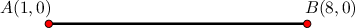

Suppose we want to find the point $C$ on this segment that divides it in the ratio $1:6.$

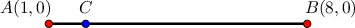

First, notice that the points $A$ and $B$ have $y=0.$ Consequently, the point $C$ also has $y=0.$

Partitioning a line segment $\overline{AB}$ in the ratio $a:b$ means that we must

- divide the line segment into $a+b$ equal parts, and

- find the point $C$ that is $a$ equal parts from $A.$

In our case, the ratio $1:6$ implies $AC: CB=1:6.$ This means

- there are $1+6 = 7$ equal parts, and

- we want the point that is $1$ equal part from $A.$ So, we have as shown below.

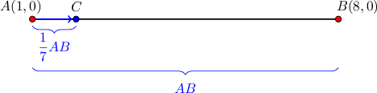

Now, since $\overline{AB}$ is horizontal, its length is simply the difference between the $x$-coordinates of the endpoints:

$$

AB = x_B - x_A

$$

Let's add this to our diagram.

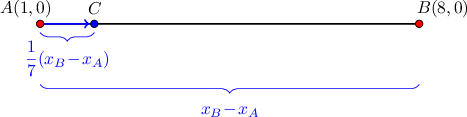

Finally, to find the coordinates of $C,$ we start at the point $A$ and "run" from $A$ to $C$ horizontally. So, the $x$-coordinate of $C$ is

$$

\begin{aligned}𝑥_{𝐶} & =𝑥_{𝐴}+\frac{1}{7}(𝑥_{𝐵}−𝑥_{𝐴}) \\ & =1+\frac{1}{7}(8−1) \\ & =1+1 \\ & =2.\end{aligned}

$$

Therefore, $C$ has coordinates $(2,0).$

### Example: Finding a Point Dividing a Horizontal Segment

#### Question

Given the points $A(1,2)$ and $B(16,2)$, find the coordinates of the point $C$ that lies on $\overline{AB}$ such that $AC:CB=3:2.$

#### Explanation

First, notice that the $y$-coordinates of $A$ and $B$ are the same. Therefore, the points $A$ and $B$ both lie on the horizontal line $y=2.$ Consequently, the point $C$ also has $y=2.$

Now, since $AC:CB=3:2$, we must have $AC=\dfrac{3}{5}AB.$

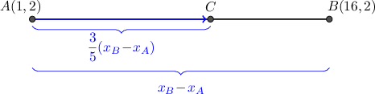

To get from point $A$ to point $C,$ we can "run" from $A$ to $C$ horizontally. So, the $x$-coordinate of $C$ is

$$

\begin{aligned}𝑥_{𝐶} & =𝑥_{𝐴}+\frac{3}{5}(𝑥_{𝐵}−𝑥_{𝐴}) \\ & =1+\frac{3}{5}(16−1) \\ & =1+\frac{3}{5}⋅15 \\ & =10.\end{aligned}

$$

Therefore, $C$ has coordinates $\left(10,2 \right).$

### Partitioning a Vertical Segment

We can also partition a *vertical* segment in a given ratio.

Suppose we want to find a point $C$ on the line segment from the point $A(0,1)$ to the point $B(0,17)$ that divides the segment in the ratio $7:1,$ as shown below.

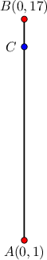

First, notice that the $x$-coordinates of $A$ and $B$ are the same. Therefore, the points $A$ and $B$ lie on the vertical line $x=0.$ Consequently, the point $C$ also has $x=0.$

Partitioning a line segment $\overline{AB}$ into a ratio $a:b$ means we must

- divide the segment into $a+b$ equal parts, and

- find the point $C$ that is $a$ equal parts from $A$.

In our case, the ratio $7:1$ implies $AC:CB=7:1.$ This means

- there are $7+1 = 8$ equal parts, and

- we want to find the point $C$ that is $7$ equal parts from $A.$ So, we have as shown below.

Now, since $AB$ is vertical, its length is simply the difference between the $y$-coordinates of the endpoints:

$$

AB = y_B - y_A

$$

Let's add this to our diagram.

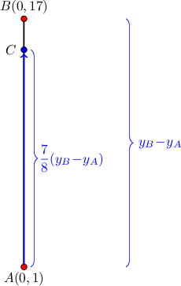

Finally, to get the coordinates of $C,$ we start at the point $A$ and "rise" vertically from $A$ to $C$. So, the $y$-coordinate of $C$ is

$$

\begin{aligned}𝑦_{𝐶} & =𝑦_{𝐴}+\frac{7}{8}(𝑦_{𝐵}−𝑦_{𝐴}) \\ & =1+\frac{7}{8}(17−1) \\ & =1+14 \\ & =15.\end{aligned}

$$

Therefore, $C$ has coordinates $(0,15).$

### Example: Finding a Point Dividing a Vertical Segment

#### Question

Given the points $A(1,2)$ and $B(1,11)$, find the coordinates of the point $C$ that lies on $\overline{AB}$ such that $AC:CB=2:1.$

#### Explanation

First, notice that the $x$-coordinates of $A$ and $B$ are the same. Therefore, the points $A$ and $B$ both lie on the vertical line $x=1.$ Consequently, the point $C$ also has $x=1.$

Notice that since $AC:CB=2:1$, we must have $AC=\dfrac{2}{3}AB.$

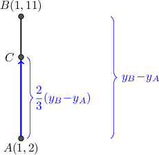

To get from point $A$ to point $C,$ we can "rise" from $A$ to $C$ vertically. So, the $y$-coordinate of $C$ is

$$

\begin{aligned}𝑦_{𝐶} & =𝑦_{𝐴}+\frac{2}{3}(𝑦_{𝐵}−𝑦_{𝐴}) \\ & =2+\frac{2}{3}(11−2) \\ & =2+\frac{2}{3}⋅9 \\ & =8\end{aligned}

$$

Therefore, $C$ has coordinates $\left(1, 8\right).$

### Partitioning a Segment

We can partition any segment in a given ratio using techniques like those discussed for horizontal and vertical segments.

For example, suppose we want to find the point $C$ on the segment from the point $A(-1,0)$ to the point $B(7,4)$ that divides the segment into the ratio $1:1.$

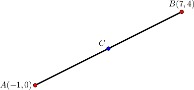

Partitioning a line segment $\overline{AB}$ into a ratio $a:b$ means we must

- divide the segment into $a+b$ equal parts, and

- find the point $C$ that is $a$ equal parts from $A$.

In our case, the ratio $1:1$ implies $AC:CB = 1:1.$ This means

- there are $1+1 = 2$ equal parts, and

- we want to find the point $C$ that is $1$ equal part from $A.$ So, we have

Next, consider another point $X$ that is horizontal with $A$ and directly above $C,$ as shown in the diagram.

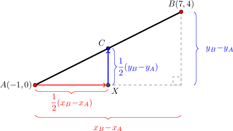

To go from point $A$ to point $C,$ we can "run" horizontally from $A$ to $X$ and then "rise" vertically from $X$ to $C.$

So, we compute the coordinates of $C$ as follows:

- The $x$-coordinate of $C$ is

- The $y$-coordinate of $C$ is

Therefore, $C$ has coordinates $\left(3, 2 \right).$

### Example: Finding a Point Dividing a Segment

#### Question

Given the points $A(2,1)$ and $B(6,9)$, find the coordinates of the point $C$ that partitions the segment $\overline{AB}$ in the ratio $1:3$.

#### Explanation

Partitioning a line segment $\overline{AB}$ into a ratio $a:b$ means we must

- divide the segment into $a+b$ equal parts, and

- find the point $C$ that is $a$ equal parts from $A.$

In our case, the ratio $1:3$ implies $AC:CB = 1:3.$ This means

- there are $1+3 = 4$ equal parts, and

- we want to find the point $C$ that is $1$ equal part from $A.$ So, we have

Next, consider another point $X$ that is horizontal with $A$ and directly below $C,$ as shown in the diagram.

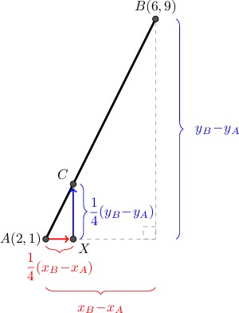

To get from point $A$ to point $C,$ we can "run" horizontally from $A$ to $X$ and then "rise" vertically from $X$ to $C$:

- The $x$-coordinate of $C$ is

- The $y$-coordinate of $C$ is

Therefore, $C$ has coordinates $\left(3, 3 \right).$
